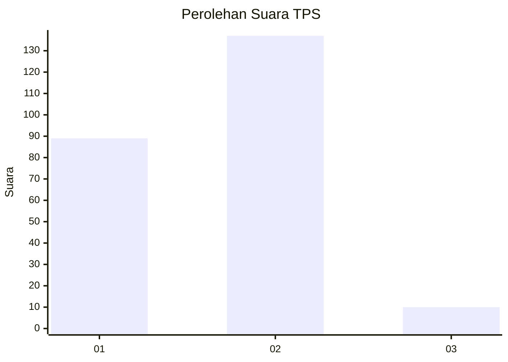
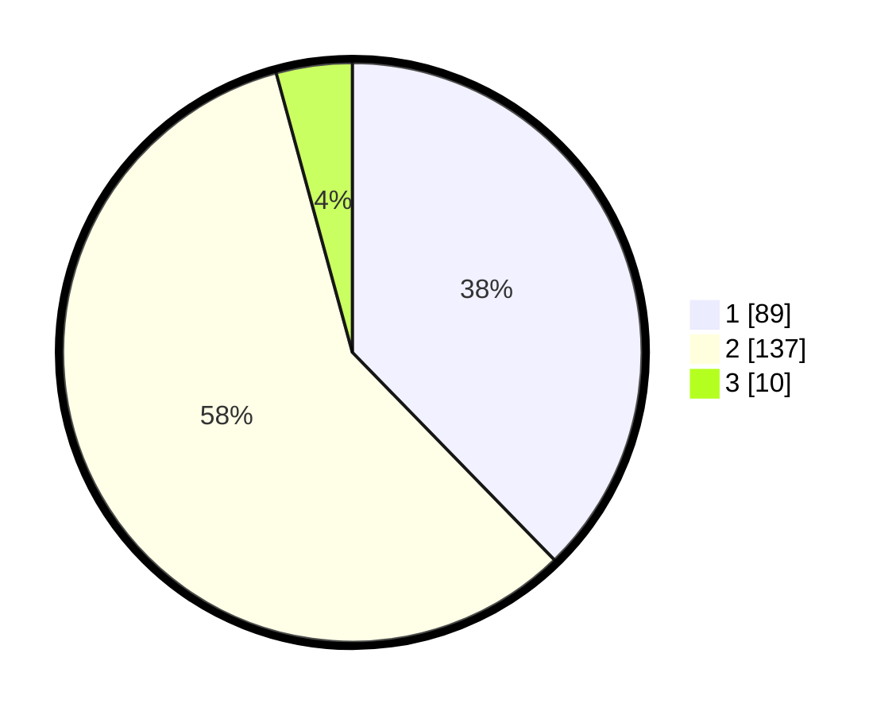

# Hasil

## Grafik

## Tabel

| No. | Nama Paslon    | Suara | Suara (raw) | Persentase |
|:--- |:-------------- | -----:| -----------:| ----------:|
| 1   | ANIES MUHAIMIN | 89    | [89][p-1]   | 37,71      |
| 2   | PRABOWO GIBRAN | 137   | [137][p-2]  | 58,05      |
| 3   | GANJAR MAHFUD  | 10    | [10][p-3]   | 4,24       |

[p-1]: https://github.com/gigit-pemilu/pemilu-2024-11-aceh/blob/main/pilpres/hitung-suara/sub/11-aceh/sub/10-aceh-singkil/sub/10-singkil-utara/sub/2007-telaga-bakti/sub/001-tps/sub/paslon-1.txt
[p-2]: https://github.com/gigit-pemilu/pemilu-2024-11-aceh/blob/main/pilpres/hitung-suara/sub/11-aceh/sub/10-aceh-singkil/sub/10-singkil-utara/sub/2007-telaga-bakti/sub/001-tps/sub/paslon-2.txt
[p-3]: https://github.com/gigit-pemilu/pemilu-2024-11-aceh/blob/main/pilpres/hitung-suara/sub/11-aceh/sub/10-aceh-singkil/sub/10-singkil-utara/sub/2007-telaga-bakti/sub/001-tps/sub/paslon-3.txt

## Foto C Plano

https://sirekap-obj-formc.kpu.go.id/3ecf/pemilu/ppwp/11/10/10/20/07/1110102007001-20240221-095544--054947eb-cc3e-4c3e-8cb5-70f5c64c6d9d.jpg

https://sirekap-obj-formc.kpu.go.id/3ecf/pemilu/ppwp/11/10/10/20/07/1110102007001-20240221-095652--6aca93fa-7c9d-4966-bf12-916ddc41d126.jpg

https://sirekap-obj-formc.kpu.go.id/3ecf/pemilu/ppwp/11/10/10/20/07/1110102007001-20240221-095743--78e8040e-0aee-4dc6-bb31-88fba585b1c1.jpg

## Metadata

| Key        | Value               |
| ---------- | ------------------- |
| Time Stamp | 2024-02-24 22:31:28 |

## DATA PEMILIH TETAP

Jumlah pemilih dalam DPT: **272**.
 * L: **440**.
 * P: **132**.

## DATA PENGGUNA HAK PILIH

Jumlah pengguna hak pilih dalam DPT: **223**.
 * L: **212**.
 * P: **201**.

Jumlah pengguna hak pilih dalam DPTb: **22**.
 * L: **83**.
 * P: **9**.

Jumlah pengguna hak pilih dalam DPK: **6**.
 * L: **93**.
 * P: **903**.

Jumlah pengguna hak pilih: **240**.
 * L: **828**.
 * P: **443**.

## JUMLAH SUARA SAH DAN TIDAK SAH

JUMLAH SELURUH SUARA SAH: **236**.

JUMLAH SUARA TIDAK SAH: **5**.

JUMLAH SELURUH SUARA SAH DAN SUARA TIDAK SAH: **241**.

