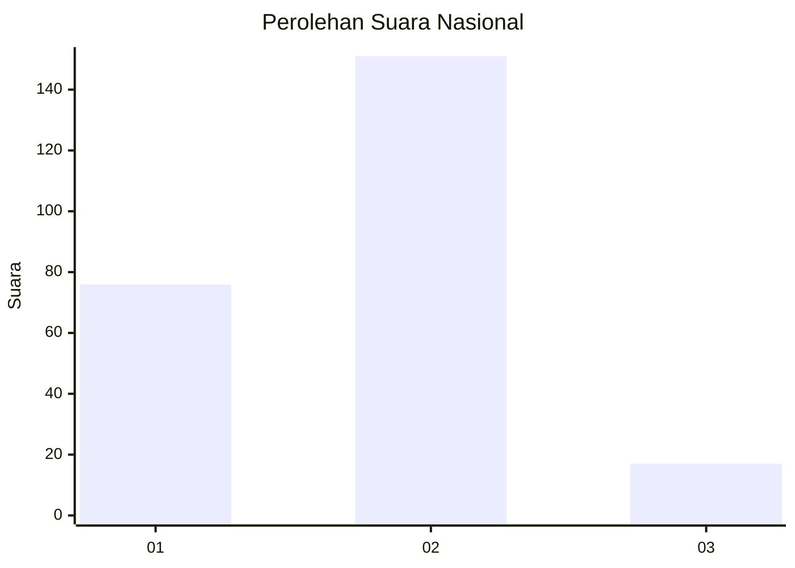
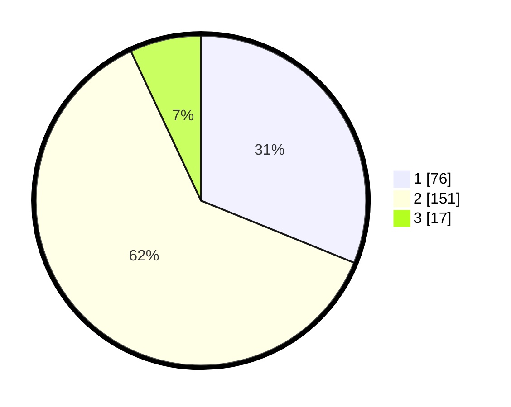

# Hasil

## Grafik

## Tabel

| No. | Nama Paslon    | Suara | Suara (raw) | Persentase |
|:--- |:-------------- | -----:| -----------:| ----------:|
| 1   | ANIES MUHAIMIN | 76    | [76][p-1]   | 31,15      |
| 2   | PRABOWO GIBRAN | 151   | [151][p-2]  | 61,89      |
| 3   | GANJAR MAHFUD  | 17    | [17][p-3]   | 6,97       |

[p-1]: https://github.com/gigit-pemilu/pemilu-2024/blob/main/pilpres/hitung-suara/sub/11-aceh/sub/10-aceh-singkil/sub/10-singkil-utara/sub/2007-telaga-bakti/sub/002-tps/sub/paslon-1.txt
[p-2]: https://github.com/gigit-pemilu/pemilu-2024/blob/main/pilpres/hitung-suara/sub/11-aceh/sub/10-aceh-singkil/sub/10-singkil-utara/sub/2007-telaga-bakti/sub/002-tps/sub/paslon-2.txt
[p-3]: https://github.com/gigit-pemilu/pemilu-2024/blob/main/pilpres/hitung-suara/sub/11-aceh/sub/10-aceh-singkil/sub/10-singkil-utara/sub/2007-telaga-bakti/sub/002-tps/sub/paslon-3.txt

## Foto C Plano

https://sirekap-obj-formc.kpu.go.id/9463/pemilu/ppwp/11/10/10/20/07/1110102007002-20240221-123030--b25b0ff3-9b6b-43d7-8b4a-34a12ac14939.jpg

https://sirekap-obj-formc.kpu.go.id/9463/pemilu/ppwp/11/10/10/20/07/1110102007002-20240221-115712--b086db5c-a3aa-4571-b100-af29e71b5a16.jpg

https://sirekap-obj-formc.kpu.go.id/9463/pemilu/ppwp/11/10/10/20/07/1110102007002-20240221-115814--b985e76b-3d19-48f3-9ccd-6c906aaf9db3.jpg

## Metadata

| Key        | Value               |
| ---------- | ------------------- |
| Time Stamp | 2024-02-24 22:31:28 |

## DATA PEMILIH TETAP

Jumlah pemilih dalam DPT: **283**.
 * L: **149**.
 * P: **334**.

## DATA PENGGUNA HAK PILIH

Jumlah pengguna hak pilih dalam DPT: **236**.
 * L: **635**.
 * P: **802**.

Jumlah pengguna hak pilih dalam DPTb: **905**.
 * L: **993**.
 * P: **293**.

Jumlah pengguna hak pilih dalam DPK: **997**.
 * L: **903**.
 * P: **94**.

Jumlah pengguna hak pilih: **248**.
 * L: **134**.
 * P: **247**.

## JUMLAH SUARA SAH DAN TIDAK SAH

JUMLAH SELURUH SUARA SAH: **244**.

JUMLAH SUARA TIDAK SAH: **4**.

JUMLAH SELURUH SUARA SAH DAN SUARA TIDAK SAH: **248**.

