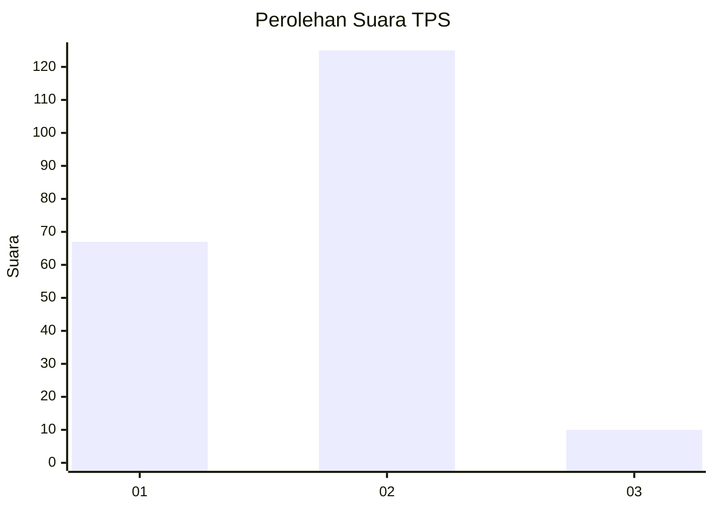
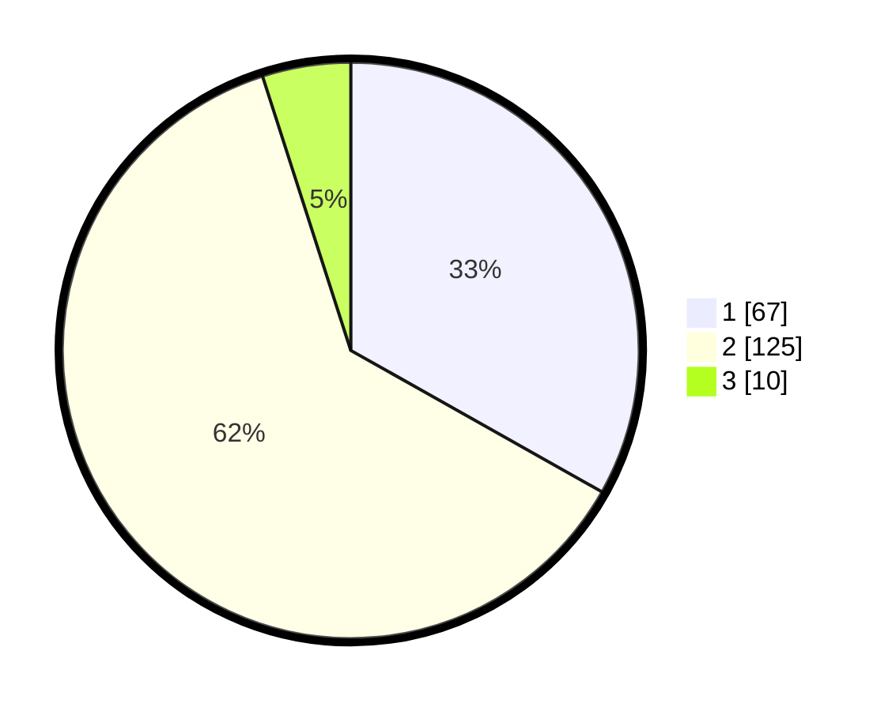

# Hasil

## Grafik

## Tabel

| No. | Nama Paslon    | Suara | Suara (raw) | Persentase |
|:--- |:-------------- | -----:| -----------:| ----------:|
| 1   | ANIES MUHAIMIN | 67    | [67][p-1]   | 33,17      |
| 2   | PRABOWO GIBRAN | 125   | [125][p-2]  | 61,88      |
| 3   | GANJAR MAHFUD  | 10    | [10][p-3]   | 4,95       |

[p-1]: https://github.com/gigit-pemilu/pemilu-2024-11-aceh/blob/main/pilpres/hitung-suara/sub/11-aceh/sub/10-aceh-singkil/sub/10-singkil-utara/sub/2007-telaga-bakti/sub/003-tps/sub/paslon-1.txt
[p-2]: https://github.com/gigit-pemilu/pemilu-2024-11-aceh/blob/main/pilpres/hitung-suara/sub/11-aceh/sub/10-aceh-singkil/sub/10-singkil-utara/sub/2007-telaga-bakti/sub/003-tps/sub/paslon-2.txt
[p-3]: https://github.com/gigit-pemilu/pemilu-2024-11-aceh/blob/main/pilpres/hitung-suara/sub/11-aceh/sub/10-aceh-singkil/sub/10-singkil-utara/sub/2007-telaga-bakti/sub/003-tps/sub/paslon-3.txt

## Foto C Plano

https://sirekap-obj-formc.kpu.go.id/0ee9/pemilu/ppwp/11/10/10/20/07/1110102007003-20240221-135431--cffea80f-628d-4a98-a0f0-0bdf29076e12.jpg

https://sirekap-obj-formc.kpu.go.id/0ee9/pemilu/ppwp/11/10/10/20/07/1110102007003-20240221-135605--8a44aba9-46de-40bb-819c-3520439b91fe.jpg

## Metadata

| Key        | Value               |
| ---------- | ------------------- |
| Time Stamp | 2024-02-25 18:00:00 |

