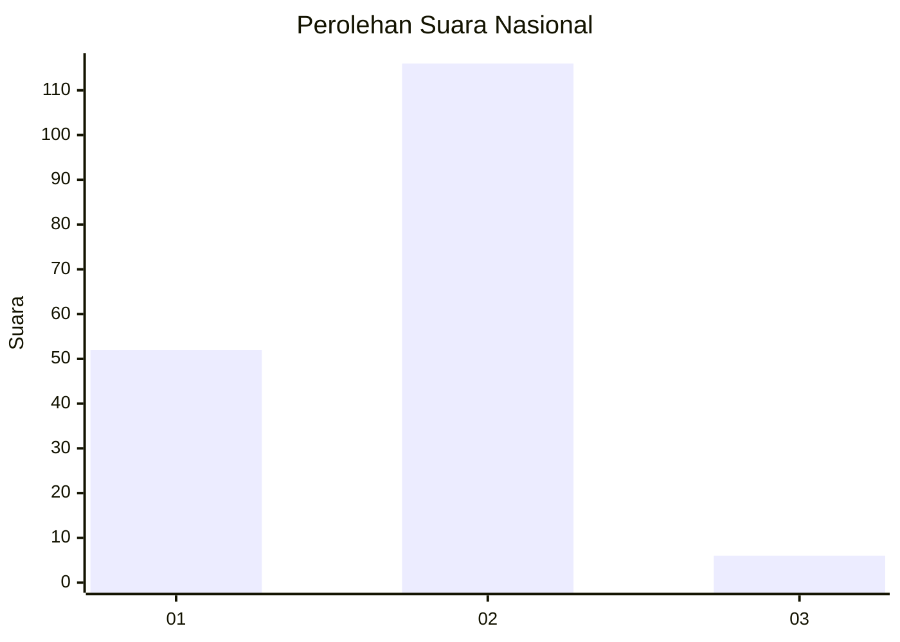
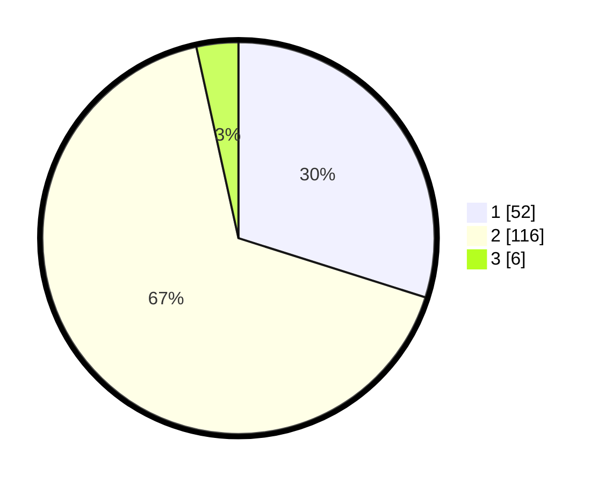

# Hasil

## Grafik

## Tabel

| No. | Nama Paslon    | Suara | Suara (raw) | Persentase |
|:--- |:-------------- | -----:| -----------:| ----------:|
| 1   | ANIES MUHAIMIN | 52    | [52][p-1]   | 29,89      |
| 2   | PRABOWO GIBRAN | 116   | [116][p-2]  | 66,67      |
| 3   | GANJAR MAHFUD  | 6     | [6][p-3]    | 3,45       |

[p-1]: https://github.com/gigit-pemilu/pemilu-2024/blob/main/pilpres/hitung-suara/sub/11-aceh/sub/10-aceh-singkil/sub/10-singkil-utara/sub/2007-telaga-bakti/sub/004-tps/sub/paslon-1.txt
[p-2]: https://github.com/gigit-pemilu/pemilu-2024/blob/main/pilpres/hitung-suara/sub/11-aceh/sub/10-aceh-singkil/sub/10-singkil-utara/sub/2007-telaga-bakti/sub/004-tps/sub/paslon-2.txt
[p-3]: https://github.com/gigit-pemilu/pemilu-2024/blob/main/pilpres/hitung-suara/sub/11-aceh/sub/10-aceh-singkil/sub/10-singkil-utara/sub/2007-telaga-bakti/sub/004-tps/sub/paslon-3.txt

## Foto C Plano

https://sirekap-obj-formc.kpu.go.id/0c4f/pemilu/ppwp/11/10/10/20/07/1110102007004-20240221-160243--e32ceaa4-2956-451d-a9a6-63f2ae2947f4.jpg

https://sirekap-obj-formc.kpu.go.id/0c4f/pemilu/ppwp/11/10/10/20/07/1110102007004-20240221-160413--617a9b65-3b42-4177-8f9c-8e29838b728a.jpg

https://sirekap-obj-formc.kpu.go.id/0c4f/pemilu/ppwp/11/10/10/20/07/1110102007004-20240221-160453--60f8de31-87fc-4f26-b345-a6f7ed68bb74.jpg

## Metadata

| Key        | Value               |
| ---------- | ------------------- |
| Time Stamp | 2024-02-24 22:31:28 |

## DATA PEMILIH TETAP

Jumlah pemilih dalam DPT: **197**.
 * L: **101**.
 * P: **96**.

## DATA PENGGUNA HAK PILIH

Jumlah pengguna hak pilih dalam DPT: **769**.
 * L: **83**.
 * P: **81**.

Jumlah pengguna hak pilih dalam DPTb: **7**.
 * L: **2**.
 * P: **5**.

Jumlah pengguna hak pilih dalam DPK: **6**.
 * L: **6**.
 * P: **0**.

Jumlah pengguna hak pilih: **873**.
 * L: **92**.
 * P: **86**.

## JUMLAH SUARA SAH DAN TIDAK SAH

JUMLAH SELURUH SUARA SAH: **174**.

JUMLAH SUARA TIDAK SAH: **3**.

JUMLAH SELURUH SUARA SAH DAN SUARA TIDAK SAH: **177**.

