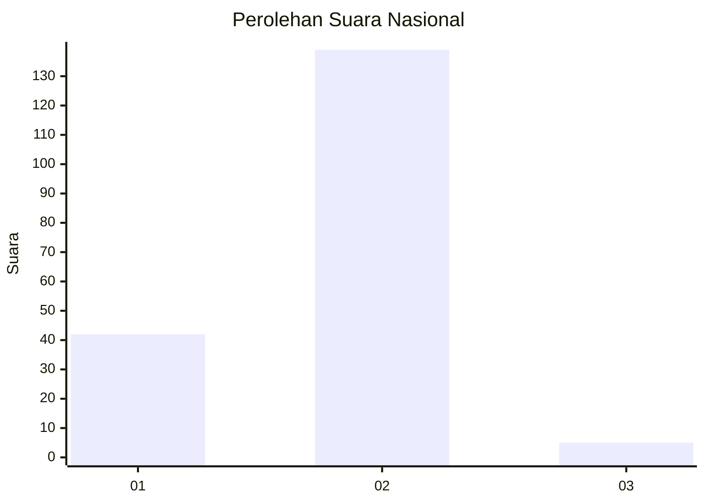

# Hasil

## Grafik

## Tabel

| No. | Nama Paslon    | Suara | Suara (raw) | Persentase |
|:--- |:-------------- | -----:| -----------:| ----------:|
| 1   | ANIES MUHAIMIN | 42    | [42][p-1]   | 22,58      |
| 2   | PRABOWO GIBRAN | 139   | [139][p-2]  | 74,73      |
| 3   | GANJAR MAHFUD  | 5     | [5][p-3]    | 2,69       |

[p-1]: https://github.com/gigit-pemilu/pemilu-2024/blob/main/pilpres/hitung-suara/sub/11-aceh/sub/10-aceh-singkil/sub/11-danau-paris/sub/2001-lae-balno/sub/001-tps/sub/paslon-1.txt
[p-2]: https://github.com/gigit-pemilu/pemilu-2024/blob/main/pilpres/hitung-suara/sub/11-aceh/sub/10-aceh-singkil/sub/11-danau-paris/sub/2001-lae-balno/sub/001-tps/sub/paslon-2.txt
[p-3]: https://github.com/gigit-pemilu/pemilu-2024/blob/main/pilpres/hitung-suara/sub/11-aceh/sub/10-aceh-singkil/sub/11-danau-paris/sub/2001-lae-balno/sub/001-tps/sub/paslon-3.txt

## Foto C Plano

https://sirekap-obj-formc.kpu.go.id/bcaa/pemilu/ppwp/11/10/11/20/01/1110112001001-20240219-144624--cc07e951-7025-4bfb-a13e-5f368a9d9eab.jpg

https://sirekap-obj-formc.kpu.go.id/bcaa/pemilu/ppwp/11/10/11/20/01/1110112001001-20240219-144755--0a0170c0-5474-4f6f-a93e-35ef424ad3bd.jpg

https://sirekap-obj-formc.kpu.go.id/bcaa/pemilu/ppwp/11/10/11/20/01/1110112001001-20240219-144932--30593507-b149-42f1-b371-0b6472fbe05f.jpg

## Metadata

| Key        | Value               |
| ---------- | ------------------- |
| Time Stamp | 2024-02-19 16:00:00 |

## DATA PEMILIH TETAP

Jumlah pemilih dalam DPT: **228**.
 * L: **126**.
 * P: **102**.

## DATA PENGGUNA HAK PILIH

Jumlah pengguna hak pilih dalam DPT: **184**.
 * L: **98**.
 * P: **86**.

Jumlah pengguna hak pilih dalam DPTb: **17**.
 * L: **7**.
 * P: **10**.

Jumlah pengguna hak pilih dalam DPK: **2**.
 * L: **0**.
 * P: **2**.

Jumlah pengguna hak pilih: **203**.
 * L: **105**.
 * P: **98**.

## JUMLAH SUARA SAH DAN TIDAK SAH

JUMLAH SELURUH SUARA SAH: **186**.

JUMLAH SUARA TIDAK SAH: **17**.

JUMLAH SELURUH SUARA SAH DAN SUARA TIDAK SAH: **203**.

