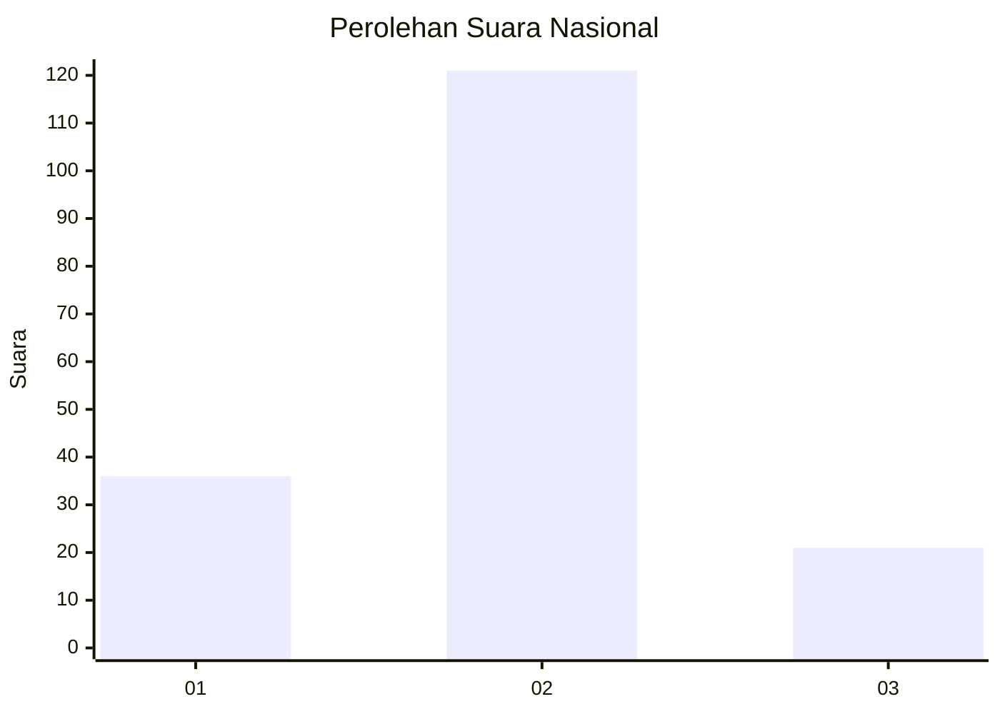
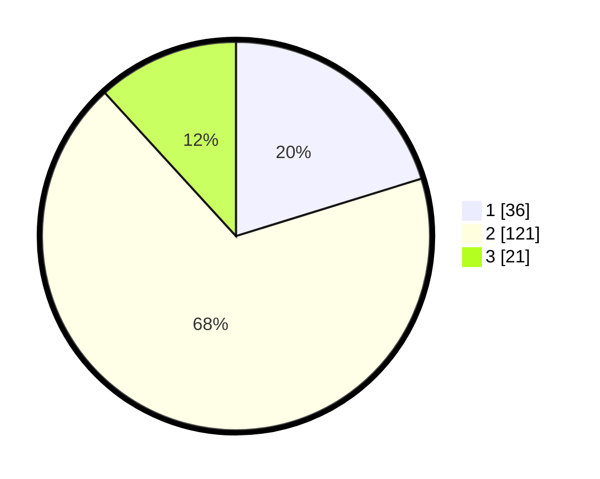

# Hasil

## Grafik

## Tabel

| No. | Nama Paslon    | Suara | Suara (raw) | Persentase |
|:--- |:-------------- | -----:| -----------:| ----------:|
| 1   | ANIES MUHAIMIN | 36    | [36][p-1]   | 20,22      |
| 2   | PRABOWO GIBRAN | 121   | [121][p-2]  | 67,98      |
| 3   | GANJAR MAHFUD  | 21    | [21][p-3]   | 11,80      |

[p-1]: https://github.com/gigit-pemilu/pemilu-2024/blob/main/pilpres/hitung-suara/sub/11-aceh/sub/10-aceh-singkil/sub/11-danau-paris/sub/2001-lae-balno/sub/002-tps/sub/paslon-1.txt
[p-2]: https://github.com/gigit-pemilu/pemilu-2024/blob/main/pilpres/hitung-suara/sub/11-aceh/sub/10-aceh-singkil/sub/11-danau-paris/sub/2001-lae-balno/sub/002-tps/sub/paslon-2.txt
[p-3]: https://github.com/gigit-pemilu/pemilu-2024/blob/main/pilpres/hitung-suara/sub/11-aceh/sub/10-aceh-singkil/sub/11-danau-paris/sub/2001-lae-balno/sub/002-tps/sub/paslon-3.txt

## Foto C Plano

https://sirekap-obj-formc.kpu.go.id/8bab/pemilu/ppwp/11/10/11/20/01/1110112001002-20240219-221730--db9d5fd7-faea-45b8-a5f4-e85c67284f12.jpg

https://sirekap-obj-formc.kpu.go.id/8bab/pemilu/ppwp/11/10/11/20/01/1110112001002-20240219-221808--6d6be625-5d9a-4078-940e-42d23371cf8d.jpg

https://sirekap-obj-formc.kpu.go.id/8bab/pemilu/ppwp/11/10/11/20/01/1110112001002-20240219-221854--20c62d8b-a262-4514-8044-d1c6d46904a3.jpg

## Metadata

| Key        | Value               |
| ---------- | ------------------- |
| Time Stamp | 2024-02-19 23:00:00 |

## DATA PEMILIH TETAP

Jumlah pemilih dalam DPT: **224**.
 * L: **119**.
 * P: **105**.

## DATA PENGGUNA HAK PILIH

Jumlah pengguna hak pilih dalam DPT: **175**.
 * L: **93**.
 * P: **82**.

Jumlah pengguna hak pilih dalam DPTb: **4**.
 * L: **2**.
 * P: **2**.

Jumlah pengguna hak pilih dalam DPK: **6**.
 * L: **3**.
 * P: **3**.

Jumlah pengguna hak pilih: **185**.
 * L: **98**.
 * P: **87**.

## JUMLAH SUARA SAH DAN TIDAK SAH

JUMLAH SELURUH SUARA SAH: **178**.

JUMLAH SUARA TIDAK SAH: **7**.

JUMLAH SELURUH SUARA SAH DAN SUARA TIDAK SAH: **185**.

