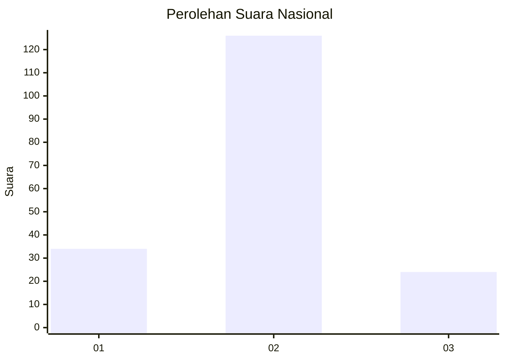
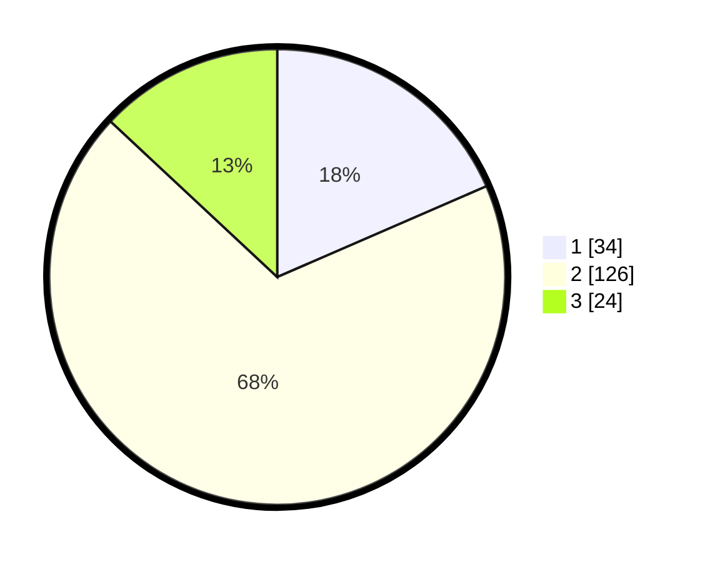

# Hasil

## Grafik

## Tabel

| No. | Nama Paslon    | Suara | Suara (raw) | Persentase |
|:--- |:-------------- | -----:| -----------:| ----------:|
| 1   | ANIES MUHAIMIN | 34    | [34][p-1]   | 18,48      |
| 2   | PRABOWO GIBRAN | 126   | [126][p-2]  | 68,48      |
| 3   | GANJAR MAHFUD  | 24    | [24][p-3]   | 13,04      |

[p-1]: https://github.com/gigit-pemilu/pemilu-2024/blob/main/pilpres/hitung-suara/sub/11-aceh/sub/10-aceh-singkil/sub/11-danau-paris/sub/2001-lae-balno/sub/003-tps/sub/paslon-1.txt
[p-2]: https://github.com/gigit-pemilu/pemilu-2024/blob/main/pilpres/hitung-suara/sub/11-aceh/sub/10-aceh-singkil/sub/11-danau-paris/sub/2001-lae-balno/sub/003-tps/sub/paslon-2.txt
[p-3]: https://github.com/gigit-pemilu/pemilu-2024/blob/main/pilpres/hitung-suara/sub/11-aceh/sub/10-aceh-singkil/sub/11-danau-paris/sub/2001-lae-balno/sub/003-tps/sub/paslon-3.txt

## Foto C Plano

https://sirekap-obj-formc.kpu.go.id/1eca/pemilu/ppwp/11/10/11/20/01/1110112001003-20240220-013245--02294506-6315-4d7d-81f1-348745bb962f.jpg

https://sirekap-obj-formc.kpu.go.id/1eca/pemilu/ppwp/11/10/11/20/01/1110112001003-20240220-013246--7fea58c2-9603-4409-bdfa-897a6ef21811.jpg

https://sirekap-obj-formc.kpu.go.id/1eca/pemilu/ppwp/11/10/11/20/01/1110112001003-20240220-013246--b96392a5-62ab-4a80-adf5-faceb3c058dc.jpg

## Metadata

| Key        | Value               |
| ---------- | ------------------- |
| Time Stamp | 2024-02-22 11:00:00 |

## DATA PEMILIH TETAP

Jumlah pemilih dalam DPT: **239**.
 * L: **107**.
 * P: **132**.

## DATA PENGGUNA HAK PILIH

Jumlah pengguna hak pilih dalam DPT: **0**.
 * L: **0**.
 * P: **0**.

Jumlah pengguna hak pilih dalam DPTb: **0**.
 * L: **0**.
 * P: **0**.

Jumlah pengguna hak pilih dalam DPK: **5**.
 * L: **1**.
 * P: **2**.

Jumlah pengguna hak pilih: **192**.
 * L: **0**.
 * P: **102**.

## JUMLAH SUARA SAH DAN TIDAK SAH

JUMLAH SELURUH SUARA SAH: **184**.

JUMLAH SUARA TIDAK SAH: **8**.

JUMLAH SELURUH SUARA SAH DAN SUARA TIDAK SAH: **192**.

