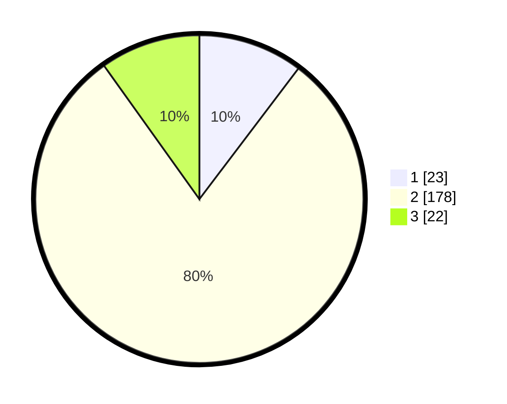

# Hasil

## Grafik

## Tabel

| No. | Nama Paslon    | Suara | Suara (raw) | Persentase |
|:--- |:-------------- | -----:| -----------:| ----------:|
| 1   | ANIES MUHAIMIN | 23    | [23][p-1]   | 10,31      |
| 2   | PRABOWO GIBRAN | 178   | [178][p-2]  | 79,82      |
| 3   | GANJAR MAHFUD  | 22    | [22][p-3]   | 9,87       |

[p-1]: https://github.com/gigit-pemilu/pemilu-2024-11-aceh/blob/main/pilpres/hitung-suara/sub/11-aceh/sub/10-aceh-singkil/sub/11-danau-paris/sub/2002-napagaluh/sub/002-tps/sub/paslon-1.txt
[p-2]: https://github.com/gigit-pemilu/pemilu-2024-11-aceh/blob/main/pilpres/hitung-suara/sub/11-aceh/sub/10-aceh-singkil/sub/11-danau-paris/sub/2002-napagaluh/sub/002-tps/sub/paslon-2.txt
[p-3]: https://github.com/gigit-pemilu/pemilu-2024-11-aceh/blob/main/pilpres/hitung-suara/sub/11-aceh/sub/10-aceh-singkil/sub/11-danau-paris/sub/2002-napagaluh/sub/002-tps/sub/paslon-3.txt

## Foto C Plano

https://sirekap-obj-formc.kpu.go.id/e868/pemilu/ppwp/11/10/11/20/02/1110112002002-20240219-115700--30db0412-fe98-4aaa-a904-6d115d15c3b0.jpg

https://sirekap-obj-formc.kpu.go.id/e868/pemilu/ppwp/11/10/11/20/02/1110112002002-20240219-115828--e6edacdd-d0ba-4355-b00b-7f169ea8ff54.jpg

https://sirekap-obj-formc.kpu.go.id/e868/pemilu/ppwp/11/10/11/20/02/1110112002002-20240219-115910--20b7a714-5987-4dbe-9a9b-7ef116535933.jpg

## Metadata

| Key        | Value               |
| ---------- | ------------------- |
| Time Stamp | 2024-02-19 14:00:00 |

## DATA PEMILIH TETAP

Jumlah pemilih dalam DPT: **269**.
 * L: **136**.
 * P: **133**.

## DATA PENGGUNA HAK PILIH

Jumlah pengguna hak pilih dalam DPT: **229**.
 * L: **118**.
 * P: **111**.

Jumlah pengguna hak pilih dalam DPTb: **2**.
 * L: **0**.
 * P: **2**.

Jumlah pengguna hak pilih dalam DPK: **9**.
 * L: **5**.
 * P: **4**.

Jumlah pengguna hak pilih: **240**.
 * L: **123**.
 * P: **117**.

## JUMLAH SUARA SAH DAN TIDAK SAH

JUMLAH SELURUH SUARA SAH: **223**.

JUMLAH SUARA TIDAK SAH: **17**.

JUMLAH SELURUH SUARA SAH DAN SUARA TIDAK SAH: **240**.

