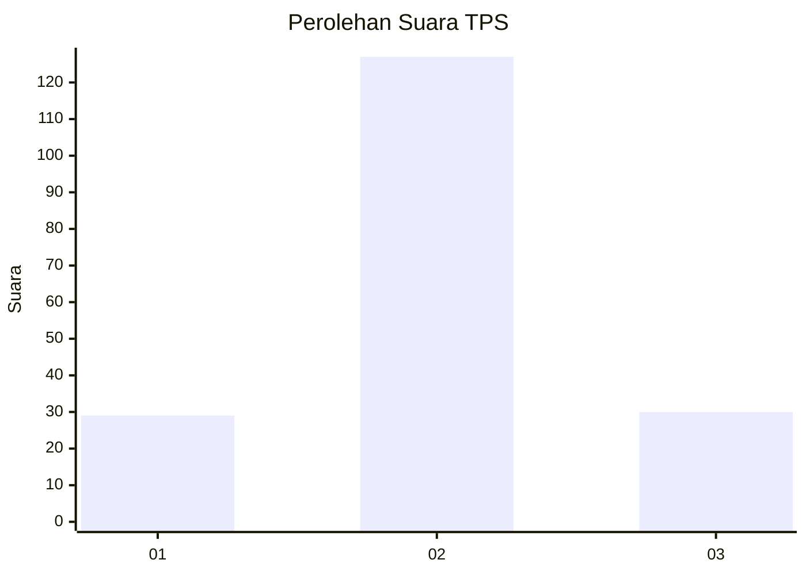
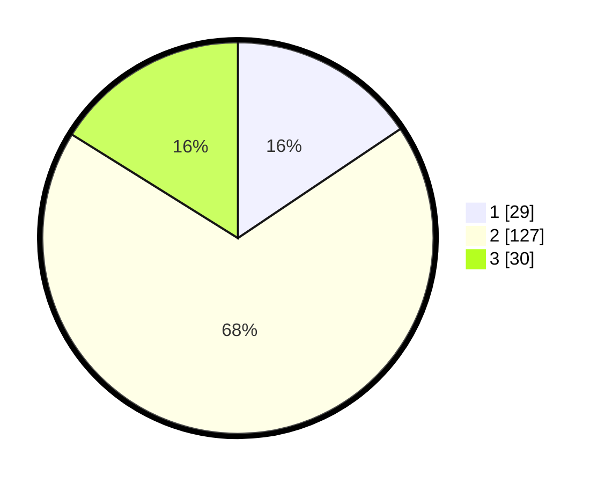

# Hasil

## Grafik

## Tabel

| No. | Nama Paslon    | Suara | Suara (raw) | Persentase |
|:--- |:-------------- | -----:| -----------:| ----------:|
| 1   | ANIES MUHAIMIN | 29    | [29][p-1]   | 15,59      |
| 2   | PRABOWO GIBRAN | 127   | [127][p-2]  | 68,28      |
| 3   | GANJAR MAHFUD  | 30    | [30][p-3]   | 16,13      |

[p-1]: https://github.com/gigit-pemilu/pemilu-2024-11-aceh/blob/main/pilpres/hitung-suara/sub/11-aceh/sub/10-aceh-singkil/sub/11-danau-paris/sub/2003-sikoran/sub/001-tps/sub/paslon-1.txt
[p-2]: https://github.com/gigit-pemilu/pemilu-2024-11-aceh/blob/main/pilpres/hitung-suara/sub/11-aceh/sub/10-aceh-singkil/sub/11-danau-paris/sub/2003-sikoran/sub/001-tps/sub/paslon-2.txt
[p-3]: https://github.com/gigit-pemilu/pemilu-2024-11-aceh/blob/main/pilpres/hitung-suara/sub/11-aceh/sub/10-aceh-singkil/sub/11-danau-paris/sub/2003-sikoran/sub/001-tps/sub/paslon-3.txt

## Foto C Plano

https://sirekap-obj-formc.kpu.go.id/8028/pemilu/ppwp/11/10/11/20/03/1110112003001-20240216-192320--504d1f7a-4e91-4d4d-9e3a-a59955507d1f.jpg

https://sirekap-obj-formc.kpu.go.id/8028/pemilu/ppwp/11/10/11/20/03/1110112003001-20240216-192321--51272523-4b28-42f0-99ee-85a4fdd2afc0.jpg

https://sirekap-obj-formc.kpu.go.id/8028/pemilu/ppwp/11/10/11/20/03/1110112003001-20240216-192321--a0bccdf8-94e1-44ce-88b0-38cea56ef178.jpg

## Metadata

| Key        | Value               |
| ---------- | ------------------- |
| Time Stamp | 2024-02-16 21:01:00 |

## DATA PEMILIH TETAP

Jumlah pemilih dalam DPT: **232**.
 * L: **122**.
 * P: **110**.

## DATA PENGGUNA HAK PILIH

Jumlah pengguna hak pilih dalam DPT: **190**.
 * L: **101**.
 * P: **89**.

Jumlah pengguna hak pilih dalam DPTb: **4**.
 * L: **2**.
 * P: **2**.

Jumlah pengguna hak pilih dalam DPK: **1**.
 * L: **1**.
 * P: **0**.

Jumlah pengguna hak pilih: **195**.
 * L: **104**.
 * P: **91**.

## JUMLAH SUARA SAH DAN TIDAK SAH

JUMLAH SELURUH SUARA SAH: **186**.

JUMLAH SUARA TIDAK SAH: **9**.

JUMLAH SELURUH SUARA SAH DAN SUARA TIDAK SAH: **195**.

