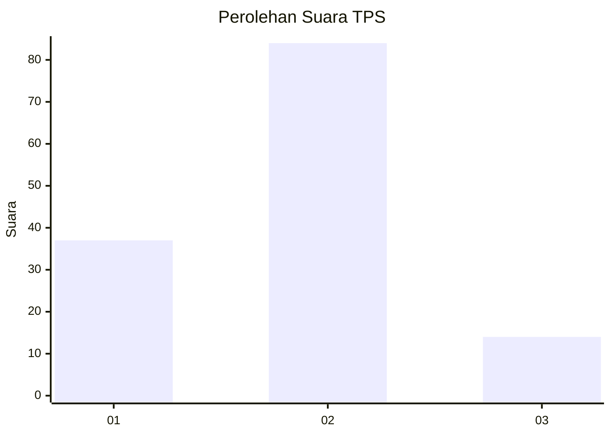
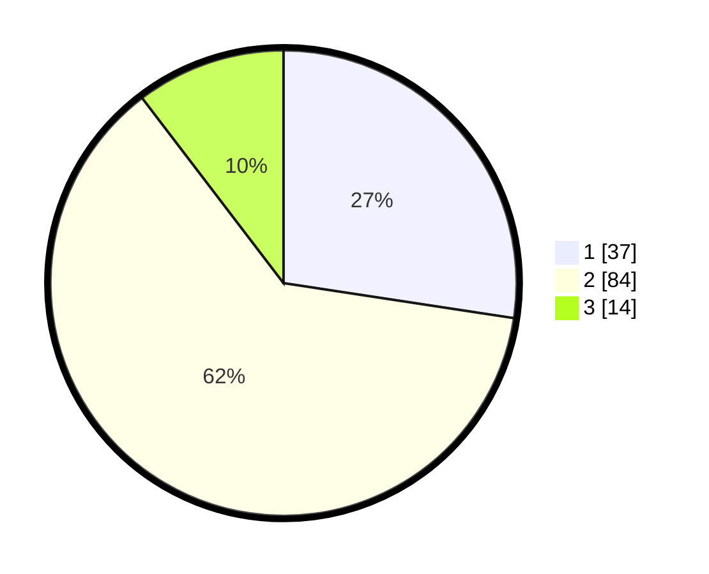

# Hasil

## Grafik

## Tabel

| No. | Nama Paslon    | Suara | Suara (raw) | Persentase |
|:--- |:-------------- | -----:| -----------:| ----------:|
| 1   | ANIES MUHAIMIN | 37    | [37][p-1]   | 27,41      |
| 2   | PRABOWO GIBRAN | 84    | [84][p-2]   | 62,22      |
| 3   | GANJAR MAHFUD  | 14    | [14][p-3]   | 10,37      |

[p-1]: https://github.com/gigit-pemilu/pemilu-2024-11-aceh/blob/main/pilpres/hitung-suara/sub/11-aceh/sub/10-aceh-singkil/sub/11-danau-paris/sub/2004-situbuh-tubuh/sub/003-tps/sub/paslon-1.txt
[p-2]: https://github.com/gigit-pemilu/pemilu-2024-11-aceh/blob/main/pilpres/hitung-suara/sub/11-aceh/sub/10-aceh-singkil/sub/11-danau-paris/sub/2004-situbuh-tubuh/sub/003-tps/sub/paslon-2.txt
[p-3]: https://github.com/gigit-pemilu/pemilu-2024-11-aceh/blob/main/pilpres/hitung-suara/sub/11-aceh/sub/10-aceh-singkil/sub/11-danau-paris/sub/2004-situbuh-tubuh/sub/003-tps/sub/paslon-3.txt

## Foto C Plano

https://sirekap-obj-formc.kpu.go.id/56cd/pemilu/ppwp/11/10/11/20/04/1110112004003-20240221-021814--9a927516-f8c8-4859-b162-59f91697b430.jpg

https://sirekap-obj-formc.kpu.go.id/56cd/pemilu/ppwp/11/10/11/20/04/1110112004003-20240221-021922--8a79ac0a-5fd6-479b-bcd7-bf5a07e4ed0f.jpg

https://sirekap-obj-formc.kpu.go.id/56cd/pemilu/ppwp/11/10/11/20/04/1110112004003-20240221-022024--6b5b87cf-90fb-47a5-bb6a-b1dfaf6a4b38.jpg

## Metadata

| Key        | Value               |
| ---------- | ------------------- |
| Time Stamp | 2024-02-22 11:00:00 |

## DATA PEMILIH TETAP

Jumlah pemilih dalam DPT: **157**.
 * L: **93**.
 * P: **64**.

## DATA PENGGUNA HAK PILIH

Jumlah pengguna hak pilih dalam DPT: **121**.
 * L: **67**.
 * P: **54**.

Jumlah pengguna hak pilih dalam DPTb: **8**.
 * L: **55**.
 * P: **3**.

Jumlah pengguna hak pilih dalam DPK: **8**.
 * L: **5**.
 * P: **3**.

Jumlah pengguna hak pilih: **137**.
 * L: **77**.
 * P: **60**.

## JUMLAH SUARA SAH DAN TIDAK SAH

JUMLAH SELURUH SUARA SAH: **135**.

JUMLAH SUARA TIDAK SAH: **2**.

JUMLAH SELURUH SUARA SAH DAN SUARA TIDAK SAH: **137**.

