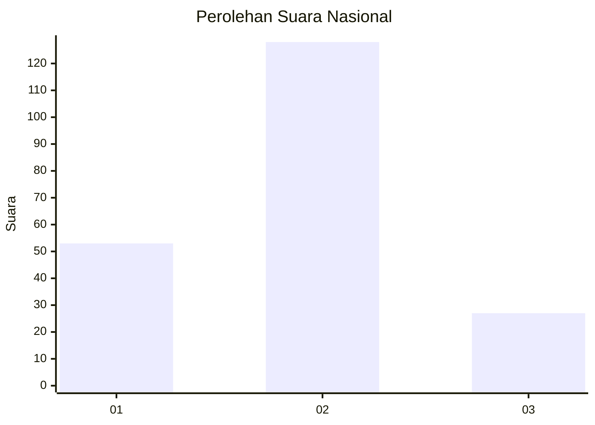
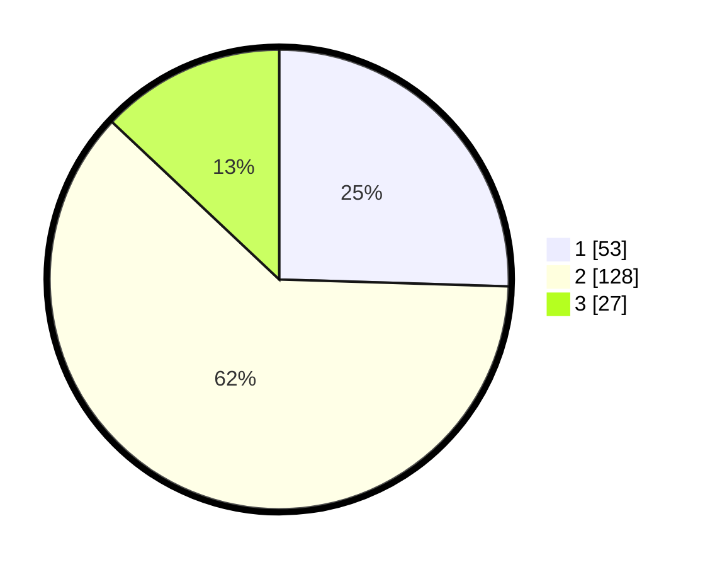

# Hasil

## Grafik

## Tabel

| No. | Nama Paslon    | Suara | Suara (raw) | Persentase |
|:--- |:-------------- | -----:| -----------:| ----------:|
| 1   | ANIES MUHAIMIN | 53    | [53][p-1]   | 25,48      |
| 2   | PRABOWO GIBRAN | 128   | [128][p-2]  | 61,54      |
| 3   | GANJAR MAHFUD  | 27    | [27][p-3]   | 12,98      |

[p-1]: https://github.com/gigit-pemilu/pemilu-2024/blob/main/pilpres/hitung-suara/sub/11-aceh/sub/10-aceh-singkil/sub/11-danau-paris/sub/2005-biskang/sub/002-tps/sub/paslon-1.txt
[p-2]: https://github.com/gigit-pemilu/pemilu-2024/blob/main/pilpres/hitung-suara/sub/11-aceh/sub/10-aceh-singkil/sub/11-danau-paris/sub/2005-biskang/sub/002-tps/sub/paslon-2.txt
[p-3]: https://github.com/gigit-pemilu/pemilu-2024/blob/main/pilpres/hitung-suara/sub/11-aceh/sub/10-aceh-singkil/sub/11-danau-paris/sub/2005-biskang/sub/002-tps/sub/paslon-3.txt

## Foto C Plano

https://sirekap-obj-formc.kpu.go.id/5f43/pemilu/ppwp/11/10/11/20/05/1110112005002-20240218-154337--d0faf68b-56da-43fb-8e13-5c2b4e228132.jpg

https://sirekap-obj-formc.kpu.go.id/5f43/pemilu/ppwp/11/10/11/20/05/1110112005002-20240218-154448--a6b76665-2e6f-4f0c-9102-08798bcfff6f.jpg

## Metadata

| Key        | Value               |
| ---------- | ------------------- |
| Time Stamp | 2024-02-21 15:00:00 |

