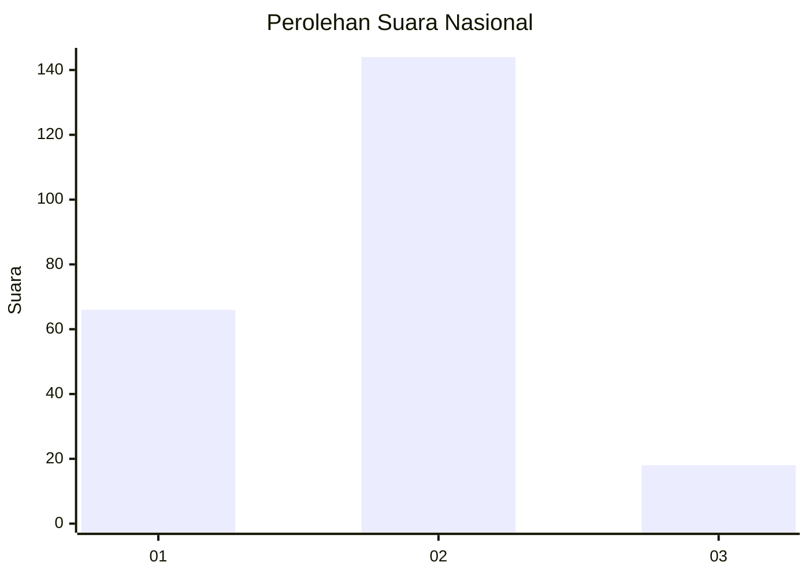
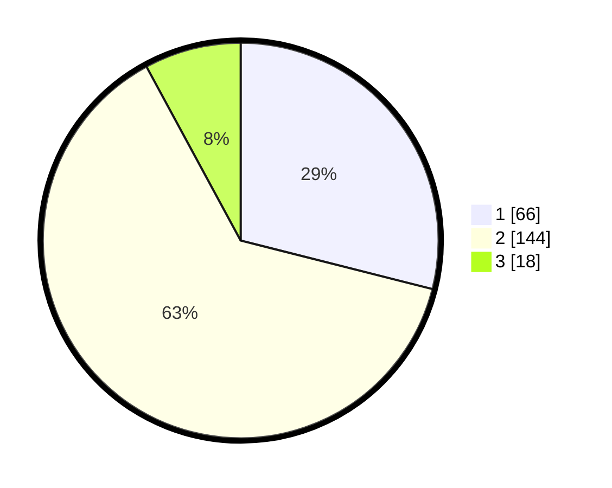

# Hasil

## Grafik

## Tabel

| No. | Nama Paslon    | Suara | Suara (raw) | Persentase |
|:--- |:-------------- | -----:| -----------:| ----------:|
| 1   | ANIES MUHAIMIN | 66    | [66][p-1]   | 28,95      |
| 2   | PRABOWO GIBRAN | 144   | [144][p-2]  | 63,16      |
| 3   | GANJAR MAHFUD  | 18    | [18][p-3]   | 7,89       |

[p-1]: https://github.com/gigit-pemilu/pemilu-2024/blob/main/pilpres/hitung-suara/sub/11-aceh/sub/10-aceh-singkil/sub/11-danau-paris/sub/2006-sintuban-makmur/sub/001-tps/sub/paslon-1.txt
[p-2]: https://github.com/gigit-pemilu/pemilu-2024/blob/main/pilpres/hitung-suara/sub/11-aceh/sub/10-aceh-singkil/sub/11-danau-paris/sub/2006-sintuban-makmur/sub/001-tps/sub/paslon-2.txt
[p-3]: https://github.com/gigit-pemilu/pemilu-2024/blob/main/pilpres/hitung-suara/sub/11-aceh/sub/10-aceh-singkil/sub/11-danau-paris/sub/2006-sintuban-makmur/sub/001-tps/sub/paslon-3.txt

## Foto C Plano

https://sirekap-obj-formc.kpu.go.id/c700/pemilu/ppwp/11/10/11/20/06/1110112006001-20240220-102232--154f815d-a99d-4dcc-8b9d-490574188284.jpg

https://sirekap-obj-formc.kpu.go.id/c700/pemilu/ppwp/11/10/11/20/06/1110112006001-20240220-102332--0352d350-24e2-488a-959e-df970876d32c.jpg

https://sirekap-obj-formc.kpu.go.id/c700/pemilu/ppwp/11/10/11/20/06/1110112006001-20240220-102438--4b3e8061-8851-479d-ab75-54dd4a36891c.jpg

## Metadata

| Key        | Value               |
| ---------- | ------------------- |
| Time Stamp | 2024-02-22 11:00:00 |

## DATA PEMILIH TETAP

Jumlah pemilih dalam DPT: **279**.
 * L: **151**.
 * P: **128**.

## DATA PENGGUNA HAK PILIH

Jumlah pengguna hak pilih dalam DPT: **213**.
 * L: **113**.
 * P: **100**.

Jumlah pengguna hak pilih dalam DPTb: **11**.
 * L: **4**.
 * P: **7**.

Jumlah pengguna hak pilih dalam DPK: **9**.
 * L: **7**.
 * P: **2**.

Jumlah pengguna hak pilih: **233**.
 * L: **124**.
 * P: **109**.

## JUMLAH SUARA SAH DAN TIDAK SAH

JUMLAH SELURUH SUARA SAH: **228**.

JUMLAH SUARA TIDAK SAH: **5**.

JUMLAH SELURUH SUARA SAH DAN SUARA TIDAK SAH: **233**.

