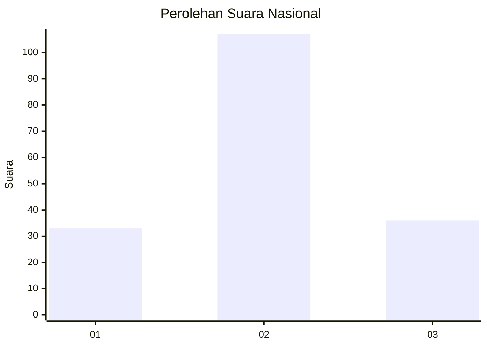
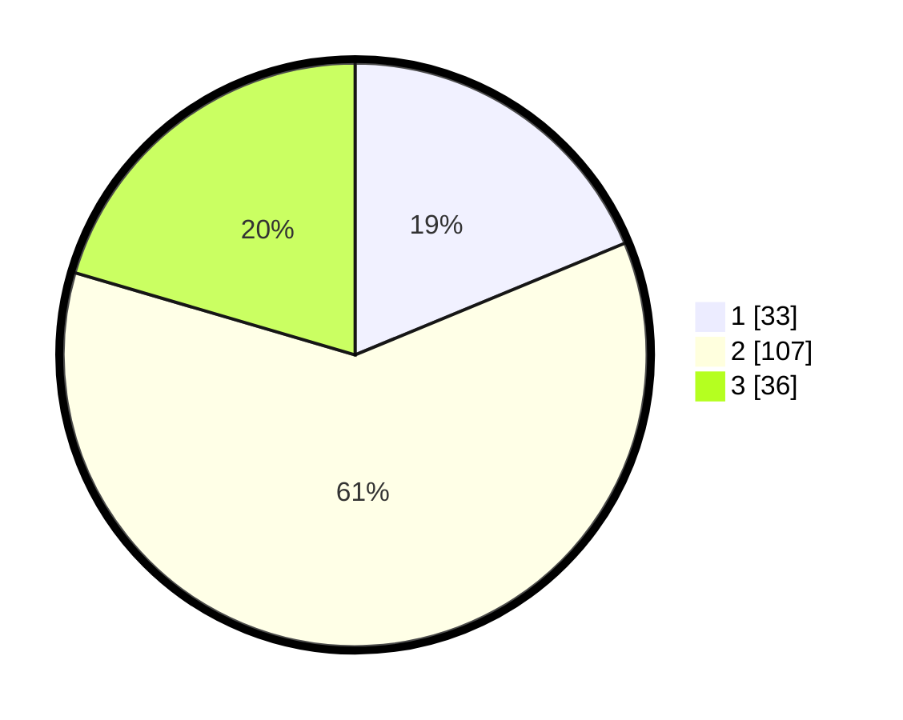

# Hasil

## Grafik

## Tabel

| No. | Nama Paslon    | Suara | Suara (raw) | Persentase |
|:--- |:-------------- | -----:| -----------:| ----------:|
| 1   | ANIES MUHAIMIN | 33    | [33][p-1]   | 18,75      |
| 2   | PRABOWO GIBRAN | 107   | [107][p-2]  | 60,80      |
| 3   | GANJAR MAHFUD  | 36    | [36][p-3]   | 20,45      |

[p-1]: https://github.com/gigit-pemilu/pemilu-2024/blob/main/pilpres/hitung-suara/sub/11-aceh/sub/10-aceh-singkil/sub/11-danau-paris/sub/2006-sintuban-makmur/sub/003-tps/sub/paslon-1.txt
[p-2]: https://github.com/gigit-pemilu/pemilu-2024/blob/main/pilpres/hitung-suara/sub/11-aceh/sub/10-aceh-singkil/sub/11-danau-paris/sub/2006-sintuban-makmur/sub/003-tps/sub/paslon-2.txt
[p-3]: https://github.com/gigit-pemilu/pemilu-2024/blob/main/pilpres/hitung-suara/sub/11-aceh/sub/10-aceh-singkil/sub/11-danau-paris/sub/2006-sintuban-makmur/sub/003-tps/sub/paslon-3.txt

## Foto C Plano

https://sirekap-obj-formc.kpu.go.id/6733/pemilu/ppwp/11/10/11/20/06/1110112006003-20240220-144740--dac112a8-01d9-457d-8fbe-78846f6f5a95.jpg

https://sirekap-obj-formc.kpu.go.id/6733/pemilu/ppwp/11/10/11/20/06/1110112006003-20240220-145222--90bae1b8-abdd-4b94-9050-a327e5b2cd47.jpg

https://sirekap-obj-formc.kpu.go.id/6733/pemilu/ppwp/11/10/11/20/06/1110112006003-20240220-145325--a11fb658-4aff-424c-aef2-cd90caae46d6.jpg

## Metadata

| Key        | Value               |
| ---------- | ------------------- |
| Time Stamp | 2024-02-22 11:00:00 |

## DATA PEMILIH TETAP

Jumlah pemilih dalam DPT: **284**.
 * L: **146**.
 * P: **138**.

## DATA PENGGUNA HAK PILIH

Jumlah pengguna hak pilih dalam DPT: **203**.
 * L: **102**.
 * P: **101**.

Jumlah pengguna hak pilih dalam DPTb: **2**.
 * L: **1**.
 * P: **1**.

Jumlah pengguna hak pilih dalam DPK: **20**.
 * L: **9**.
 * P: **11**.

Jumlah pengguna hak pilih: **225**.
 * L: **112**.
 * P: **113**.

## JUMLAH SUARA SAH DAN TIDAK SAH

JUMLAH SELURUH SUARA SAH: **176**.

JUMLAH SUARA TIDAK SAH: **49**.

JUMLAH SELURUH SUARA SAH DAN SUARA TIDAK SAH: **225**.

