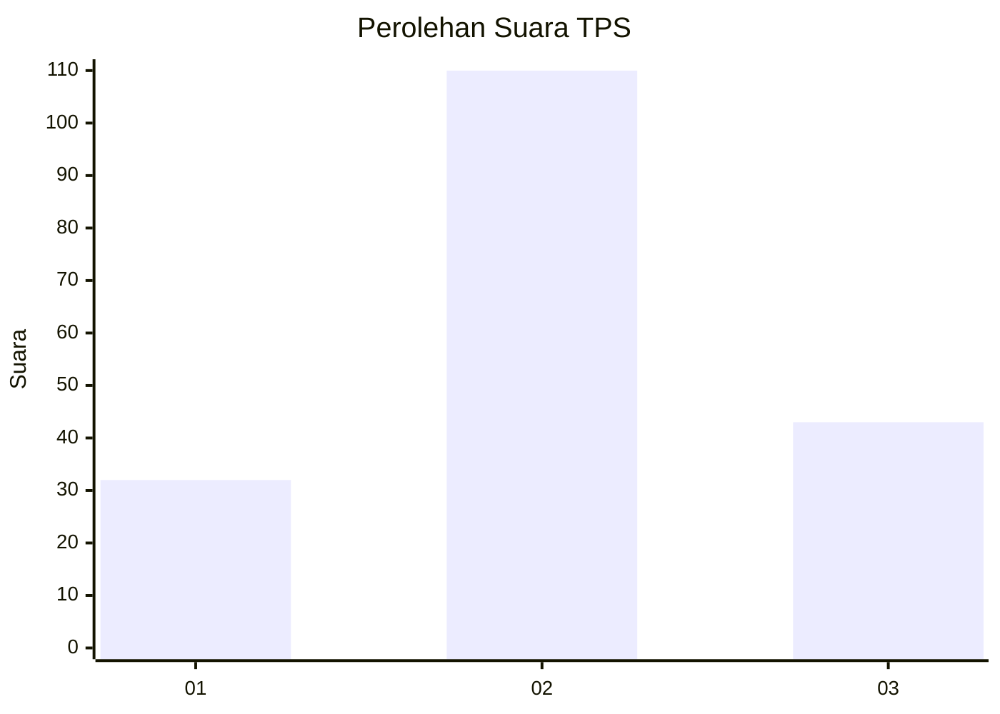
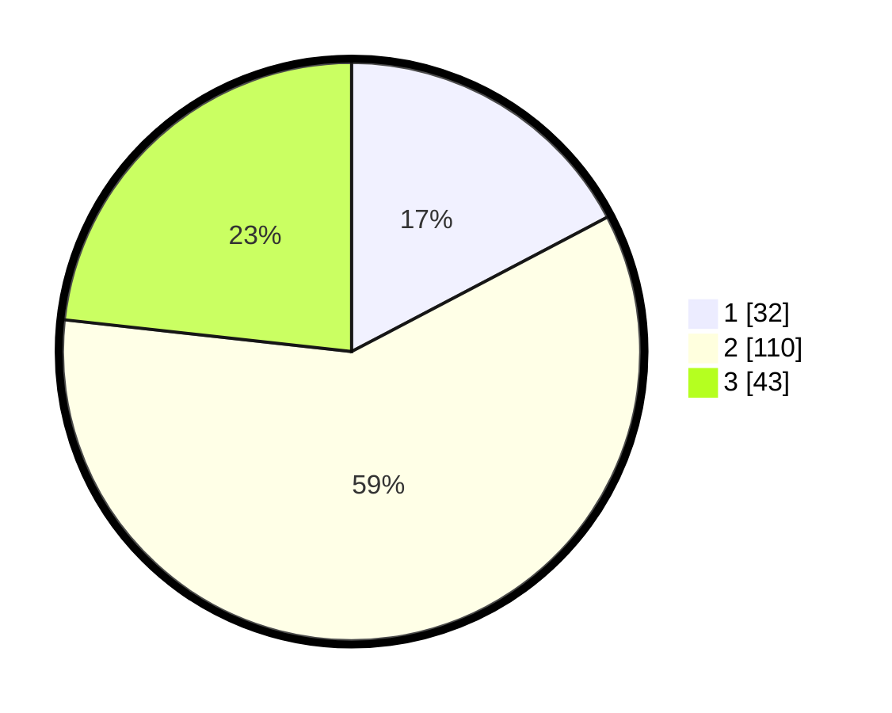

# Hasil

## Grafik

## Tabel

| No. | Nama Paslon    | Suara | Suara (raw) | Persentase |
|:--- |:-------------- | -----:| -----------:| ----------:|
| 1   | ANIES MUHAIMIN | 32    | [32][p-1]   | 17,30      |
| 2   | PRABOWO GIBRAN | 110   | [110][p-2]  | 59,46      |
| 3   | GANJAR MAHFUD  | 43    | [43][p-3]   | 23,24      |

[p-1]: https://github.com/gigit-pemilu/pemilu-2024-11-aceh/blob/main/pilpres/hitung-suara/sub/11-aceh/sub/10-aceh-singkil/sub/11-danau-paris/sub/2006-sintuban-makmur/sub/004-tps/sub/paslon-1.txt
[p-2]: https://github.com/gigit-pemilu/pemilu-2024-11-aceh/blob/main/pilpres/hitung-suara/sub/11-aceh/sub/10-aceh-singkil/sub/11-danau-paris/sub/2006-sintuban-makmur/sub/004-tps/sub/paslon-2.txt
[p-3]: https://github.com/gigit-pemilu/pemilu-2024-11-aceh/blob/main/pilpres/hitung-suara/sub/11-aceh/sub/10-aceh-singkil/sub/11-danau-paris/sub/2006-sintuban-makmur/sub/004-tps/sub/paslon-3.txt

## Foto C Plano

https://sirekap-obj-formc.kpu.go.id/5530/pemilu/ppwp/11/10/11/20/06/1110112006004-20240220-162514--ad36b317-821a-446e-852f-0811c69408ba.jpg

https://sirekap-obj-formc.kpu.go.id/5530/pemilu/ppwp/11/10/11/20/06/1110112006004-20240220-162537--fbb74196-d56d-4d2e-9c64-511465b168ea.jpg

https://sirekap-obj-formc.kpu.go.id/5530/pemilu/ppwp/11/10/11/20/06/1110112006004-20240220-163451--1356159d-2b76-45f2-bc54-de604c5a5491.jpg

## Metadata

| Key        | Value               |
| ---------- | ------------------- |
| Time Stamp | 2024-02-20 17:00:00 |

## DATA PEMILIH TETAP

Jumlah pemilih dalam DPT: **259**.
 * L: **135**.
 * P: **124**.

## DATA PENGGUNA HAK PILIH

Jumlah pengguna hak pilih dalam DPT: **192**.
 * L: **96**.
 * P: **96**.

Jumlah pengguna hak pilih dalam DPTb: **1**.
 * L: **1**.
 * P: **0**.

Jumlah pengguna hak pilih dalam DPK: **21**.
 * L: **10**.
 * P: **11**.

Jumlah pengguna hak pilih: **214**.
 * L: **107**.
 * P: **107**.

## JUMLAH SUARA SAH DAN TIDAK SAH

JUMLAH SELURUH SUARA SAH: **185**.

JUMLAH SUARA TIDAK SAH: **29**.

JUMLAH SELURUH SUARA SAH DAN SUARA TIDAK SAH: **214**.

