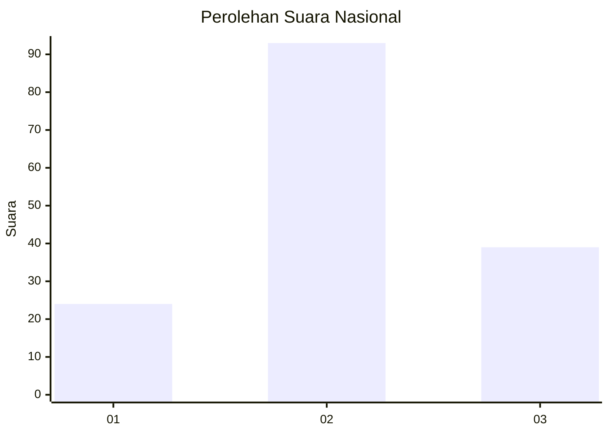
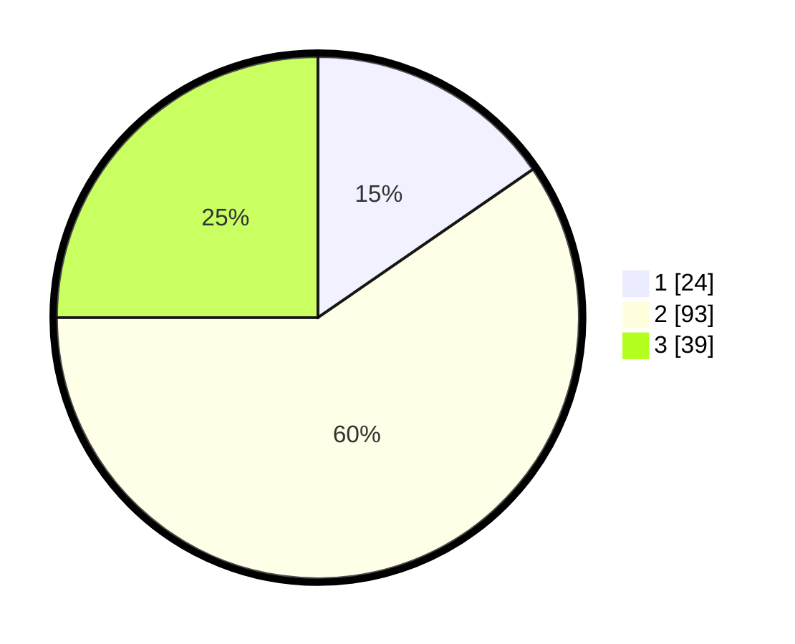

# Hasil

## Grafik

## Tabel

| No. | Nama Paslon    | Suara | Suara (raw) | Persentase |
|:--- |:-------------- | -----:| -----------:| ----------:|
| 1   | ANIES MUHAIMIN | 24    | [24][p-1]   | 15,38      |
| 2   | PRABOWO GIBRAN | 93    | [93][p-2]   | 59,62      |
| 3   | GANJAR MAHFUD  | 39    | [39][p-3]   | 25,00      |

[p-1]: https://github.com/gigit-pemilu/pemilu-2024/blob/main/pilpres/hitung-suara/sub/11-aceh/sub/10-aceh-singkil/sub/11-danau-paris/sub/2006-sintuban-makmur/sub/005-tps/sub/paslon-1.txt
[p-2]: https://github.com/gigit-pemilu/pemilu-2024/blob/main/pilpres/hitung-suara/sub/11-aceh/sub/10-aceh-singkil/sub/11-danau-paris/sub/2006-sintuban-makmur/sub/005-tps/sub/paslon-2.txt
[p-3]: https://github.com/gigit-pemilu/pemilu-2024/blob/main/pilpres/hitung-suara/sub/11-aceh/sub/10-aceh-singkil/sub/11-danau-paris/sub/2006-sintuban-makmur/sub/005-tps/sub/paslon-3.txt

## Foto C Plano

https://sirekap-obj-formc.kpu.go.id/bda4/pemilu/ppwp/11/10/11/20/06/1110112006005-20240220-203146--3ce69050-66b2-495d-a158-6aab8d5f24f0.jpg

https://sirekap-obj-formc.kpu.go.id/bda4/pemilu/ppwp/11/10/11/20/06/1110112006005-20240220-203254--b30955f2-47b6-424a-a124-99b8b530bda2.jpg

https://sirekap-obj-formc.kpu.go.id/bda4/pemilu/ppwp/11/10/11/20/06/1110112006005-20240220-203448--5c79f68f-6a9c-41c2-9cfd-42e34dd57b2d.jpg

## Metadata

| Key        | Value               |
| ---------- | ------------------- |
| Time Stamp | 2024-02-20 21:00:00 |

## DATA PEMILIH TETAP

Jumlah pemilih dalam DPT: **260**.
 * L: **131**.
 * P: **129**.

## DATA PENGGUNA HAK PILIH

Jumlah pengguna hak pilih dalam DPT: **160**.
 * L: **80**.
 * P: **780**.

Jumlah pengguna hak pilih dalam DPTb: **0**.
 * L: **0**.
 * P: **0**.

Jumlah pengguna hak pilih dalam DPK: **20**.
 * L: **10**.
 * P: **10**.

Jumlah pengguna hak pilih: **180**.
 * L: **90**.
 * P: **90**.

## JUMLAH SUARA SAH DAN TIDAK SAH

JUMLAH SELURUH SUARA SAH: **156**.

JUMLAH SUARA TIDAK SAH: **24**.

JUMLAH SELURUH SUARA SAH DAN SUARA TIDAK SAH: **180**.

