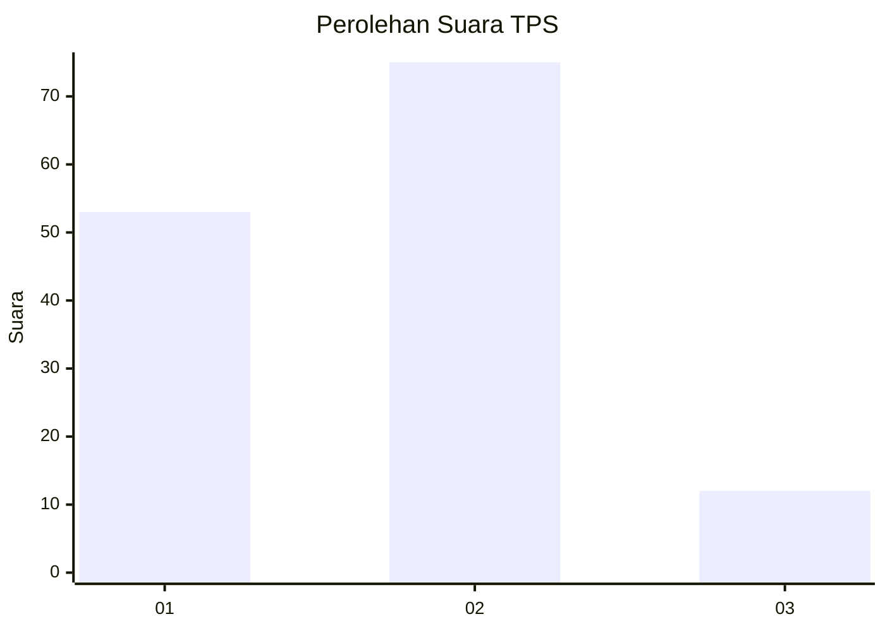

# Hasil

## Grafik

## Tabel

| No. | Nama Paslon    | Suara | Suara (raw) | Persentase |
|:--- |:-------------- | -----:| -----------:| ----------:|
| 1   | ANIES MUHAIMIN | 53    | [53][p-1]   | 37,86      |
| 2   | PRABOWO GIBRAN | 75    | [75][p-2]   | 53,57      |
| 3   | GANJAR MAHFUD  | 12    | [12][p-3]   | 8,57       |

[p-1]: https://github.com/gigit-pemilu/pemilu-2024-11-aceh/blob/main/pilpres/hitung-suara/sub/11-aceh/sub/10-aceh-singkil/sub/11-danau-paris/sub/2006-sintuban-makmur/sub/006-tps/sub/paslon-1.txt
[p-2]: https://github.com/gigit-pemilu/pemilu-2024-11-aceh/blob/main/pilpres/hitung-suara/sub/11-aceh/sub/10-aceh-singkil/sub/11-danau-paris/sub/2006-sintuban-makmur/sub/006-tps/sub/paslon-2.txt
[p-3]: https://github.com/gigit-pemilu/pemilu-2024-11-aceh/blob/main/pilpres/hitung-suara/sub/11-aceh/sub/10-aceh-singkil/sub/11-danau-paris/sub/2006-sintuban-makmur/sub/006-tps/sub/paslon-3.txt

## Foto C Plano

https://sirekap-obj-formc.kpu.go.id/4b19/pemilu/ppwp/11/10/11/20/06/1110112006006-20240215-161600--d146df2d-12db-4d3a-aebd-e94c292cd959.jpg

https://sirekap-obj-formc.kpu.go.id/4b19/pemilu/ppwp/11/10/11/20/06/1110112006006-20240215-161634--868da1f4-0a47-4e87-8820-deaec704783e.jpg

https://sirekap-obj-formc.kpu.go.id/4b19/pemilu/ppwp/11/10/11/20/06/1110112006006-20240215-161702--bddf6b02-cdc8-478d-beb7-c33b93be6584.jpg

## Metadata

| Key        | Value               |
| ---------- | ------------------- |
| Time Stamp | 2024-02-16 12:51:22 |

