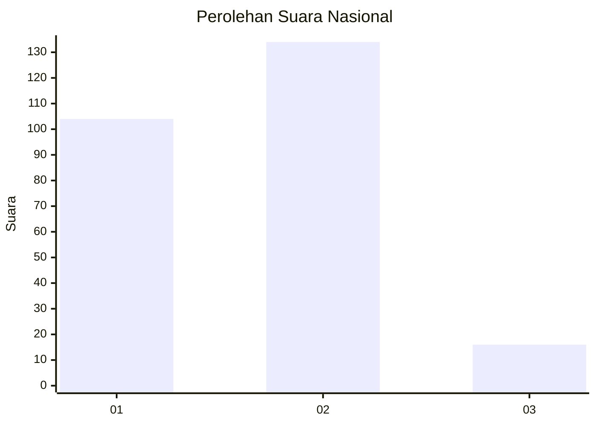

# Hasil

## Grafik

## Tabel

| No. | Nama Paslon    | Suara | Suara (raw) | Persentase |
|:--- |:-------------- | -----:| -----------:| ----------:|
| 1   | ANIES MUHAIMIN | 104   | [104][p-1]  | 40,94      |
| 2   | PRABOWO GIBRAN | 134   | [134][p-2]  | 52,76      |
| 3   | GANJAR MAHFUD  | 16    | [16][p-3]   | 6,30       |

[p-1]: https://github.com/gigit-pemilu/pemilu-2024/blob/main/pilpres/hitung-suara/sub/11-aceh/sub/10-aceh-singkil/sub/12-suro-makmur/sub/2001-suro-makmur/sub/001-tps/sub/paslon-1.txt
[p-2]: https://github.com/gigit-pemilu/pemilu-2024/blob/main/pilpres/hitung-suara/sub/11-aceh/sub/10-aceh-singkil/sub/12-suro-makmur/sub/2001-suro-makmur/sub/001-tps/sub/paslon-2.txt
[p-3]: https://github.com/gigit-pemilu/pemilu-2024/blob/main/pilpres/hitung-suara/sub/11-aceh/sub/10-aceh-singkil/sub/12-suro-makmur/sub/2001-suro-makmur/sub/001-tps/sub/paslon-3.txt

## Foto C Plano

https://sirekap-obj-formc.kpu.go.id/d3f8/pemilu/ppwp/11/10/12/20/01/1110122001001-20240218-115449--dbb7db2a-8098-4316-831f-3713fb2b24a3.jpg

https://sirekap-obj-formc.kpu.go.id/d3f8/pemilu/ppwp/11/10/12/20/01/1110122001001-20240218-121030--3bb77276-b77d-45c9-a183-d65eb6045df1.jpg

https://sirekap-obj-formc.kpu.go.id/d3f8/pemilu/ppwp/11/10/12/20/01/1110122001001-20240218-124356--184b8f02-bae9-40d7-b168-a5511b26e165.jpg

## Metadata

| Key        | Value               |
| ---------- | ------------------- |
| Time Stamp | 2024-02-19 06:16:00 |

## DATA PEMILIH TETAP

Jumlah pemilih dalam DPT: **280**.
 * L: **136**.
 * P: **144**.

## DATA PENGGUNA HAK PILIH

Jumlah pengguna hak pilih dalam DPT: **255**.
 * L: **127**.
 * P: **128**.

Jumlah pengguna hak pilih dalam DPTb: **2**.
 * L: **1**.
 * P: **1**.

Jumlah pengguna hak pilih dalam DPK: **4**.
 * L: **4**.
 * P: **0**.

Jumlah pengguna hak pilih: **261**.
 * L: **132**.
 * P: **129**.

## JUMLAH SUARA SAH DAN TIDAK SAH

JUMLAH SELURUH SUARA SAH: **254**.

JUMLAH SUARA TIDAK SAH: **7**.

JUMLAH SELURUH SUARA SAH DAN SUARA TIDAK SAH: **261**.

