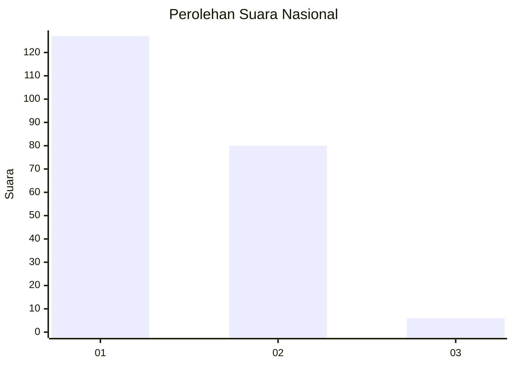
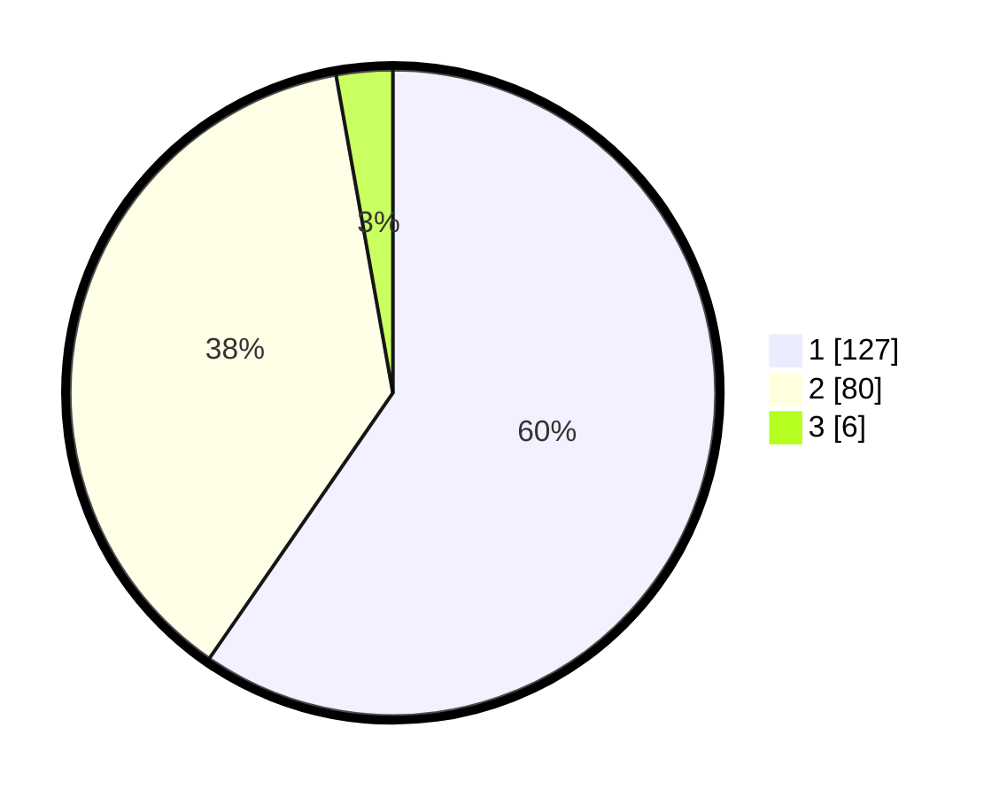

# Hasil

## Grafik

## Tabel

| No. | Nama Paslon    | Suara | Suara (raw) | Persentase |
|:--- |:-------------- | -----:| -----------:| ----------:|
| 1   | ANIES MUHAIMIN | 127   | [127][p-1]  | 59,62      |
| 2   | PRABOWO GIBRAN | 80    | [80][p-2]   | 37,56      |
| 3   | GANJAR MAHFUD  | 6     | [6][p-3]    | 2,82       |

[p-1]: https://github.com/gigit-pemilu/pemilu-2024/blob/main/pilpres/hitung-suara/sub/11-aceh/sub/10-aceh-singkil/sub/12-suro-makmur/sub/2002-pangkalan-sulampi/sub/001-tps/sub/paslon-1.txt
[p-2]: https://github.com/gigit-pemilu/pemilu-2024/blob/main/pilpres/hitung-suara/sub/11-aceh/sub/10-aceh-singkil/sub/12-suro-makmur/sub/2002-pangkalan-sulampi/sub/001-tps/sub/paslon-2.txt
[p-3]: https://github.com/gigit-pemilu/pemilu-2024/blob/main/pilpres/hitung-suara/sub/11-aceh/sub/10-aceh-singkil/sub/12-suro-makmur/sub/2002-pangkalan-sulampi/sub/001-tps/sub/paslon-3.txt

## Foto C Plano

https://sirekap-obj-formc.kpu.go.id/711a/pemilu/ppwp/11/10/12/20/02/1110122002001-20240219-095753--f8f5cde9-4be4-494a-8beb-af1450457e84.jpg

https://sirekap-obj-formc.kpu.go.id/711a/pemilu/ppwp/11/10/12/20/02/1110122002001-20240219-095941--fe63ddba-52b4-4e6c-a0fb-63d2cd044998.jpg

https://sirekap-obj-formc.kpu.go.id/711a/pemilu/ppwp/11/10/12/20/02/1110122002001-20240219-100111--90960d3c-2623-4209-a759-5b704ad3b4f0.jpg

## Metadata

| Key        | Value               |
| ---------- | ------------------- |
| Time Stamp | 2024-02-19 11:00:00 |

## DATA PEMILIH TETAP

Jumlah pemilih dalam DPT: **235**.
 * L: **122**.
 * P: **113**.

## DATA PENGGUNA HAK PILIH

Jumlah pengguna hak pilih dalam DPT: **220**.
 * L: **113**.
 * P: **107**.

Jumlah pengguna hak pilih dalam DPTb: **0**.
 * L: **0**.
 * P: **0**.

Jumlah pengguna hak pilih dalam DPK: **0**.
 * L: **0**.
 * P: **0**.

Jumlah pengguna hak pilih: **220**.
 * L: **113**.
 * P: **107**.

## JUMLAH SUARA SAH DAN TIDAK SAH

JUMLAH SELURUH SUARA SAH: **213**.

JUMLAH SUARA TIDAK SAH: **7**.

JUMLAH SELURUH SUARA SAH DAN SUARA TIDAK SAH: **220**.

