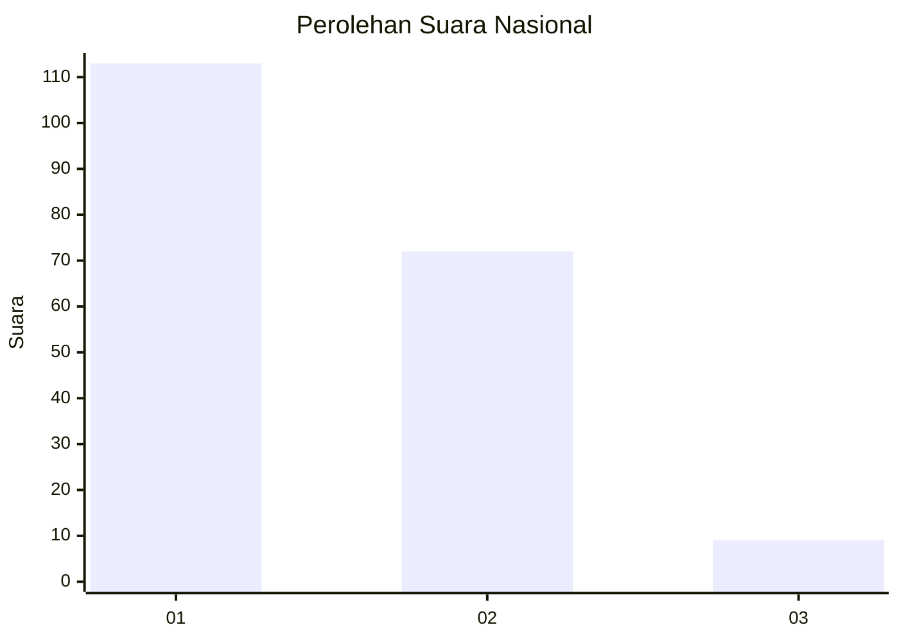
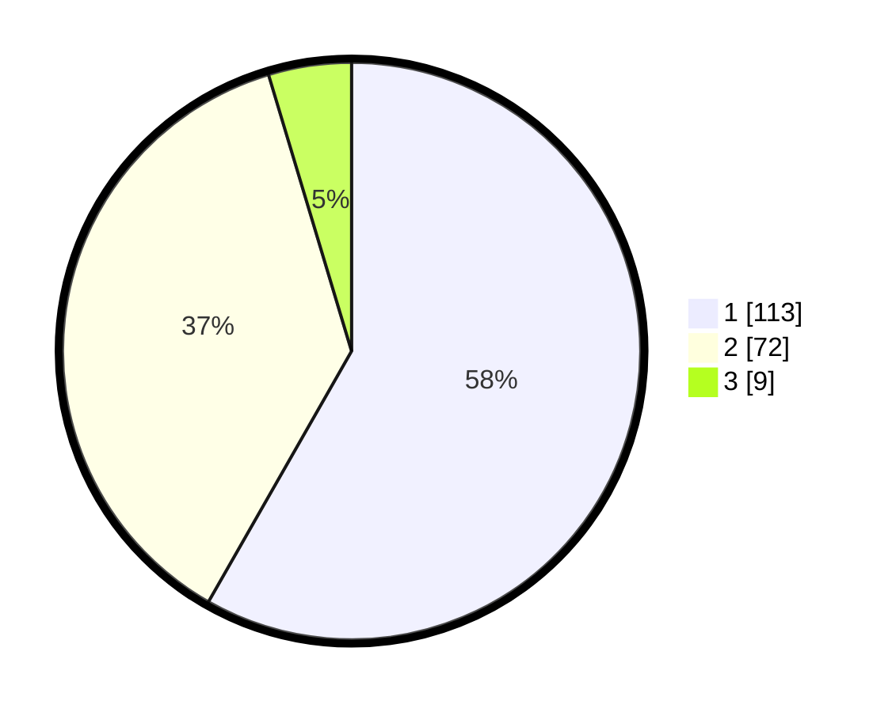

# Hasil

## Grafik

## Tabel

| No. | Nama Paslon    | Suara | Suara (raw) | Persentase |
|:--- |:-------------- | -----:| -----------:| ----------:|
| 1   | ANIES MUHAIMIN | 113   | [113][p-1]  | 58,25      |
| 2   | PRABOWO GIBRAN | 72    | [72][p-2]   | 37,11      |
| 3   | GANJAR MAHFUD  | 9     | [9][p-3]    | 4,64       |

[p-1]: https://github.com/gigit-pemilu/pemilu-2024/blob/main/pilpres/hitung-suara/sub/11-aceh/sub/10-aceh-singkil/sub/12-suro-makmur/sub/2002-pangkalan-sulampi/sub/002-tps/sub/paslon-1.txt
[p-2]: https://github.com/gigit-pemilu/pemilu-2024/blob/main/pilpres/hitung-suara/sub/11-aceh/sub/10-aceh-singkil/sub/12-suro-makmur/sub/2002-pangkalan-sulampi/sub/002-tps/sub/paslon-2.txt
[p-3]: https://github.com/gigit-pemilu/pemilu-2024/blob/main/pilpres/hitung-suara/sub/11-aceh/sub/10-aceh-singkil/sub/12-suro-makmur/sub/2002-pangkalan-sulampi/sub/002-tps/sub/paslon-3.txt

## Foto C Plano

https://sirekap-obj-formc.kpu.go.id/0542/pemilu/ppwp/11/10/12/20/02/1110122002002-20240219-120446--1a17462b-e00d-4df6-b7ce-a71dc3445342.jpg

https://sirekap-obj-formc.kpu.go.id/0542/pemilu/ppwp/11/10/12/20/02/1110122002002-20240219-120800--5396addb-d602-45ff-b8f2-2246161ad65f.jpg

https://sirekap-obj-formc.kpu.go.id/0542/pemilu/ppwp/11/10/12/20/02/1110122002002-20240219-120928--bc4cda27-bf6c-4bfa-8960-64c34ef943e2.jpg

## Metadata

| Key        | Value               |
| ---------- | ------------------- |
| Time Stamp | 2024-02-19 13:00:00 |

## DATA PEMILIH TETAP

Jumlah pemilih dalam DPT: **209**.
 * L: **99**.
 * P: **110**.

## DATA PENGGUNA HAK PILIH

Jumlah pengguna hak pilih dalam DPT: **193**.
 * L: **93**.
 * P: **100**.

Jumlah pengguna hak pilih dalam DPTb: **0**.
 * L: **0**.
 * P: **0**.

Jumlah pengguna hak pilih dalam DPK: **6**.
 * L: **2**.
 * P: **4**.

Jumlah pengguna hak pilih: **199**.
 * L: **95**.
 * P: **104**.

## JUMLAH SUARA SAH DAN TIDAK SAH

JUMLAH SELURUH SUARA SAH: **194**.

JUMLAH SUARA TIDAK SAH: **5**.

JUMLAH SELURUH SUARA SAH DAN SUARA TIDAK SAH: **199**.

