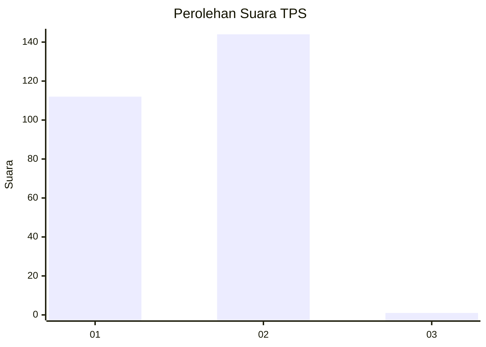
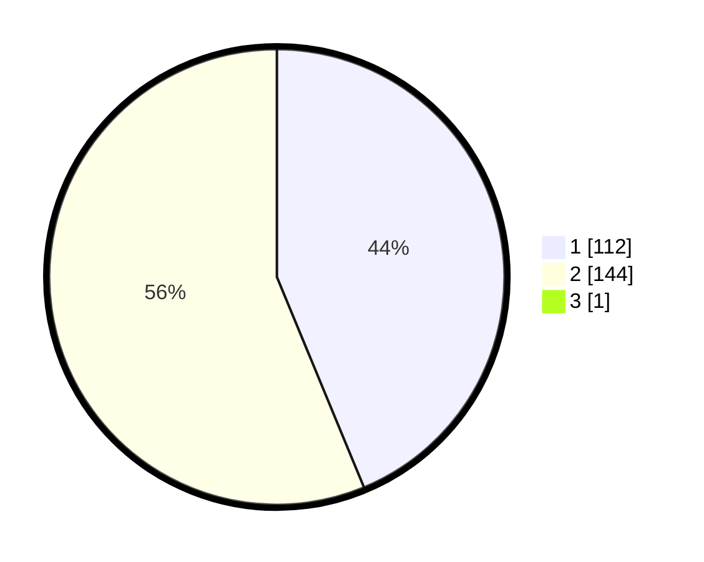

# Hasil

## Grafik

## Tabel

| No. | Nama Paslon    | Suara | Suara (raw) | Persentase |
|:--- |:-------------- | -----:| -----------:| ----------:|
| 1   | ANIES MUHAIMIN | 112   | [112][p-1]  | 43,58      |
| 2   | PRABOWO GIBRAN | 144   | [144][p-2]  | 56,03      |
| 3   | GANJAR MAHFUD  | 1     | [1][p-3]    | 0,39       |

[p-1]: https://github.com/gigit-pemilu/pemilu-2024-11-aceh/blob/main/pilpres/hitung-suara/sub/11-aceh/sub/10-aceh-singkil/sub/12-suro-makmur/sub/2004-lae-bangun/sub/001-tps/sub/paslon-1.txt
[p-2]: https://github.com/gigit-pemilu/pemilu-2024-11-aceh/blob/main/pilpres/hitung-suara/sub/11-aceh/sub/10-aceh-singkil/sub/12-suro-makmur/sub/2004-lae-bangun/sub/001-tps/sub/paslon-2.txt
[p-3]: https://github.com/gigit-pemilu/pemilu-2024-11-aceh/blob/main/pilpres/hitung-suara/sub/11-aceh/sub/10-aceh-singkil/sub/12-suro-makmur/sub/2004-lae-bangun/sub/001-tps/sub/paslon-3.txt

## Foto C Plano

https://sirekap-obj-formc.kpu.go.id/b709/pemilu/ppwp/11/10/12/20/04/1110122004001-20240220-142531--89f39a25-611d-4d5c-be23-048c1ea8dbb3.jpg

https://sirekap-obj-formc.kpu.go.id/b709/pemilu/ppwp/11/10/12/20/04/1110122004001-20240220-144537--6a4e7077-4298-40f8-a564-922ec45ecfd5.jpg

https://sirekap-obj-formc.kpu.go.id/b709/pemilu/ppwp/11/10/12/20/04/1110122004001-20240220-144734--9e2f9732-7d09-4767-b46b-0bc913dc777f.jpg

## Metadata

| Key        | Value               |
| ---------- | ------------------- |
| Time Stamp | 2024-02-20 15:00:00 |

