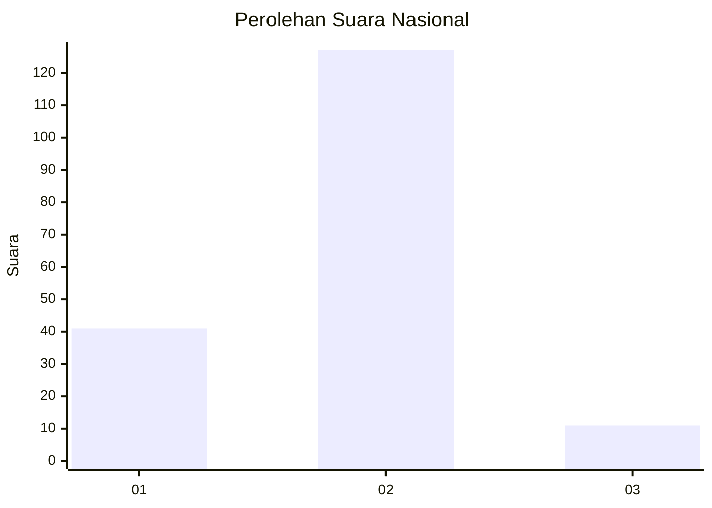

# Hasil

## Grafik

## Tabel

| No. | Nama Paslon    | Suara | Suara (raw) | Persentase |
|:--- |:-------------- | -----:| -----------:| ----------:|
| 1   | ANIES MUHAIMIN | 41    | [41][p-1]   | 22,91      |
| 2   | PRABOWO GIBRAN | 127   | [127][p-2]  | 70,95      |
| 3   | GANJAR MAHFUD  | 11    | [11][p-3]   | 6,15       |

[p-1]: https://github.com/gigit-pemilu/pemilu-2024/blob/main/pilpres/hitung-suara/sub/11-aceh/sub/10-aceh-singkil/sub/12-suro-makmur/sub/2009-mandumpang/sub/003-tps/sub/paslon-1.txt
[p-2]: https://github.com/gigit-pemilu/pemilu-2024/blob/main/pilpres/hitung-suara/sub/11-aceh/sub/10-aceh-singkil/sub/12-suro-makmur/sub/2009-mandumpang/sub/003-tps/sub/paslon-2.txt
[p-3]: https://github.com/gigit-pemilu/pemilu-2024/blob/main/pilpres/hitung-suara/sub/11-aceh/sub/10-aceh-singkil/sub/12-suro-makmur/sub/2009-mandumpang/sub/003-tps/sub/paslon-3.txt

## Foto C Plano

https://sirekap-obj-formc.kpu.go.id/aa20/pemilu/ppwp/11/10/12/20/09/1110122009003-20240215-071356--3e411186-afca-41f7-86f5-01ebd4ece9d0.jpg

https://sirekap-obj-formc.kpu.go.id/aa20/pemilu/ppwp/11/10/12/20/09/1110122009003-20240220-210947--ed6ca621-d209-4ca8-9ebf-c77e27659289.jpg

https://sirekap-obj-formc.kpu.go.id/aa20/pemilu/ppwp/11/10/12/20/09/1110122009003-20240215-071604--2f559c58-0914-4073-a747-13be28f053cb.jpg

## Metadata

| Key        | Value               |
| ---------- | ------------------- |
| Time Stamp | 2024-02-24 22:31:28 |

