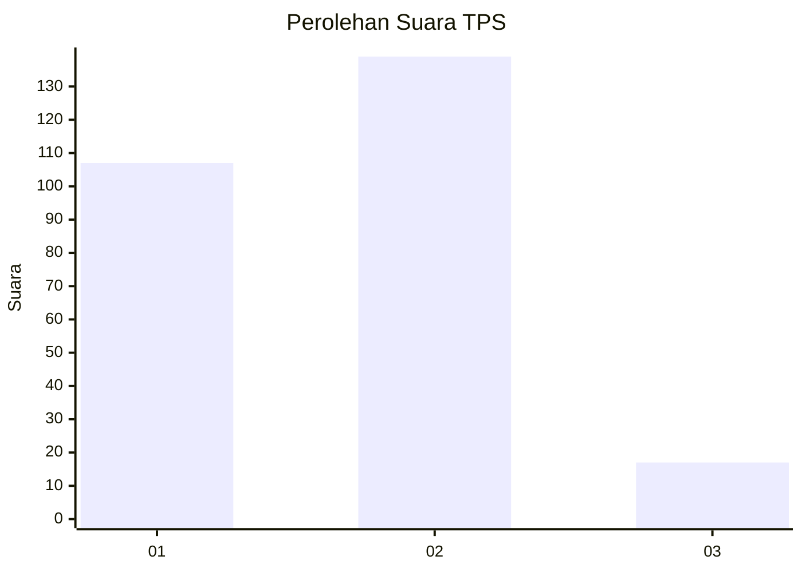

# Hasil

## Grafik

## Tabel

| No. | Nama Paslon    | Suara | Suara (raw) | Persentase |
|:--- |:-------------- | -----:| -----------:| ----------:|
| 1   | ANIES MUHAIMIN | 107   | [107][p-1]  | 40,68      |
| 2   | PRABOWO GIBRAN | 139   | [139][p-2]  | 52,85      |
| 3   | GANJAR MAHFUD  | 17    | [17][p-3]   | 6,46       |

[p-1]: https://github.com/gigit-pemilu/pemilu-2024-11-aceh/blob/main/pilpres/hitung-suara/sub/11-aceh/sub/10-aceh-singkil/sub/13-singkohor/sub/2001-singkohor/sub/002-tps/sub/paslon-1.txt
[p-2]: https://github.com/gigit-pemilu/pemilu-2024-11-aceh/blob/main/pilpres/hitung-suara/sub/11-aceh/sub/10-aceh-singkil/sub/13-singkohor/sub/2001-singkohor/sub/002-tps/sub/paslon-2.txt
[p-3]: https://github.com/gigit-pemilu/pemilu-2024-11-aceh/blob/main/pilpres/hitung-suara/sub/11-aceh/sub/10-aceh-singkil/sub/13-singkohor/sub/2001-singkohor/sub/002-tps/sub/paslon-3.txt

## Foto C Plano

https://sirekap-obj-formc.kpu.go.id/97ac/pemilu/ppwp/11/10/13/20/01/1110132001002-20240217-202952--bebff56b-02ed-4c46-82ad-19e38fd13452.jpg

https://sirekap-obj-formc.kpu.go.id/97ac/pemilu/ppwp/11/10/13/20/01/1110132001002-20240217-203053--08073b15-ce0f-483e-b922-b00c9beff635.jpg

https://sirekap-obj-formc.kpu.go.id/97ac/pemilu/ppwp/11/10/13/20/01/1110132001002-20240217-203203--4f2010fc-5108-480c-859a-01618da6ffab.jpg

## Metadata

| Key        | Value               |
| ---------- | ------------------- |
| Time Stamp | 2024-02-19 06:16:00 |

## DATA PEMILIH TETAP

Jumlah pemilih dalam DPT: **295**.
 * L: **138**.
 * P: **157**.

## DATA PENGGUNA HAK PILIH

Jumlah pengguna hak pilih dalam DPT: **261**.
 * L: **121**.
 * P: **140**.

Jumlah pengguna hak pilih dalam DPTb: **0**.
 * L: **0**.
 * P: **0**.

Jumlah pengguna hak pilih dalam DPK: **9**.
 * L: **3**.
 * P: **6**.

Jumlah pengguna hak pilih: **270**.
 * L: **124**.
 * P: **146**.

## JUMLAH SUARA SAH DAN TIDAK SAH

JUMLAH SELURUH SUARA SAH: **263**.

JUMLAH SUARA TIDAK SAH: **7**.

JUMLAH SELURUH SUARA SAH DAN SUARA TIDAK SAH: **270**.

