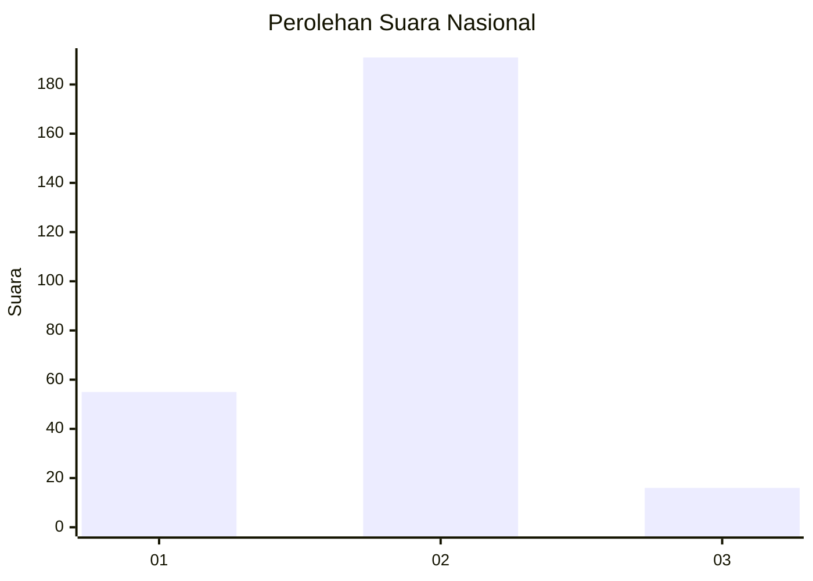

# Hasil

## Grafik

## Tabel

| No. | Nama Paslon    | Suara | Suara (raw) | Persentase |
|:--- |:-------------- | -----:| -----------:| ----------:|
| 1   | ANIES MUHAIMIN | 55    | [55][p-1]   | 20,99      |
| 2   | PRABOWO GIBRAN | 191   | [191][p-2]  | 72,90      |
| 3   | GANJAR MAHFUD  | 16    | [16][p-3]   | 6,11       |

[p-1]: https://github.com/gigit-pemilu/pemilu-2024/blob/main/pilpres/hitung-suara/sub/11-aceh/sub/10-aceh-singkil/sub/13-singkohor/sub/2001-singkohor/sub/003-tps/sub/paslon-1.txt
[p-2]: https://github.com/gigit-pemilu/pemilu-2024/blob/main/pilpres/hitung-suara/sub/11-aceh/sub/10-aceh-singkil/sub/13-singkohor/sub/2001-singkohor/sub/003-tps/sub/paslon-2.txt
[p-3]: https://github.com/gigit-pemilu/pemilu-2024/blob/main/pilpres/hitung-suara/sub/11-aceh/sub/10-aceh-singkil/sub/13-singkohor/sub/2001-singkohor/sub/003-tps/sub/paslon-3.txt

## Foto C Plano

https://sirekap-obj-formc.kpu.go.id/a0bc/pemilu/ppwp/11/10/13/20/01/1110132001003-20240217-111026--ea91fb97-bea3-4330-a05e-fb684ec71700.jpg

https://sirekap-obj-formc.kpu.go.id/a0bc/pemilu/ppwp/11/10/13/20/01/1110132001003-20240216-180555--0161aa98-7acc-4b32-8ea5-41fef0717e75.jpg

https://sirekap-obj-formc.kpu.go.id/a0bc/pemilu/ppwp/11/10/13/20/01/1110132001003-20240217-112104--c2ea847b-0f97-4481-b687-33938ed3f83a.jpg

## Metadata

| Key        | Value               |
| ---------- | ------------------- |
| Time Stamp | 2024-02-19 06:16:00 |

## DATA PEMILIH TETAP

Jumlah pemilih dalam DPT: **294**.
 * L: **139**.
 * P: **155**.

## DATA PENGGUNA HAK PILIH

Jumlah pengguna hak pilih dalam DPT: **265**.
 * L: **128**.
 * P: **137**.

Jumlah pengguna hak pilih dalam DPTb: **3**.
 * L: **2**.
 * P: **1**.

Jumlah pengguna hak pilih dalam DPK: **4**.
 * L: **2**.
 * P: **2**.

Jumlah pengguna hak pilih: **272**.
 * L: **132**.
 * P: **140**.

## JUMLAH SUARA SAH DAN TIDAK SAH

JUMLAH SELURUH SUARA SAH: **262**.

JUMLAH SUARA TIDAK SAH: **9**.

JUMLAH SELURUH SUARA SAH DAN SUARA TIDAK SAH: **271**.

