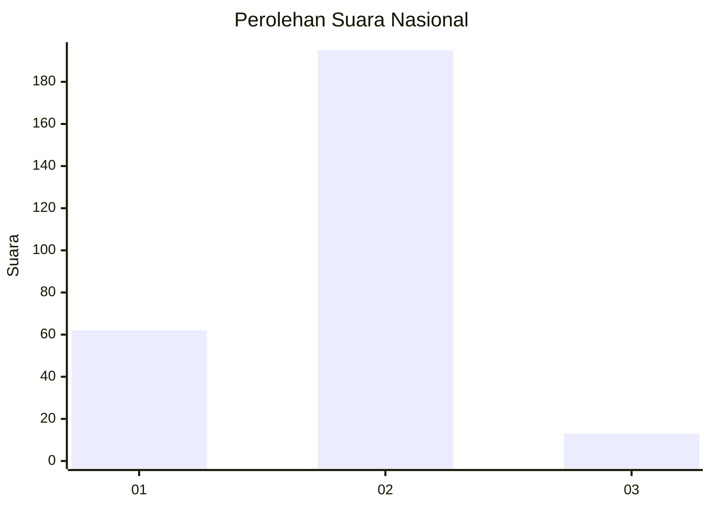
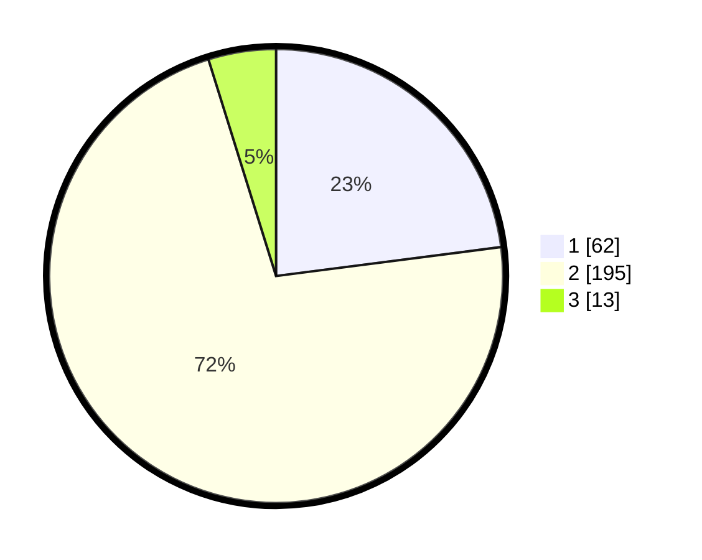

# Hasil

## Grafik

## Tabel

| No. | Nama Paslon    | Suara | Suara (raw) | Persentase |
|:--- |:-------------- | -----:| -----------:| ----------:|
| 1   | ANIES MUHAIMIN | 62    | [62][p-1]   | 22,96      |
| 2   | PRABOWO GIBRAN | 195   | [195][p-2]  | 72,22      |
| 3   | GANJAR MAHFUD  | 13    | [13][p-3]   | 4,81       |

[p-1]: https://github.com/gigit-pemilu/pemilu-2024/blob/main/pilpres/hitung-suara/sub/11-aceh/sub/10-aceh-singkil/sub/13-singkohor/sub/2001-singkohor/sub/004-tps/sub/paslon-1.txt
[p-2]: https://github.com/gigit-pemilu/pemilu-2024/blob/main/pilpres/hitung-suara/sub/11-aceh/sub/10-aceh-singkil/sub/13-singkohor/sub/2001-singkohor/sub/004-tps/sub/paslon-2.txt
[p-3]: https://github.com/gigit-pemilu/pemilu-2024/blob/main/pilpres/hitung-suara/sub/11-aceh/sub/10-aceh-singkil/sub/13-singkohor/sub/2001-singkohor/sub/004-tps/sub/paslon-3.txt

## Foto C Plano

https://sirekap-obj-formc.kpu.go.id/9e8e/pemilu/ppwp/11/10/13/20/01/1110132001004-20240216-221950--03090f42-ef62-4865-bb46-6c9f464975a1.jpg

https://sirekap-obj-formc.kpu.go.id/9e8e/pemilu/ppwp/11/10/13/20/01/1110132001004-20240216-232948--f56ca029-32a0-4eb4-9550-227ac3904209.jpg

https://sirekap-obj-formc.kpu.go.id/9e8e/pemilu/ppwp/11/10/13/20/01/1110132001004-20240216-214033--e9747408-6afc-4fa7-affd-55681d739805.jpg

## Metadata

| Key        | Value               |
| ---------- | ------------------- |
| Time Stamp | 2024-02-17 09:00:02 |

## DATA PEMILIH TETAP

Jumlah pemilih dalam DPT: **297**.
 * L: **144**.
 * P: **153**.

## DATA PENGGUNA HAK PILIH

Jumlah pengguna hak pilih dalam DPT: **269**.
 * L: **131**.
 * P: **138**.

Jumlah pengguna hak pilih dalam DPTb: **5**.
 * L: **3**.
 * P: **2**.

Jumlah pengguna hak pilih dalam DPK: **0**.
 * L: **0**.
 * P: **0**.

Jumlah pengguna hak pilih: **274**.
 * L: **134**.
 * P: **140**.

## JUMLAH SUARA SAH DAN TIDAK SAH

JUMLAH SELURUH SUARA SAH: **270**.

JUMLAH SUARA TIDAK SAH: **4**.

JUMLAH SELURUH SUARA SAH DAN SUARA TIDAK SAH: **274**.

