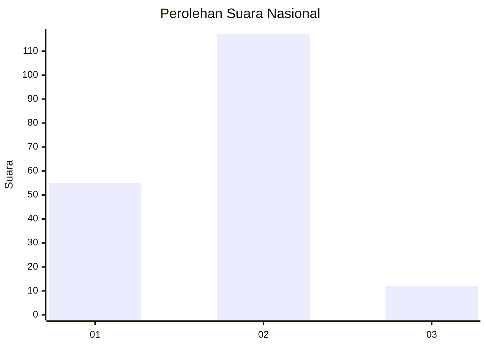
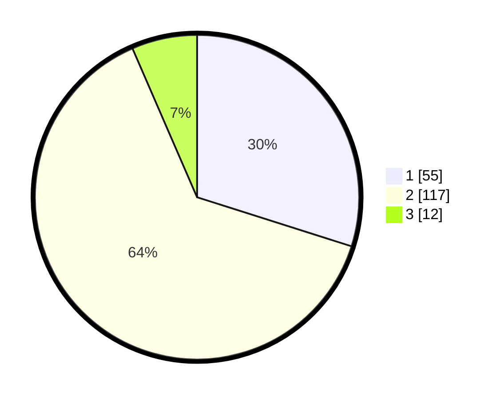

# Hasil

## Grafik

## Tabel

| No. | Nama Paslon    | Suara | Suara (raw) | Persentase |
|:--- |:-------------- | -----:| -----------:| ----------:|
| 1   | ANIES MUHAIMIN | 55    | [55][p-1]   | 29,89      |
| 2   | PRABOWO GIBRAN | 117   | [117][p-2]  | 63,59      |
| 3   | GANJAR MAHFUD  | 12    | [12][p-3]   | 6,52       |

[p-1]: https://github.com/gigit-pemilu/pemilu-2024/blob/main/pilpres/hitung-suara/sub/11-aceh/sub/10-aceh-singkil/sub/13-singkohor/sub/2001-singkohor/sub/005-tps/sub/paslon-1.txt
[p-2]: https://github.com/gigit-pemilu/pemilu-2024/blob/main/pilpres/hitung-suara/sub/11-aceh/sub/10-aceh-singkil/sub/13-singkohor/sub/2001-singkohor/sub/005-tps/sub/paslon-2.txt
[p-3]: https://github.com/gigit-pemilu/pemilu-2024/blob/main/pilpres/hitung-suara/sub/11-aceh/sub/10-aceh-singkil/sub/13-singkohor/sub/2001-singkohor/sub/005-tps/sub/paslon-3.txt

## Foto C Plano

https://sirekap-obj-formc.kpu.go.id/a31d/pemilu/ppwp/11/10/13/20/01/1110132001005-20240216-093959--8e1355b4-5c83-4827-bfb4-d3bb7f979e00.jpg

https://sirekap-obj-formc.kpu.go.id/a31d/pemilu/ppwp/11/10/13/20/01/1110132001005-20240218-084737--e0bb6129-745c-470c-aa54-39b3f3599cf4.jpg

https://sirekap-obj-formc.kpu.go.id/a31d/pemilu/ppwp/11/10/13/20/01/1110132001005-20240216-093113--7809da4a-f540-44c7-90cd-06fc67eb5f09.jpg

## Metadata

| Key        | Value               |
| ---------- | ------------------- |
| Time Stamp | 2024-02-19 06:16:00 |

## DATA PEMILIH TETAP

Jumlah pemilih dalam DPT: **220**.
 * L: **112**.
 * P: **108**.

## DATA PENGGUNA HAK PILIH

Jumlah pengguna hak pilih dalam DPT: **187**.
 * L: **100**.
 * P: **87**.

Jumlah pengguna hak pilih dalam DPTb: **4**.
 * L: **2**.
 * P: **2**.

Jumlah pengguna hak pilih dalam DPK: **5**.
 * L: **3**.
 * P: **2**.

Jumlah pengguna hak pilih: **196**.
 * L: **105**.
 * P: **91**.

## JUMLAH SUARA SAH DAN TIDAK SAH

JUMLAH SELURUH SUARA SAH: **184**.

JUMLAH SUARA TIDAK SAH: **12**.

JUMLAH SELURUH SUARA SAH DAN SUARA TIDAK SAH: **196**.

