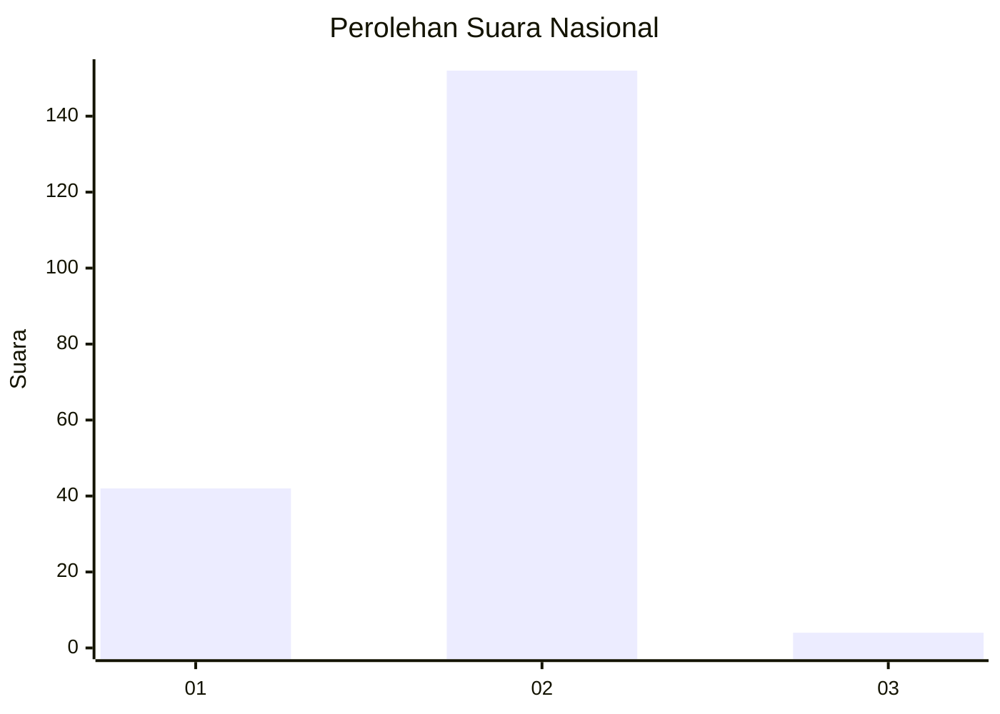
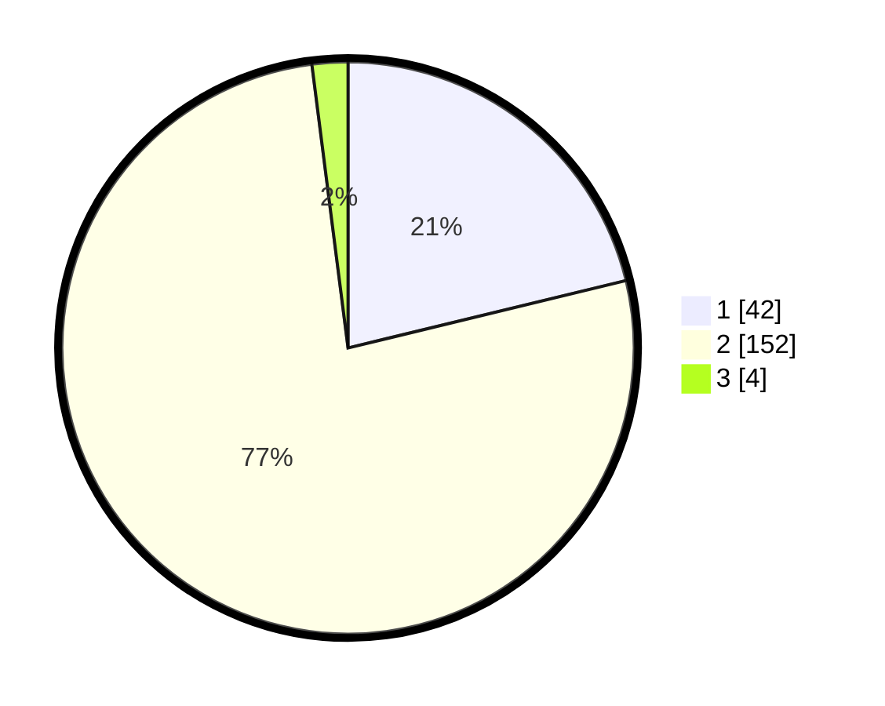

# Hasil

## Grafik

## Tabel

| No. | Nama Paslon    | Suara | Suara (raw) | Persentase |
|:--- |:-------------- | -----:| -----------:| ----------:|
| 1   | ANIES MUHAIMIN | 42    | [42][p-1]   | 21,21      |
| 2   | PRABOWO GIBRAN | 152   | [152][p-2]  | 76,77      |
| 3   | GANJAR MAHFUD  | 4     | [4][p-3]    | 2,02       |

[p-1]: https://github.com/gigit-pemilu/pemilu-2024/blob/main/pilpres/hitung-suara/sub/11-aceh/sub/10-aceh-singkil/sub/13-singkohor/sub/2002-lae-sipola/sub/001-tps/sub/paslon-1.txt
[p-2]: https://github.com/gigit-pemilu/pemilu-2024/blob/main/pilpres/hitung-suara/sub/11-aceh/sub/10-aceh-singkil/sub/13-singkohor/sub/2002-lae-sipola/sub/001-tps/sub/paslon-2.txt
[p-3]: https://github.com/gigit-pemilu/pemilu-2024/blob/main/pilpres/hitung-suara/sub/11-aceh/sub/10-aceh-singkil/sub/13-singkohor/sub/2002-lae-sipola/sub/001-tps/sub/paslon-3.txt

## Foto C Plano

https://sirekap-obj-formc.kpu.go.id/6fa3/pemilu/ppwp/11/10/13/20/02/1110132002001-20240218-174215--20214e5b-af92-478a-a07c-554475c918d0.jpg

https://sirekap-obj-formc.kpu.go.id/6fa3/pemilu/ppwp/11/10/13/20/02/1110132002001-20240218-080503--01800be1-3784-438d-b776-667511f15cd0.jpg

https://sirekap-obj-formc.kpu.go.id/6fa3/pemilu/ppwp/11/10/13/20/02/1110132002001-20240219-230605--e3ccb23c-c39e-4833-aace-3d535763664b.jpg

## Metadata

| Key        | Value               |
| ---------- | ------------------- |
| Time Stamp | 2024-02-21 09:00:00 |

