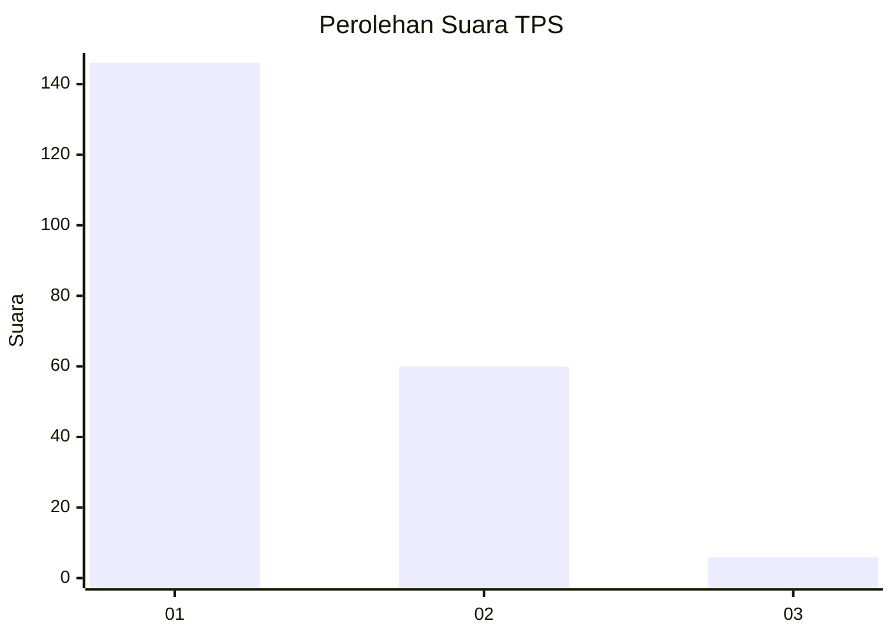
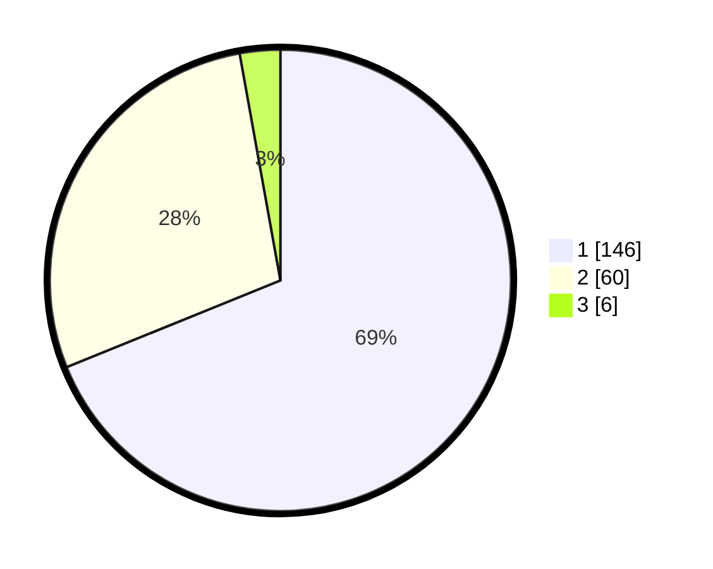

# Hasil

## Grafik

## Tabel

| No. | Nama Paslon    | Suara | Suara (raw) | Persentase |
|:--- |:-------------- | -----:| -----------:| ----------:|
| 1   | ANIES MUHAIMIN | 146   | [146][p-1]  | 68,87      |
| 2   | PRABOWO GIBRAN | 60    | [60][p-2]   | 28,30      |
| 3   | GANJAR MAHFUD  | 6     | [6][p-3]    | 2,83       |

[p-1]: https://github.com/gigit-pemilu/pemilu-2024-11-aceh/blob/main/pilpres/hitung-suara/sub/11-aceh/sub/10-aceh-singkil/sub/14-kuala-baru/sub/2001-kuala-baru-laut/sub/001-tps/sub/paslon-1.txt
[p-2]: https://github.com/gigit-pemilu/pemilu-2024-11-aceh/blob/main/pilpres/hitung-suara/sub/11-aceh/sub/10-aceh-singkil/sub/14-kuala-baru/sub/2001-kuala-baru-laut/sub/001-tps/sub/paslon-2.txt
[p-3]: https://github.com/gigit-pemilu/pemilu-2024-11-aceh/blob/main/pilpres/hitung-suara/sub/11-aceh/sub/10-aceh-singkil/sub/14-kuala-baru/sub/2001-kuala-baru-laut/sub/001-tps/sub/paslon-3.txt

## Foto C Plano

https://sirekap-obj-formc.kpu.go.id/8c1d/pemilu/ppwp/11/10/14/20/01/1110142001001-20240217-162207--85e89a35-8a59-47f0-9dab-863713aa6ba8.jpg

https://sirekap-obj-formc.kpu.go.id/8c1d/pemilu/ppwp/11/10/14/20/01/1110142001001-20240217-162416--995352a2-7315-4a40-9b54-3a41a665300b.jpg

https://sirekap-obj-formc.kpu.go.id/8c1d/pemilu/ppwp/11/10/14/20/01/1110142001001-20240217-162543--db1763d1-d0f5-42d8-94cc-849fce850ae3.jpg

## Metadata

| Key        | Value               |
| ---------- | ------------------- |
| Time Stamp | 2024-02-17 16:36:25 |

## DATA PEMILIH TETAP

Jumlah pemilih dalam DPT: **240**.
 * L: **113**.
 * P: **127**.

## DATA PENGGUNA HAK PILIH

Jumlah pengguna hak pilih dalam DPT: **217**.
 * L: **103**.
 * P: **114**.

Jumlah pengguna hak pilih dalam DPTb: **4**.
 * L: **2**.
 * P: **2**.

Jumlah pengguna hak pilih dalam DPK: **0**.
 * L: **0**.
 * P: **0**.

Jumlah pengguna hak pilih: **221**.
 * L: **105**.
 * P: **116**.

## JUMLAH SUARA SAH DAN TIDAK SAH

JUMLAH SELURUH SUARA SAH: **212**.

JUMLAH SUARA TIDAK SAH: **9**.

JUMLAH SELURUH SUARA SAH DAN SUARA TIDAK SAH: **221**.

