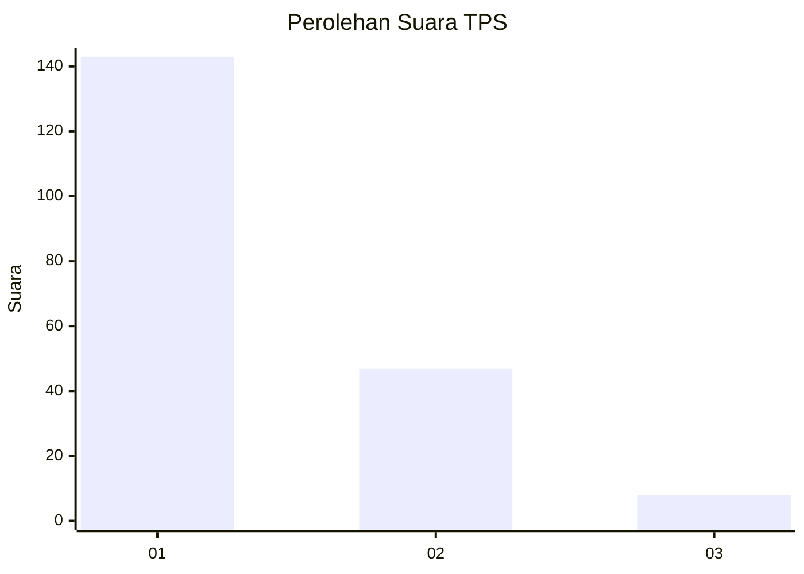
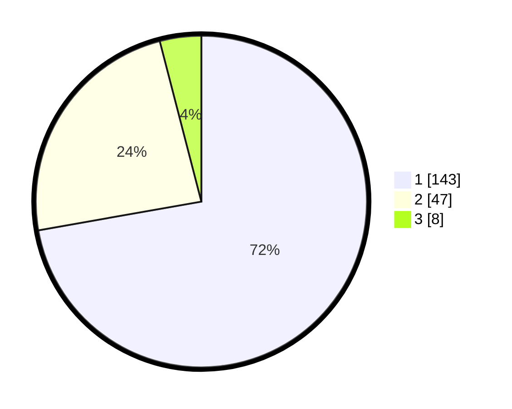

# Hasil

## Grafik

## Tabel

| No. | Nama Paslon    | Suara | Suara (raw) | Persentase |
|:--- |:-------------- | -----:| -----------:| ----------:|
| 1   | ANIES MUHAIMIN | 143   | [143][p-1]  | 72,22      |
| 2   | PRABOWO GIBRAN | 47    | [47][p-2]   | 23,74      |
| 3   | GANJAR MAHFUD  | 8     | [8][p-3]    | 4,04       |

[p-1]: https://github.com/gigit-pemilu/pemilu-2024-11-aceh/blob/main/pilpres/hitung-suara/sub/11-aceh/sub/10-aceh-singkil/sub/14-kuala-baru/sub/2001-kuala-baru-laut/sub/002-tps/sub/paslon-1.txt
[p-2]: https://github.com/gigit-pemilu/pemilu-2024-11-aceh/blob/main/pilpres/hitung-suara/sub/11-aceh/sub/10-aceh-singkil/sub/14-kuala-baru/sub/2001-kuala-baru-laut/sub/002-tps/sub/paslon-2.txt
[p-3]: https://github.com/gigit-pemilu/pemilu-2024-11-aceh/blob/main/pilpres/hitung-suara/sub/11-aceh/sub/10-aceh-singkil/sub/14-kuala-baru/sub/2001-kuala-baru-laut/sub/002-tps/sub/paslon-3.txt

## Foto C Plano

https://sirekap-obj-formc.kpu.go.id/8dce/pemilu/ppwp/11/10/14/20/01/1110142001002-20240217-165747--f4167936-bce3-4c8f-a9f1-fc4aa0755956.jpg

https://sirekap-obj-formc.kpu.go.id/8dce/pemilu/ppwp/11/10/14/20/01/1110142001002-20240217-170043--c537cdb1-c1b6-4676-ae1d-84aa92ed0140.jpg

https://sirekap-obj-formc.kpu.go.id/8dce/pemilu/ppwp/11/10/14/20/01/1110142001002-20240217-170232--12692158-81f6-4bf2-953c-8de75d56a442.jpg

## Metadata

| Key        | Value               |
| ---------- | ------------------- |
| Time Stamp | 2024-02-17 17:30:00 |

## DATA PEMILIH TETAP

Jumlah pemilih dalam DPT: **228**.
 * L: **114**.
 * P: **114**.

## DATA PENGGUNA HAK PILIH

Jumlah pengguna hak pilih dalam DPT: **200**.
 * L: **101**.
 * P: **99**.

Jumlah pengguna hak pilih dalam DPTb: **4**.
 * L: **3**.
 * P: **1**.

Jumlah pengguna hak pilih dalam DPK: **0**.
 * L: **0**.
 * P: **0**.

Jumlah pengguna hak pilih: **204**.
 * L: **104**.
 * P: **100**.

## JUMLAH SUARA SAH DAN TIDAK SAH

JUMLAH SELURUH SUARA SAH: **198**.

JUMLAH SUARA TIDAK SAH: **6**.

JUMLAH SELURUH SUARA SAH DAN SUARA TIDAK SAH: **204**.

