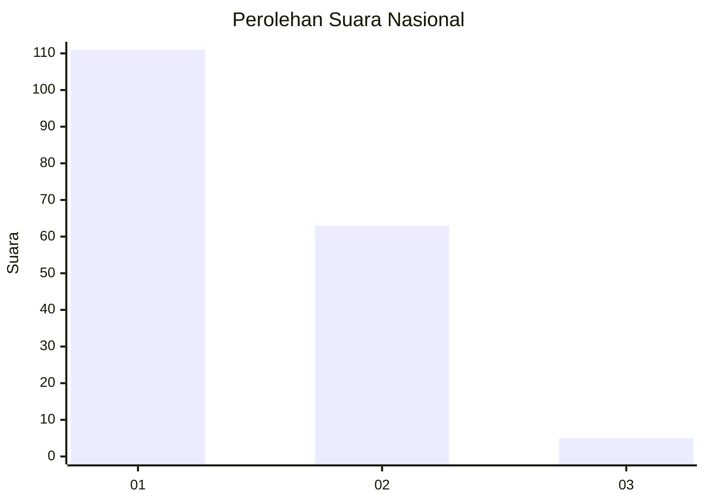
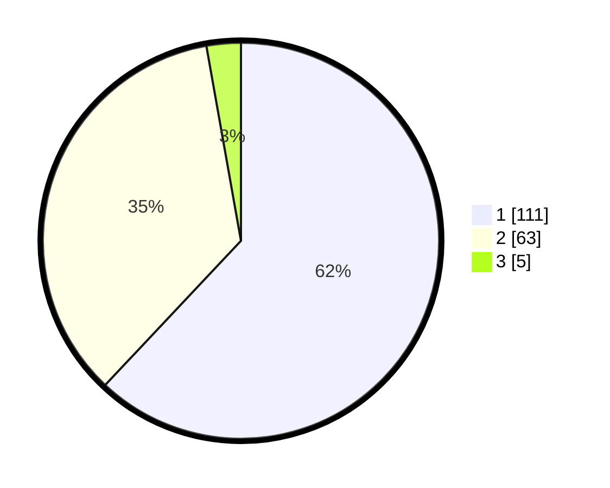

# Hasil

## Grafik

## Tabel

| No. | Nama Paslon    | Suara | Suara (raw) | Persentase |
|:--- |:-------------- | -----:| -----------:| ----------:|
| 1   | ANIES MUHAIMIN | 111   | [111][p-1]  | 62,01      |
| 2   | PRABOWO GIBRAN | 63    | [63][p-2]   | 35,20      |
| 3   | GANJAR MAHFUD  | 5     | [5][p-3]    | 2,79       |

[p-1]: https://github.com/gigit-pemilu/pemilu-2024/blob/main/pilpres/hitung-suara/sub/11-aceh/sub/10-aceh-singkil/sub/14-kuala-baru/sub/2001-kuala-baru-laut/sub/003-tps/sub/paslon-1.txt
[p-2]: https://github.com/gigit-pemilu/pemilu-2024/blob/main/pilpres/hitung-suara/sub/11-aceh/sub/10-aceh-singkil/sub/14-kuala-baru/sub/2001-kuala-baru-laut/sub/003-tps/sub/paslon-2.txt
[p-3]: https://github.com/gigit-pemilu/pemilu-2024/blob/main/pilpres/hitung-suara/sub/11-aceh/sub/10-aceh-singkil/sub/14-kuala-baru/sub/2001-kuala-baru-laut/sub/003-tps/sub/paslon-3.txt

## Foto C Plano

https://sirekap-obj-formc.kpu.go.id/94ab/pemilu/ppwp/11/10/14/20/01/1110142001003-20240214-155334--8d7076e8-6fe2-4e81-af75-cbd6d3445713.jpg

https://sirekap-obj-formc.kpu.go.id/94ab/pemilu/ppwp/11/10/14/20/01/1110142001003-20240217-172357--b57f7241-9001-4113-a8fc-153c2bda3806.jpg

https://sirekap-obj-formc.kpu.go.id/94ab/pemilu/ppwp/11/10/14/20/01/1110142001003-20240217-172521--199630e9-bad2-4be9-a9ac-e72419b329fa.jpg

## Metadata

| Key        | Value               |
| ---------- | ------------------- |
| Time Stamp | 2024-02-17 17:30:00 |

