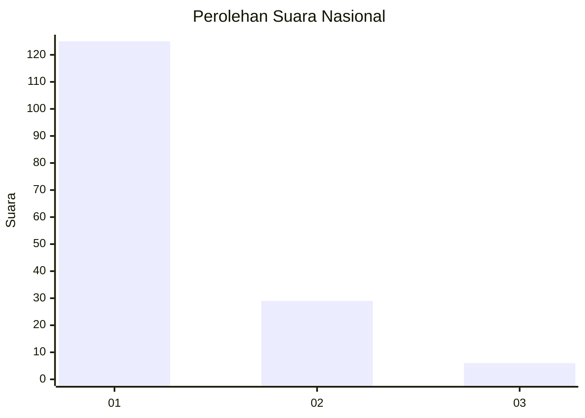
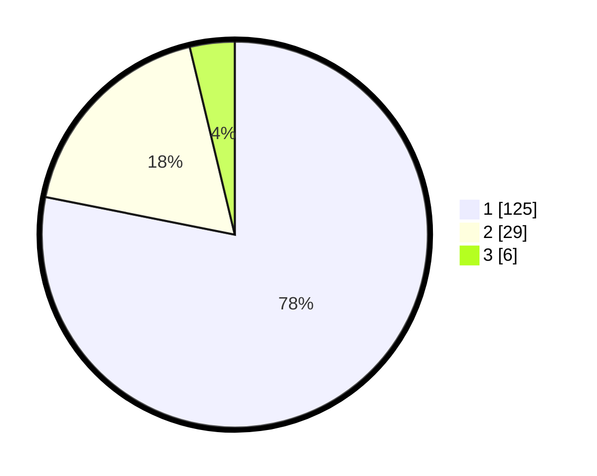

# Hasil

## Grafik

## Tabel

| No. | Nama Paslon    | Suara | Suara (raw) | Persentase |
|:--- |:-------------- | -----:| -----------:| ----------:|
| 1   | ANIES MUHAIMIN | 125   | [125][p-1]  | 78,13      |
| 2   | PRABOWO GIBRAN | 29    | [29][p-2]   | 18,13      |
| 3   | GANJAR MAHFUD  | 6     | [6][p-3]    | 3,75       |

[p-1]: https://github.com/gigit-pemilu/pemilu-2024/blob/main/pilpres/hitung-suara/sub/11-aceh/sub/10-aceh-singkil/sub/14-kuala-baru/sub/2002-kuala-baru-sungai/sub/001-tps/sub/paslon-1.txt
[p-2]: https://github.com/gigit-pemilu/pemilu-2024/blob/main/pilpres/hitung-suara/sub/11-aceh/sub/10-aceh-singkil/sub/14-kuala-baru/sub/2002-kuala-baru-sungai/sub/001-tps/sub/paslon-2.txt
[p-3]: https://github.com/gigit-pemilu/pemilu-2024/blob/main/pilpres/hitung-suara/sub/11-aceh/sub/10-aceh-singkil/sub/14-kuala-baru/sub/2002-kuala-baru-sungai/sub/001-tps/sub/paslon-3.txt

## Foto C Plano

https://sirekap-obj-formc.kpu.go.id/1cb7/pemilu/ppwp/11/10/14/20/02/1110142002001-20240217-175555--c5025b53-c8ec-4824-b83b-34fbc97462aa.jpg

https://sirekap-obj-formc.kpu.go.id/1cb7/pemilu/ppwp/11/10/14/20/02/1110142002001-20240217-175806--b139f201-5310-47df-b74c-8075e9309b84.jpg

https://sirekap-obj-formc.kpu.go.id/1cb7/pemilu/ppwp/11/10/14/20/02/1110142002001-20240217-175931--c217000b-753d-4aa4-a120-633306389ad8.jpg

## Metadata

| Key        | Value               |
| ---------- | ------------------- |
| Time Stamp | 2024-02-17 18:00:00 |

## DATA PEMILIH TETAP

Jumlah pemilih dalam DPT: **183**.
 * L: **88**.
 * P: **95**.

## DATA PENGGUNA HAK PILIH

Jumlah pengguna hak pilih dalam DPT: **159**.
 * L: **79**.
 * P: **80**.

Jumlah pengguna hak pilih dalam DPTb: **2**.
 * L: **1**.
 * P: **1**.

Jumlah pengguna hak pilih dalam DPK: **3**.
 * L: **3**.
 * P: **0**.

Jumlah pengguna hak pilih: **164**.
 * L: **83**.
 * P: **81**.

## JUMLAH SUARA SAH DAN TIDAK SAH

JUMLAH SELURUH SUARA SAH: **160**.

JUMLAH SUARA TIDAK SAH: **4**.

JUMLAH SELURUH SUARA SAH DAN SUARA TIDAK SAH: **164**.

