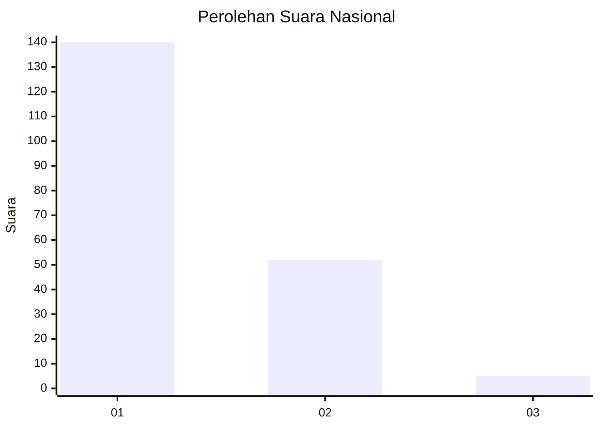
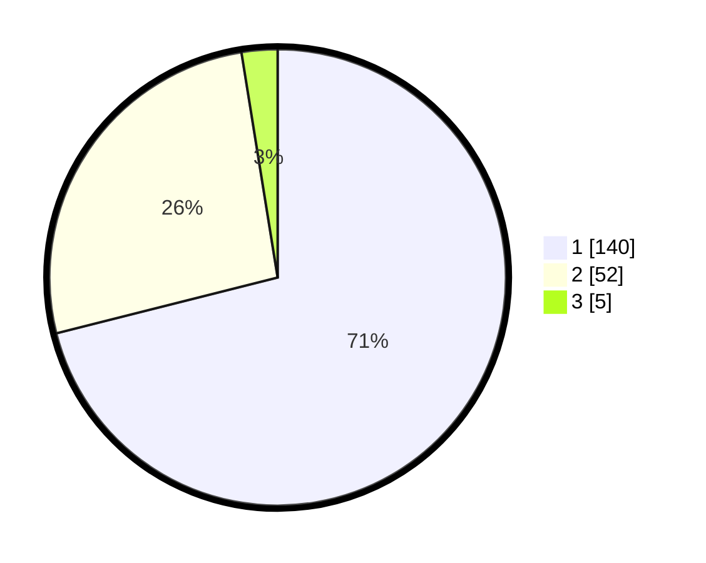

# Hasil

## Grafik

## Tabel

| No. | Nama Paslon    | Suara | Suara (raw) | Persentase |
|:--- |:-------------- | -----:| -----------:| ----------:|
| 1   | ANIES MUHAIMIN | 140   | [140][p-1]  | 71,07      |
| 2   | PRABOWO GIBRAN | 52    | [52][p-2]   | 26,40      |
| 3   | GANJAR MAHFUD  | 5     | [5][p-3]    | 2,54       |

[p-1]: https://github.com/gigit-pemilu/pemilu-2024/blob/main/pilpres/hitung-suara/sub/11-aceh/sub/10-aceh-singkil/sub/14-kuala-baru/sub/2002-kuala-baru-sungai/sub/002-tps/sub/paslon-1.txt
[p-2]: https://github.com/gigit-pemilu/pemilu-2024/blob/main/pilpres/hitung-suara/sub/11-aceh/sub/10-aceh-singkil/sub/14-kuala-baru/sub/2002-kuala-baru-sungai/sub/002-tps/sub/paslon-2.txt
[p-3]: https://github.com/gigit-pemilu/pemilu-2024/blob/main/pilpres/hitung-suara/sub/11-aceh/sub/10-aceh-singkil/sub/14-kuala-baru/sub/2002-kuala-baru-sungai/sub/002-tps/sub/paslon-3.txt

## Foto C Plano

https://sirekap-obj-formc.kpu.go.id/2ddf/pemilu/ppwp/11/10/14/20/02/1110142002002-20240218-072620--7d5ae6c9-4415-4e19-a1db-3fc34e58efad.jpg

https://sirekap-obj-formc.kpu.go.id/2ddf/pemilu/ppwp/11/10/14/20/02/1110142002002-20240217-181706--f0ba2c89-8192-4178-8d4a-493d8bd76e25.jpg

## Metadata

| Key        | Value               |
| ---------- | ------------------- |
| Time Stamp | 2024-02-24 22:31:28 |

