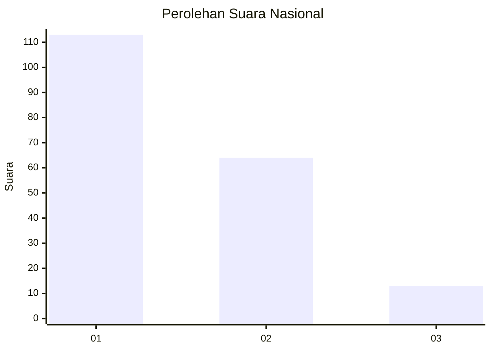
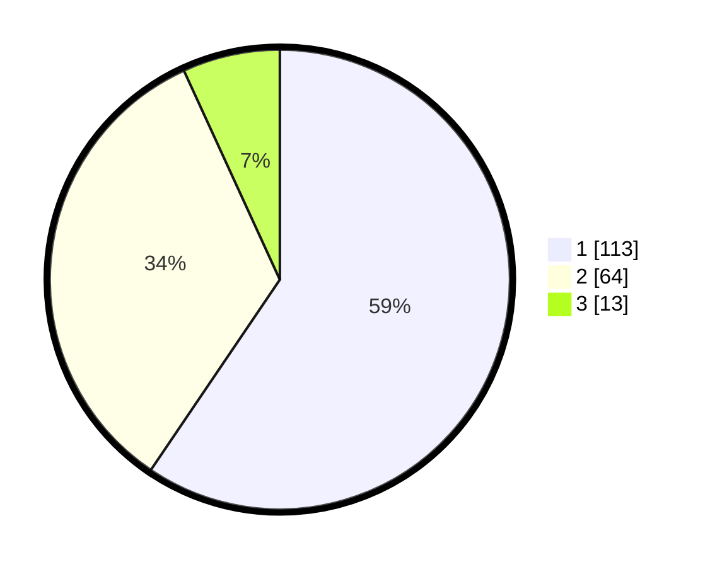

# Hasil

## Grafik

## Tabel

| No. | Nama Paslon    | Suara | Suara (raw) | Persentase |
|:--- |:-------------- | -----:| -----------:| ----------:|
| 1   | ANIES MUHAIMIN | 113   | [113][p-1]  | 59,47      |
| 2   | PRABOWO GIBRAN | 64    | [64][p-2]   | 33,68      |
| 3   | GANJAR MAHFUD  | 13    | [13][p-3]   | 6,84       |

[p-1]: https://github.com/gigit-pemilu/pemilu-2024/blob/main/pilpres/hitung-suara/sub/11-aceh/sub/10-aceh-singkil/sub/16-pulau-banyak-barat/sub/2001-haloban/sub/001-tps/sub/paslon-1.txt
[p-2]: https://github.com/gigit-pemilu/pemilu-2024/blob/main/pilpres/hitung-suara/sub/11-aceh/sub/10-aceh-singkil/sub/16-pulau-banyak-barat/sub/2001-haloban/sub/001-tps/sub/paslon-2.txt
[p-3]: https://github.com/gigit-pemilu/pemilu-2024/blob/main/pilpres/hitung-suara/sub/11-aceh/sub/10-aceh-singkil/sub/16-pulau-banyak-barat/sub/2001-haloban/sub/001-tps/sub/paslon-3.txt

## Foto C Plano

https://sirekap-obj-formc.kpu.go.id/3220/pemilu/ppwp/11/10/16/20/01/1110162001001-20240218-202510--9c8c3840-0e19-4e28-afc8-a14126f9d1ef.jpg

https://sirekap-obj-formc.kpu.go.id/3220/pemilu/ppwp/11/10/16/20/01/1110162001001-20240218-202539--ab92719c-aee4-421e-81d8-8d93628dbc28.jpg

https://sirekap-obj-formc.kpu.go.id/3220/pemilu/ppwp/11/10/16/20/01/1110162001001-20240218-202601--0e56b379-bfdc-4301-b1db-31918b8192ea.jpg

## Metadata

| Key        | Value               |
| ---------- | ------------------- |
| Time Stamp | 2024-02-19 06:16:00 |

## DATA PEMILIH TETAP

Jumlah pemilih dalam DPT: **243**.
 * L: **122**.
 * P: **121**.

## DATA PENGGUNA HAK PILIH

Jumlah pengguna hak pilih dalam DPT: **191**.
 * L: **96**.
 * P: **95**.

Jumlah pengguna hak pilih dalam DPTb: **4**.
 * L: **2**.
 * P: **2**.

Jumlah pengguna hak pilih dalam DPK: **3**.
 * L: **1**.
 * P: **2**.

Jumlah pengguna hak pilih: **198**.
 * L: **99**.
 * P: **99**.

## JUMLAH SUARA SAH DAN TIDAK SAH

JUMLAH SELURUH SUARA SAH: **190**.

JUMLAH SUARA TIDAK SAH: **8**.

JUMLAH SELURUH SUARA SAH DAN SUARA TIDAK SAH: **198**.

