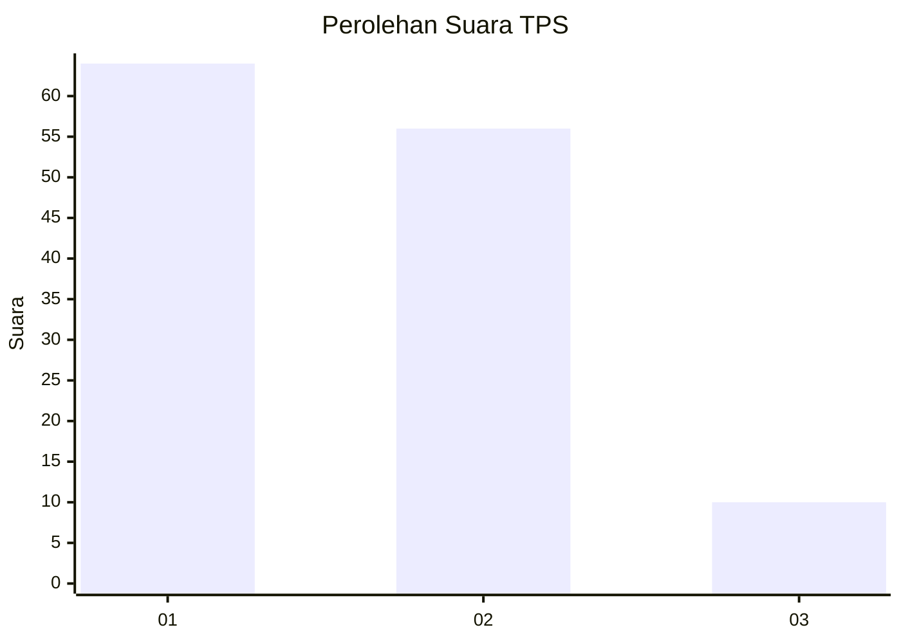
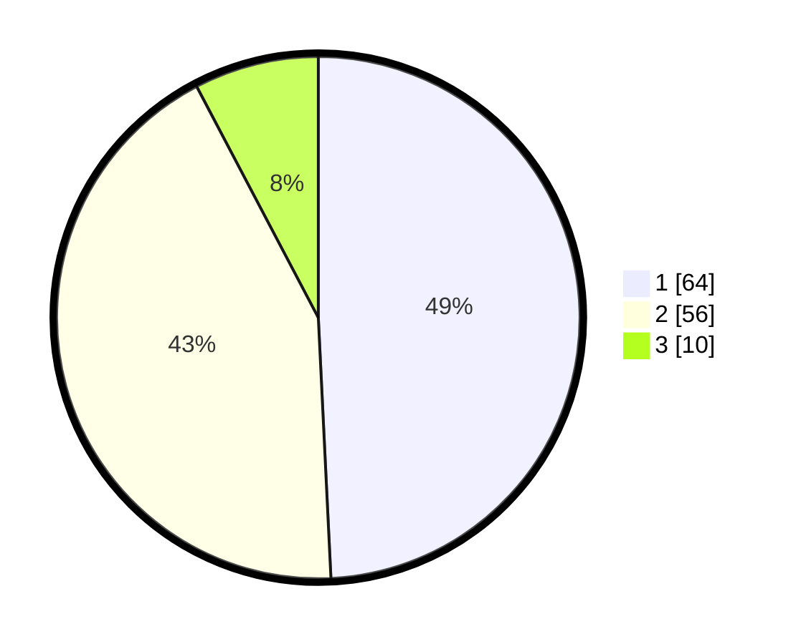

# Hasil

## Grafik

## Tabel

| No. | Nama Paslon    | Suara | Suara (raw) | Persentase |
|:--- |:-------------- | -----:| -----------:| ----------:|
| 1   | ANIES MUHAIMIN | 64    | [64][p-1]   | 49,23      |
| 2   | PRABOWO GIBRAN | 56    | [56][p-2]   | 43,08      |
| 3   | GANJAR MAHFUD  | 10    | [10][p-3]   | 7,69       |

[p-1]: https://github.com/gigit-pemilu/pemilu-2024-11-aceh/blob/main/pilpres/hitung-suara/sub/11-aceh/sub/10-aceh-singkil/sub/16-pulau-banyak-barat/sub/2001-haloban/sub/002-tps/sub/paslon-1.txt
[p-2]: https://github.com/gigit-pemilu/pemilu-2024-11-aceh/blob/main/pilpres/hitung-suara/sub/11-aceh/sub/10-aceh-singkil/sub/16-pulau-banyak-barat/sub/2001-haloban/sub/002-tps/sub/paslon-2.txt
[p-3]: https://github.com/gigit-pemilu/pemilu-2024-11-aceh/blob/main/pilpres/hitung-suara/sub/11-aceh/sub/10-aceh-singkil/sub/16-pulau-banyak-barat/sub/2001-haloban/sub/002-tps/sub/paslon-3.txt

## Foto C Plano

https://sirekap-obj-formc.kpu.go.id/1532/pemilu/ppwp/11/10/16/20/01/1110162001002-20240218-170827--95928874-0099-4546-8148-92b06c77512c.jpg

https://sirekap-obj-formc.kpu.go.id/1532/pemilu/ppwp/11/10/16/20/01/1110162001002-20240218-170654--3b59aca3-e64d-4c58-86ad-5134e06da32c.jpg

https://sirekap-obj-formc.kpu.go.id/1532/pemilu/ppwp/11/10/16/20/01/1110162001002-20240218-171236--78e8a3e6-15d7-41f8-9e86-a1b794ddedec.jpg

## Metadata

| Key        | Value               |
| ---------- | ------------------- |
| Time Stamp | 2024-02-19 15:00:00 |

## DATA PEMILIH TETAP

Jumlah pemilih dalam DPT: **179**.
 * L: **99**.
 * P: **80**.

## DATA PENGGUNA HAK PILIH

Jumlah pengguna hak pilih dalam DPT: **141**.
 * L: **75**.
 * P: **66**.

Jumlah pengguna hak pilih dalam DPTb: **1**.
 * L: **0**.
 * P: **1**.

Jumlah pengguna hak pilih dalam DPK: **3**.
 * L: **2**.
 * P: **1**.

Jumlah pengguna hak pilih: **145**.
 * L: **77**.
 * P: **68**.

## JUMLAH SUARA SAH DAN TIDAK SAH

JUMLAH SELURUH SUARA SAH: **130**.

JUMLAH SUARA TIDAK SAH: **15**.

JUMLAH SELURUH SUARA SAH DAN SUARA TIDAK SAH: **145**.

