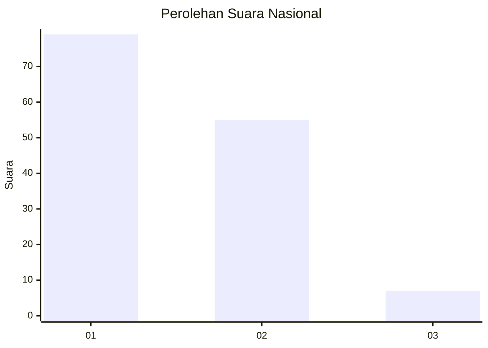
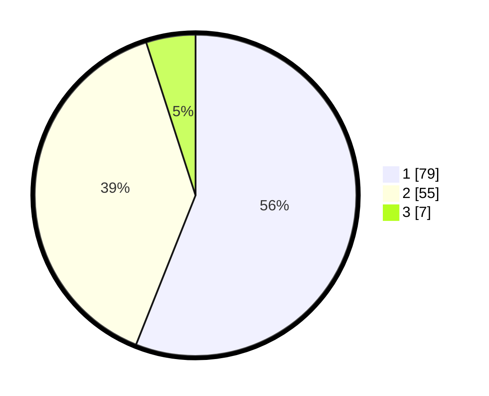

# Hasil

## Grafik

## Tabel

| No. | Nama Paslon    | Suara | Suara (raw) | Persentase |
|:--- |:-------------- | -----:| -----------:| ----------:|
| 1   | ANIES MUHAIMIN | 79    | [79][p-1]   | 56,03      |
| 2   | PRABOWO GIBRAN | 55    | [55][p-2]   | 39,01      |
| 3   | GANJAR MAHFUD  | 7     | [7][p-3]    | 4,96       |

[p-1]: https://github.com/gigit-pemilu/pemilu-2024/blob/main/pilpres/hitung-suara/sub/11-aceh/sub/10-aceh-singkil/sub/16-pulau-banyak-barat/sub/2001-haloban/sub/003-tps/sub/paslon-1.txt
[p-2]: https://github.com/gigit-pemilu/pemilu-2024/blob/main/pilpres/hitung-suara/sub/11-aceh/sub/10-aceh-singkil/sub/16-pulau-banyak-barat/sub/2001-haloban/sub/003-tps/sub/paslon-2.txt
[p-3]: https://github.com/gigit-pemilu/pemilu-2024/blob/main/pilpres/hitung-suara/sub/11-aceh/sub/10-aceh-singkil/sub/16-pulau-banyak-barat/sub/2001-haloban/sub/003-tps/sub/paslon-3.txt

## Foto C Plano

https://sirekap-obj-formc.kpu.go.id/0258/pemilu/ppwp/11/10/16/20/01/1110162001003-20240214-201041--44000f66-cfb4-493d-91f3-8b3caf2e8d5c.jpg

https://sirekap-obj-formc.kpu.go.id/0258/pemilu/ppwp/11/10/16/20/01/1110162001003-20240214-201525--cbcd1622-7d40-4056-9317-b9ff40c0d5f6.jpg

https://sirekap-obj-formc.kpu.go.id/0258/pemilu/ppwp/11/10/16/20/01/1110162001003-20240214-201712--5492623e-6885-44c8-bdbf-5b9404ae00b9.jpg

## Metadata

| Key        | Value               |
| ---------- | ------------------- |
| Time Stamp | 2024-02-15 00:41:44 |

## DATA PEMILIH TETAP

Jumlah pemilih dalam DPT: **174**.
 * L: **90**.
 * P: **84**.

## DATA PENGGUNA HAK PILIH

Jumlah pengguna hak pilih dalam DPT: **144**.
 * L: **72**.
 * P: **72**.

Jumlah pengguna hak pilih dalam DPTb: **0**.
 * L: **0**.
 * P: **0**.

Jumlah pengguna hak pilih dalam DPK: **3**.
 * L: **3**.
 * P: **0**.

Jumlah pengguna hak pilih: **147**.
 * L: **75**.
 * P: **72**.

## JUMLAH SUARA SAH DAN TIDAK SAH

JUMLAH SELURUH SUARA SAH: **141**.

JUMLAH SUARA TIDAK SAH: **6**.

JUMLAH SELURUH SUARA SAH DAN SUARA TIDAK SAH: **147**.

