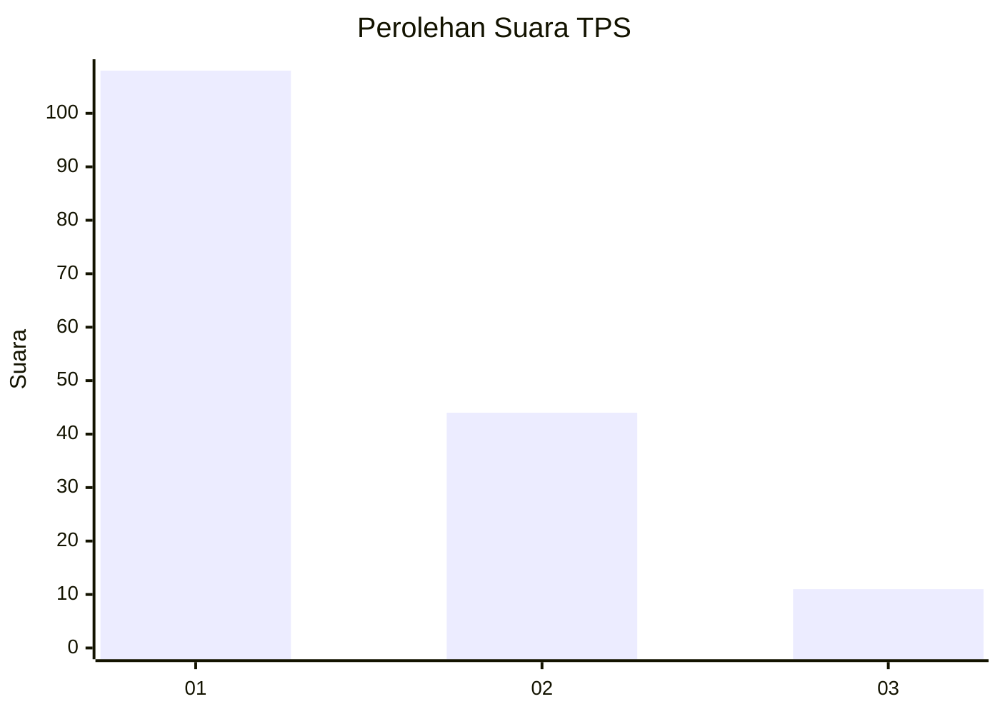
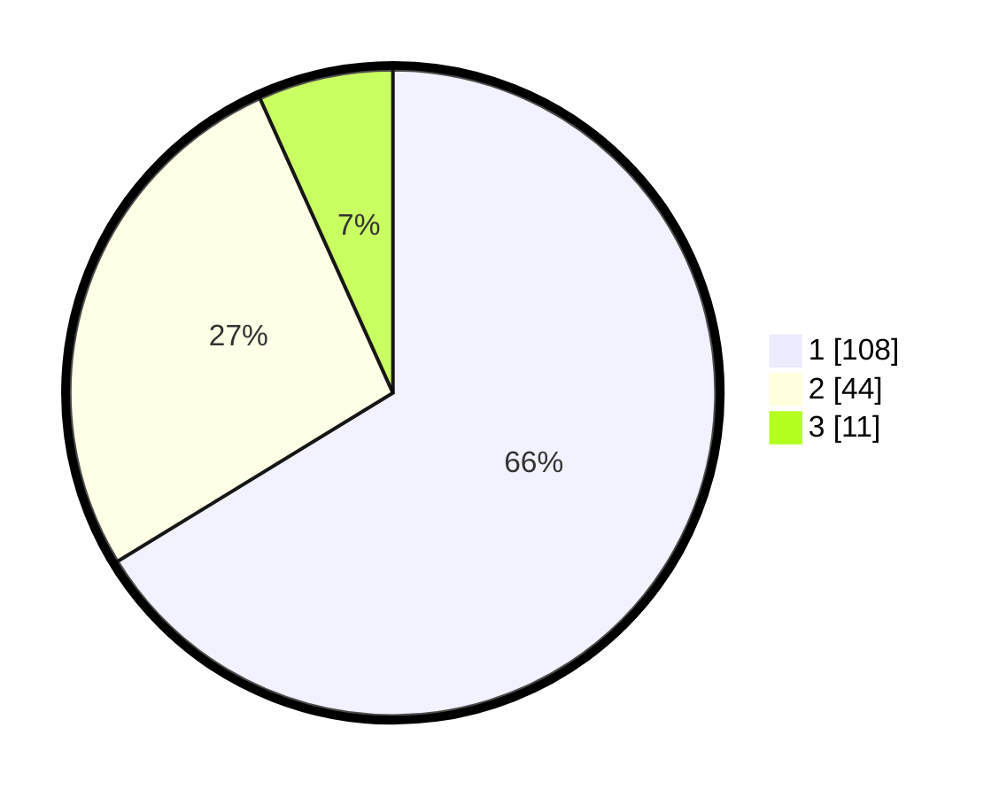

# Hasil

## Grafik

## Tabel

| No. | Nama Paslon    | Suara | Suara (raw) | Persentase |
|:--- |:-------------- | -----:| -----------:| ----------:|
| 1   | ANIES MUHAIMIN | 108   | [108][p-1]  | 66,26      |
| 2   | PRABOWO GIBRAN | 44    | [44][p-2]   | 26,99      |
| 3   | GANJAR MAHFUD  | 11    | [11][p-3]   | 6,75       |

[p-1]: https://github.com/gigit-pemilu/pemilu-2024-11-aceh/blob/main/pilpres/hitung-suara/sub/11-aceh/sub/10-aceh-singkil/sub/16-pulau-banyak-barat/sub/2002-asantola/sub/001-tps/sub/paslon-1.txt
[p-2]: https://github.com/gigit-pemilu/pemilu-2024-11-aceh/blob/main/pilpres/hitung-suara/sub/11-aceh/sub/10-aceh-singkil/sub/16-pulau-banyak-barat/sub/2002-asantola/sub/001-tps/sub/paslon-2.txt
[p-3]: https://github.com/gigit-pemilu/pemilu-2024-11-aceh/blob/main/pilpres/hitung-suara/sub/11-aceh/sub/10-aceh-singkil/sub/16-pulau-banyak-barat/sub/2002-asantola/sub/001-tps/sub/paslon-3.txt

## Foto C Plano

https://sirekap-obj-formc.kpu.go.id/6c84/pemilu/ppwp/11/10/16/20/02/1110162002001-20240219-155505--00fc12f2-0ed3-4219-a87d-4210d22de60d.jpg

https://sirekap-obj-formc.kpu.go.id/6c84/pemilu/ppwp/11/10/16/20/02/1110162002001-20240219-160109--b8189ef2-0b5b-4c48-b1f0-408795015bb0.jpg

https://sirekap-obj-formc.kpu.go.id/6c84/pemilu/ppwp/11/10/16/20/02/1110162002001-20240219-160346--88f06960-d528-44c9-848d-55e9cec5114f.jpg

## Metadata

| Key        | Value               |
| ---------- | ------------------- |
| Time Stamp | 2024-02-19 17:00:00 |

## DATA PEMILIH TETAP

Jumlah pemilih dalam DPT: **189**.
 * L: **94**.
 * P: **95**.

## DATA PENGGUNA HAK PILIH

Jumlah pengguna hak pilih dalam DPT: **157**.
 * L: **79**.
 * P: **78**.

Jumlah pengguna hak pilih dalam DPTb: **4**.
 * L: **2**.
 * P: **2**.

Jumlah pengguna hak pilih dalam DPK: **3**.
 * L: **3**.
 * P: **0**.

Jumlah pengguna hak pilih: **164**.
 * L: **84**.
 * P: **80**.

## JUMLAH SUARA SAH DAN TIDAK SAH

JUMLAH SELURUH SUARA SAH: **163**.

JUMLAH SUARA TIDAK SAH: **1**.

JUMLAH SELURUH SUARA SAH DAN SUARA TIDAK SAH: **164**.

