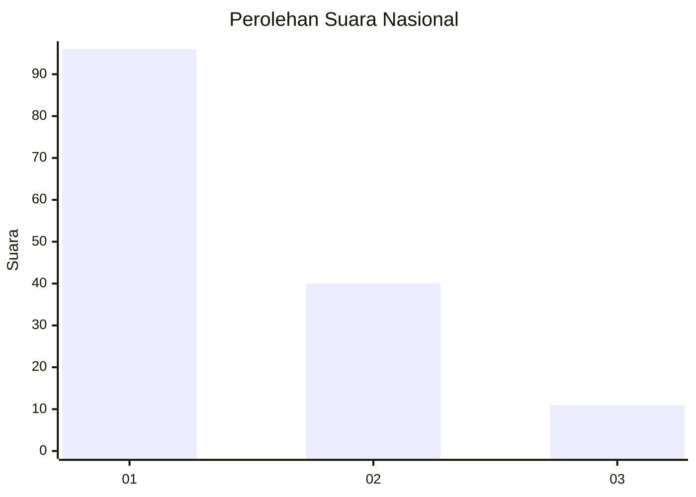
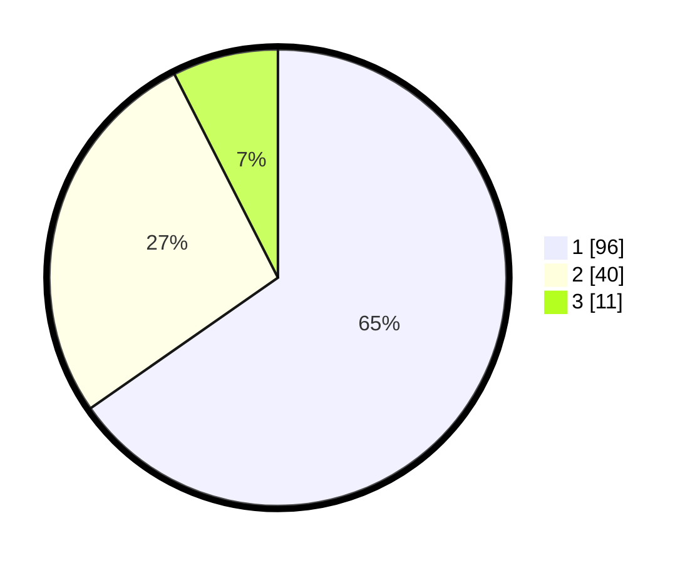

# Hasil

## Grafik

## Tabel

| No. | Nama Paslon    | Suara | Suara (raw) | Persentase |
|:--- |:-------------- | -----:| -----------:| ----------:|
| 1   | ANIES MUHAIMIN | 96    | [96][p-1]   | 65,31      |
| 2   | PRABOWO GIBRAN | 40    | [40][p-2]   | 27,21      |
| 3   | GANJAR MAHFUD  | 11    | [11][p-3]   | 7,48       |

[p-1]: https://github.com/gigit-pemilu/pemilu-2024/blob/main/pilpres/hitung-suara/sub/11-aceh/sub/10-aceh-singkil/sub/16-pulau-banyak-barat/sub/2002-asantola/sub/002-tps/sub/paslon-1.txt
[p-2]: https://github.com/gigit-pemilu/pemilu-2024/blob/main/pilpres/hitung-suara/sub/11-aceh/sub/10-aceh-singkil/sub/16-pulau-banyak-barat/sub/2002-asantola/sub/002-tps/sub/paslon-2.txt
[p-3]: https://github.com/gigit-pemilu/pemilu-2024/blob/main/pilpres/hitung-suara/sub/11-aceh/sub/10-aceh-singkil/sub/16-pulau-banyak-barat/sub/2002-asantola/sub/002-tps/sub/paslon-3.txt

## Foto C Plano

https://sirekap-obj-formc.kpu.go.id/3f2c/pemilu/ppwp/11/10/16/20/02/1110162002002-20240219-172859--8f6e6ca3-d5dc-45b1-a069-a482da73d930.jpg

https://sirekap-obj-formc.kpu.go.id/3f2c/pemilu/ppwp/11/10/16/20/02/1110162002002-20240219-173421--bf079f1e-b90f-4609-b862-8e877438a7ac.jpg

https://sirekap-obj-formc.kpu.go.id/3f2c/pemilu/ppwp/11/10/16/20/02/1110162002002-20240219-173556--faee05e6-9d44-48ae-8d1d-d0d04cb80f06.jpg

## Metadata

| Key        | Value               |
| ---------- | ------------------- |
| Time Stamp | 2024-02-19 18:00:00 |

## DATA PEMILIH TETAP

Jumlah pemilih dalam DPT: **188**.
 * L: **100**.
 * P: **88**.

## DATA PENGGUNA HAK PILIH

Jumlah pengguna hak pilih dalam DPT: **150**.
 * L: **78**.
 * P: **72**.

Jumlah pengguna hak pilih dalam DPTb: **2**.
 * L: **0**.
 * P: **2**.

Jumlah pengguna hak pilih dalam DPK: **0**.
 * L: **0**.
 * P: **0**.

Jumlah pengguna hak pilih: **152**.
 * L: **78**.
 * P: **74**.

## JUMLAH SUARA SAH DAN TIDAK SAH

JUMLAH SELURUH SUARA SAH: **147**.

JUMLAH SUARA TIDAK SAH: **5**.

JUMLAH SELURUH SUARA SAH DAN SUARA TIDAK SAH: **152**.

