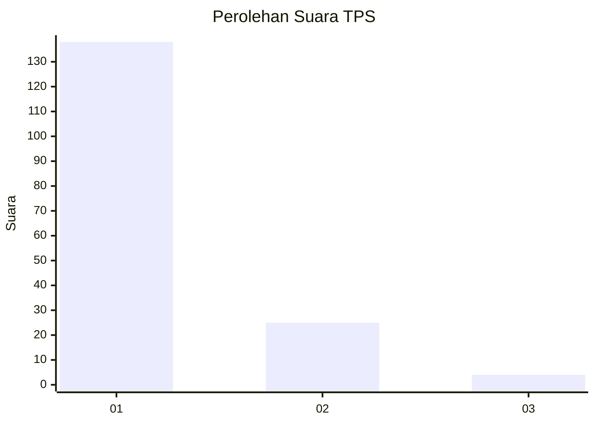
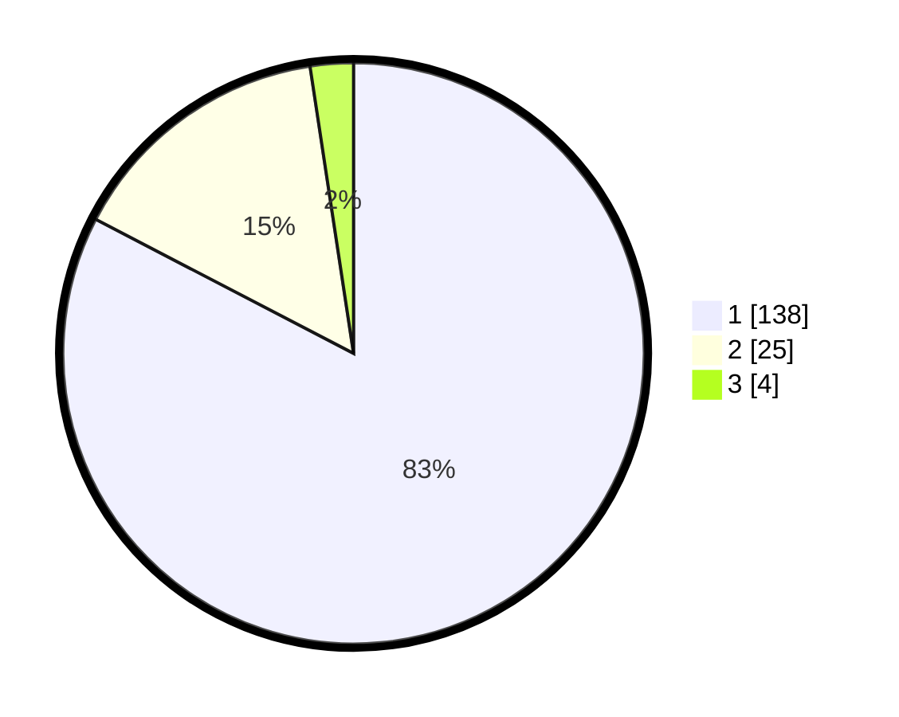

# Hasil

## Grafik

## Tabel

| No. | Nama Paslon    | Suara | Suara (raw) | Persentase |
|:--- |:-------------- | -----:| -----------:| ----------:|
| 1   | ANIES MUHAIMIN | 138   | [138][p-1]  | 82,63      |
| 2   | PRABOWO GIBRAN | 25    | [25][p-2]   | 14,97      |
| 3   | GANJAR MAHFUD  | 4     | [4][p-3]    | 2,40       |

[p-1]: https://github.com/gigit-pemilu/pemilu-2024-11-aceh/blob/main/pilpres/hitung-suara/sub/11-aceh/sub/11-bireuen/sub/01-samalanga/sub/2001-keude-aceh/sub/001-tps/sub/paslon-1.txt
[p-2]: https://github.com/gigit-pemilu/pemilu-2024-11-aceh/blob/main/pilpres/hitung-suara/sub/11-aceh/sub/11-bireuen/sub/01-samalanga/sub/2001-keude-aceh/sub/001-tps/sub/paslon-2.txt
[p-3]: https://github.com/gigit-pemilu/pemilu-2024-11-aceh/blob/main/pilpres/hitung-suara/sub/11-aceh/sub/11-bireuen/sub/01-samalanga/sub/2001-keude-aceh/sub/001-tps/sub/paslon-3.txt

## Foto C Plano

https://sirekap-obj-formc.kpu.go.id/dd0f/pemilu/ppwp/11/11/01/20/01/1111012001001-20240216-142312--96ebbcca-f01d-4f55-98ec-5aed406b277c.jpg

https://sirekap-obj-formc.kpu.go.id/dd0f/pemilu/ppwp/11/11/01/20/01/1111012001001-20240216-142313--03c47644-eaf0-4ffb-9b38-e955fe555b31.jpg

https://sirekap-obj-formc.kpu.go.id/dd0f/pemilu/ppwp/11/11/01/20/01/1111012001001-20240214-195308--871ae8ca-264d-4922-84b2-d8feae5f9218.jpg

## Metadata

| Key        | Value               |
| ---------- | ------------------- |
| Time Stamp | 2024-02-16 16:25:10 |

## DATA PEMILIH TETAP

Jumlah pemilih dalam DPT: **193**.
 * L: **91**.
 * P: **102**.

## DATA PENGGUNA HAK PILIH

Jumlah pengguna hak pilih dalam DPT: **165**.
 * L: **76**.
 * P: **89**.

Jumlah pengguna hak pilih dalam DPTb: **2**.
 * L: **2**.
 * P: **0**.

Jumlah pengguna hak pilih dalam DPK: **1**.
 * L: **1**.
 * P: **0**.

Jumlah pengguna hak pilih: **168**.
 * L: **79**.
 * P: **89**.

## JUMLAH SUARA SAH DAN TIDAK SAH

JUMLAH SELURUH SUARA SAH: **167**.

JUMLAH SUARA TIDAK SAH: **1**.

JUMLAH SELURUH SUARA SAH DAN SUARA TIDAK SAH: **168**.

