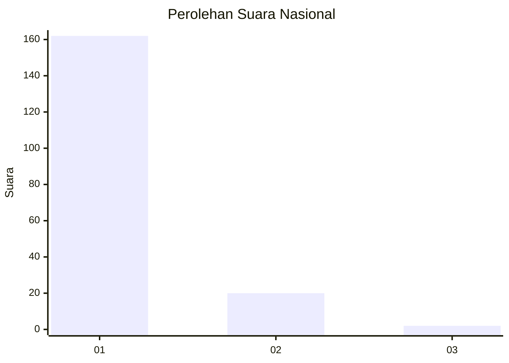
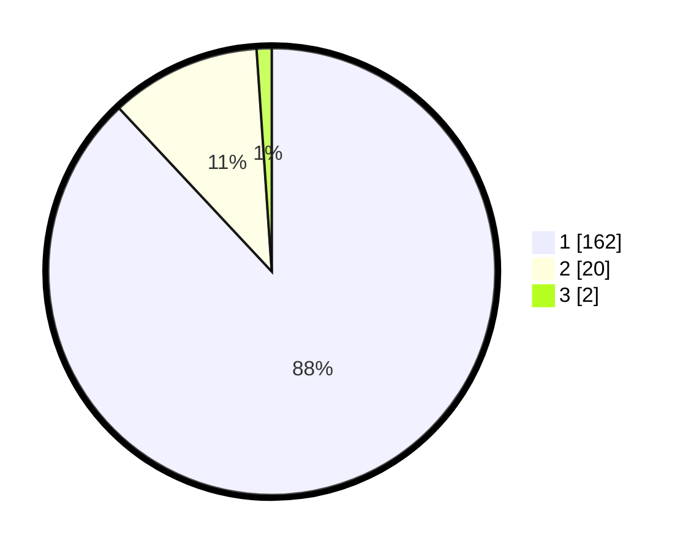

# Hasil

## Grafik

## Tabel

| No. | Nama Paslon    | Suara | Suara (raw) | Persentase |
|:--- |:-------------- | -----:| -----------:| ----------:|
| 1   | ANIES MUHAIMIN | 162   | [162][p-1]  | 88,04      |
| 2   | PRABOWO GIBRAN | 20    | [20][p-2]   | 10,87      |
| 3   | GANJAR MAHFUD  | 2     | [2][p-3]    | 1,09       |

[p-1]: https://github.com/gigit-pemilu/pemilu-2024/blob/main/pilpres/hitung-suara/sub/11-aceh/sub/11-bireuen/sub/01-samalanga/sub/2002-sangso/sub/003-tps/sub/paslon-1.txt
[p-2]: https://github.com/gigit-pemilu/pemilu-2024/blob/main/pilpres/hitung-suara/sub/11-aceh/sub/11-bireuen/sub/01-samalanga/sub/2002-sangso/sub/003-tps/sub/paslon-2.txt
[p-3]: https://github.com/gigit-pemilu/pemilu-2024/blob/main/pilpres/hitung-suara/sub/11-aceh/sub/11-bireuen/sub/01-samalanga/sub/2002-sangso/sub/003-tps/sub/paslon-3.txt

## Foto C Plano

https://sirekap-obj-formc.kpu.go.id/c5b8/pemilu/ppwp/11/11/01/20/02/1111012002003-20240215-063728--285e7179-50cb-4cef-bc8b-dbfc101cfd07.jpg

https://sirekap-obj-formc.kpu.go.id/c5b8/pemilu/ppwp/11/11/01/20/02/1111012002003-20240215-063832--589575bf-fec7-4dae-af7b-962f11c11cb8.jpg

https://sirekap-obj-formc.kpu.go.id/c5b8/pemilu/ppwp/11/11/01/20/02/1111012002003-20240215-063933--87d1738b-162a-42b0-a0bb-7369f79917af.jpg

## Metadata

| Key        | Value               |
| ---------- | ------------------- |
| Time Stamp | 2024-02-15 19:00:26 |

## DATA PEMILIH TETAP

Jumlah pemilih dalam DPT: **229**.
 * L: **112**.
 * P: **117**.

## DATA PENGGUNA HAK PILIH

Jumlah pengguna hak pilih dalam DPT: **185**.
 * L: **88**.
 * P: **97**.

Jumlah pengguna hak pilih dalam DPTb: **0**.
 * L: **0**.
 * P: **0**.

Jumlah pengguna hak pilih dalam DPK: **3**.
 * L: **1**.
 * P: **2**.

Jumlah pengguna hak pilih: **188**.
 * L: **89**.
 * P: **99**.

## JUMLAH SUARA SAH DAN TIDAK SAH

JUMLAH SELURUH SUARA SAH: **184**.

JUMLAH SUARA TIDAK SAH: **4**.

JUMLAH SELURUH SUARA SAH DAN SUARA TIDAK SAH: **188**.

