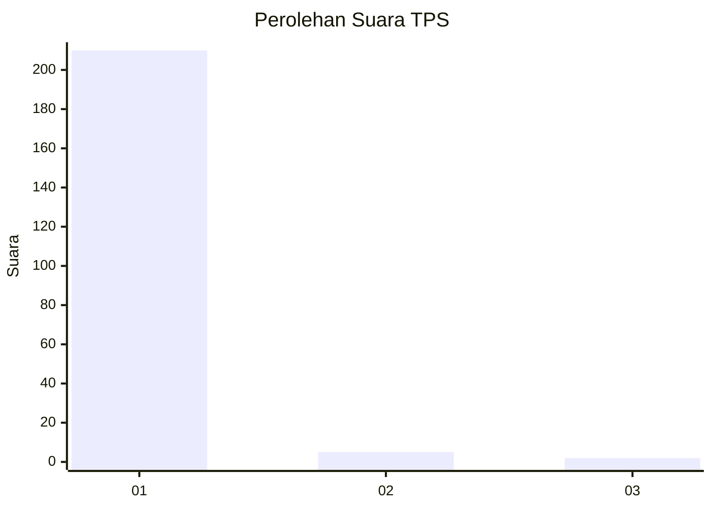
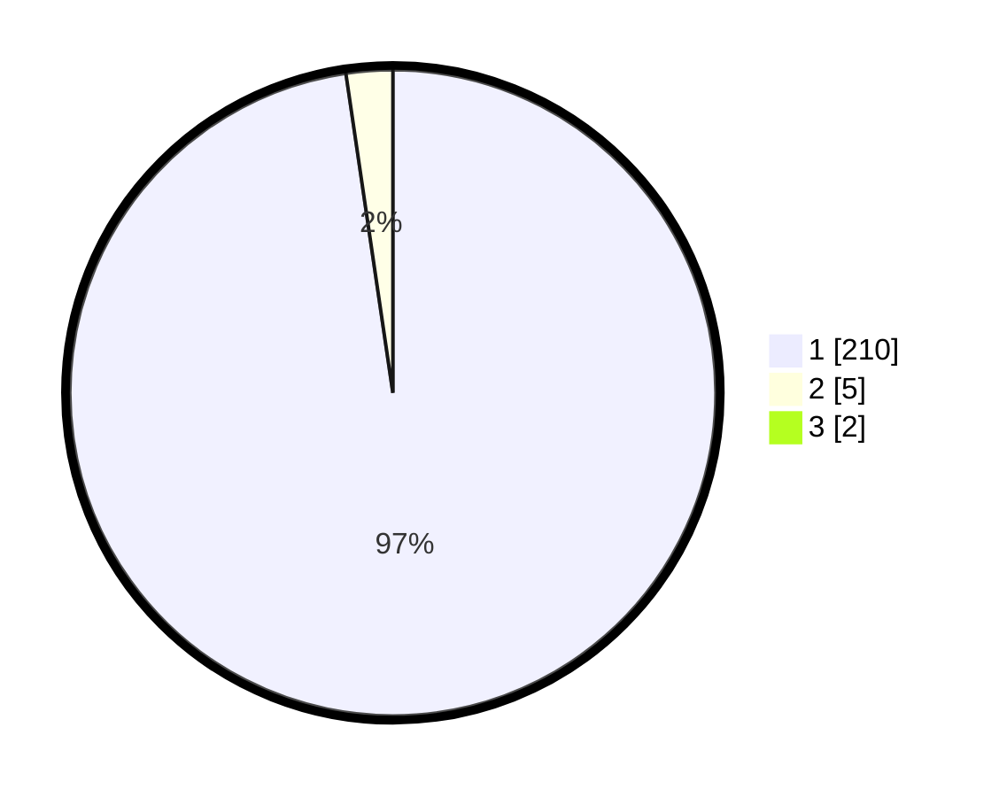

# Hasil

## Grafik

## Tabel

| No. | Nama Paslon    | Suara | Suara (raw) | Persentase |
|:--- |:-------------- | -----:| -----------:| ----------:|
| 1   | ANIES MUHAIMIN | 210   | [210][p-1]  | 96,77      |
| 2   | PRABOWO GIBRAN | 5     | [5][p-2]    | 2,30       |
| 3   | GANJAR MAHFUD  | 2     | [2][p-3]    | 0,92       |

[p-1]: https://github.com/gigit-pemilu/pemilu-2024-11-aceh/blob/main/pilpres/hitung-suara/sub/11-aceh/sub/11-bireuen/sub/01-samalanga/sub/2003-pante-rheng/sub/001-tps/sub/paslon-1.txt
[p-2]: https://github.com/gigit-pemilu/pemilu-2024-11-aceh/blob/main/pilpres/hitung-suara/sub/11-aceh/sub/11-bireuen/sub/01-samalanga/sub/2003-pante-rheng/sub/001-tps/sub/paslon-2.txt
[p-3]: https://github.com/gigit-pemilu/pemilu-2024-11-aceh/blob/main/pilpres/hitung-suara/sub/11-aceh/sub/11-bireuen/sub/01-samalanga/sub/2003-pante-rheng/sub/001-tps/sub/paslon-3.txt

## Foto C Plano

https://sirekap-obj-formc.kpu.go.id/80a6/pemilu/ppwp/11/11/01/20/03/1111012003001-20240215-153908--9257be5c-5721-45f8-b561-c8a12cc850d3.jpg

https://sirekap-obj-formc.kpu.go.id/80a6/pemilu/ppwp/11/11/01/20/03/1111012003001-20240215-160503--80dc6d4f-4a8d-4823-8850-ad9b1e2b622f.jpg

https://sirekap-obj-formc.kpu.go.id/80a6/pemilu/ppwp/11/11/01/20/03/1111012003001-20240215-154409--021704a5-b254-4086-b5dd-a6657a7b50a1.jpg

## Metadata

| Key        | Value               |
| ---------- | ------------------- |
| Time Stamp | 2024-02-15 20:30:46 |

