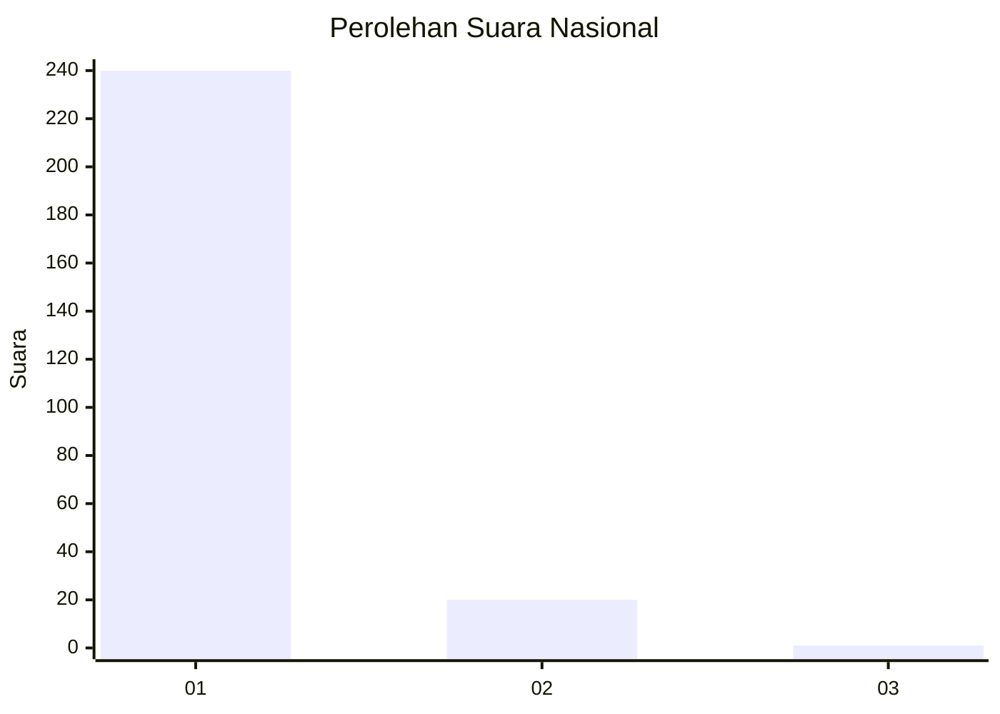
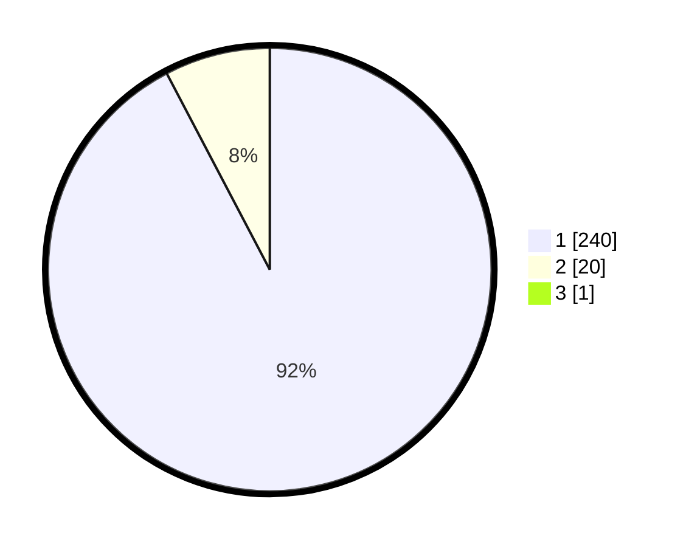

# Hasil

## Grafik

## Tabel

| No. | Nama Paslon    | Suara | Suara (raw) | Persentase |
|:--- |:-------------- | -----:| -----------:| ----------:|
| 1   | ANIES MUHAIMIN | 240   | [240][p-1]  | 91,95      |
| 2   | PRABOWO GIBRAN | 20    | [20][p-2]   | 7,66       |
| 3   | GANJAR MAHFUD  | 1     | [1][p-3]    | 0,38       |

[p-1]: https://github.com/gigit-pemilu/pemilu-2024/blob/main/pilpres/hitung-suara/sub/11-aceh/sub/11-bireuen/sub/01-samalanga/sub/2003-pante-rheng/sub/003-tps/sub/paslon-1.txt
[p-2]: https://github.com/gigit-pemilu/pemilu-2024/blob/main/pilpres/hitung-suara/sub/11-aceh/sub/11-bireuen/sub/01-samalanga/sub/2003-pante-rheng/sub/003-tps/sub/paslon-2.txt
[p-3]: https://github.com/gigit-pemilu/pemilu-2024/blob/main/pilpres/hitung-suara/sub/11-aceh/sub/11-bireuen/sub/01-samalanga/sub/2003-pante-rheng/sub/003-tps/sub/paslon-3.txt

## Foto C Plano

https://sirekap-obj-formc.kpu.go.id/c15a/pemilu/ppwp/11/11/01/20/03/1111012003003-20240215-161801--0bf68ebe-a48e-42c1-a001-471399b88543.jpg

https://sirekap-obj-formc.kpu.go.id/c15a/pemilu/ppwp/11/11/01/20/03/1111012003003-20240215-155818--757e0f8f-9f51-4579-9eac-ecbaf064a250.jpg

https://sirekap-obj-formc.kpu.go.id/c15a/pemilu/ppwp/11/11/01/20/03/1111012003003-20240215-162006--8e68c6c8-bbcf-46f2-b848-759749c2d194.jpg

## Metadata

| Key        | Value               |
| ---------- | ------------------- |
| Time Stamp | 2024-02-15 21:30:27 |

