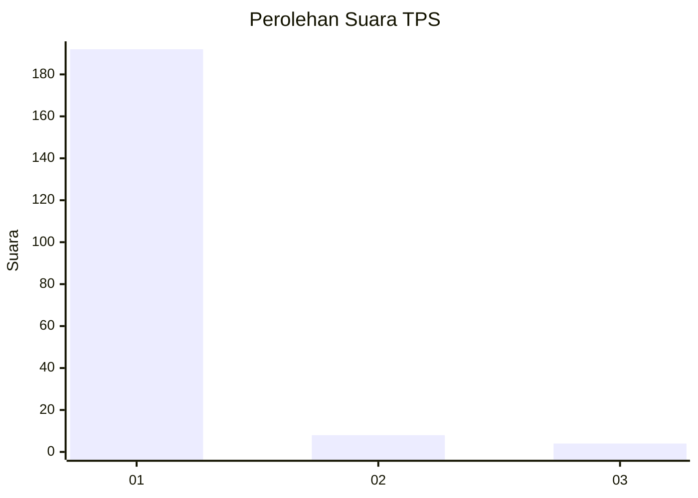
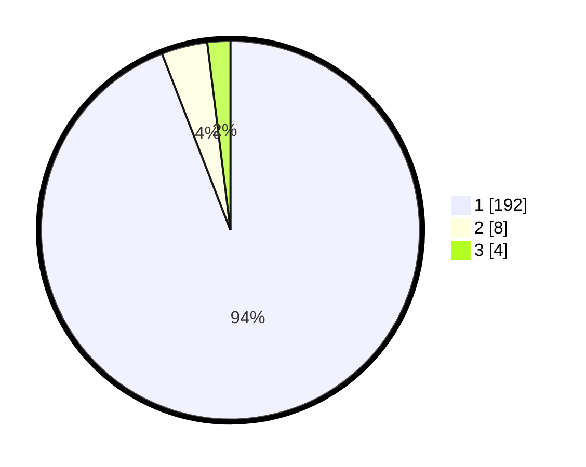

# Hasil

## Grafik

## Tabel

| No. | Nama Paslon    | Suara | Suara (raw) | Persentase |
|:--- |:-------------- | -----:| -----------:| ----------:|
| 1   | ANIES MUHAIMIN | 192   | [192][p-1]  | 94,12      |
| 2   | PRABOWO GIBRAN | 8     | [8][p-2]    | 3,92       |
| 3   | GANJAR MAHFUD  | 4     | [4][p-3]    | 1,96       |

[p-1]: https://github.com/gigit-pemilu/pemilu-2024-11-aceh/blob/main/pilpres/hitung-suara/sub/11-aceh/sub/11-bireuen/sub/01-samalanga/sub/2004-meuliek/sub/001-tps/sub/paslon-1.txt
[p-2]: https://github.com/gigit-pemilu/pemilu-2024-11-aceh/blob/main/pilpres/hitung-suara/sub/11-aceh/sub/11-bireuen/sub/01-samalanga/sub/2004-meuliek/sub/001-tps/sub/paslon-2.txt
[p-3]: https://github.com/gigit-pemilu/pemilu-2024-11-aceh/blob/main/pilpres/hitung-suara/sub/11-aceh/sub/11-bireuen/sub/01-samalanga/sub/2004-meuliek/sub/001-tps/sub/paslon-3.txt

## Foto C Plano

https://sirekap-obj-formc.kpu.go.id/0040/pemilu/ppwp/11/11/01/20/04/1111012004001-20240215-062306--e34ac722-ab61-4f23-a6e7-27a9681096ca.jpg

https://sirekap-obj-formc.kpu.go.id/0040/pemilu/ppwp/11/11/01/20/04/1111012004001-20240215-082125--0fe2122d-722d-4bc3-9d3e-df1ccde97f3d.jpg

https://sirekap-obj-formc.kpu.go.id/0040/pemilu/ppwp/11/11/01/20/04/1111012004001-20240215-063137--7aae6ed3-9993-4b8a-a778-6db9b559a83f.jpg

## Metadata

| Key        | Value               |
| ---------- | ------------------- |
| Time Stamp | 2024-02-15 21:30:27 |

