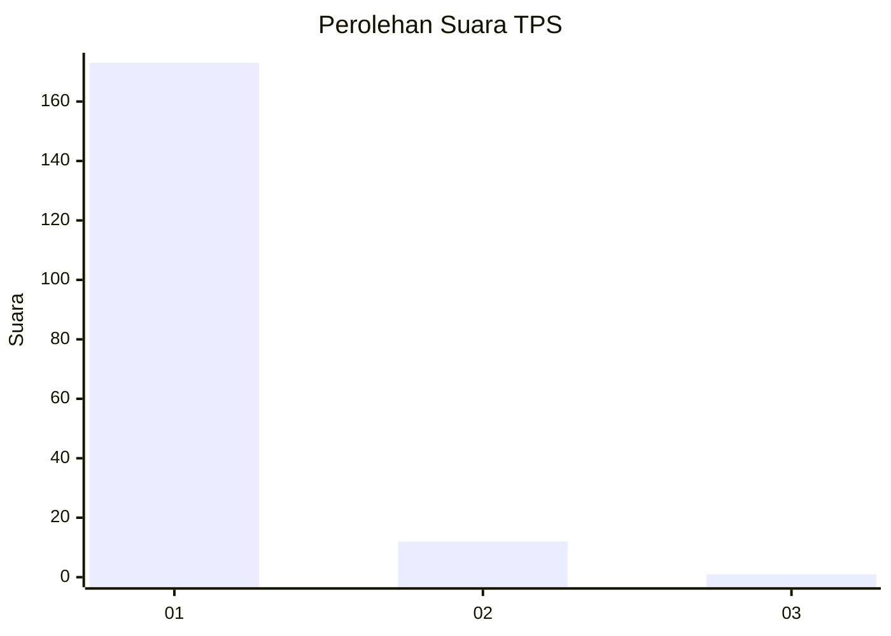
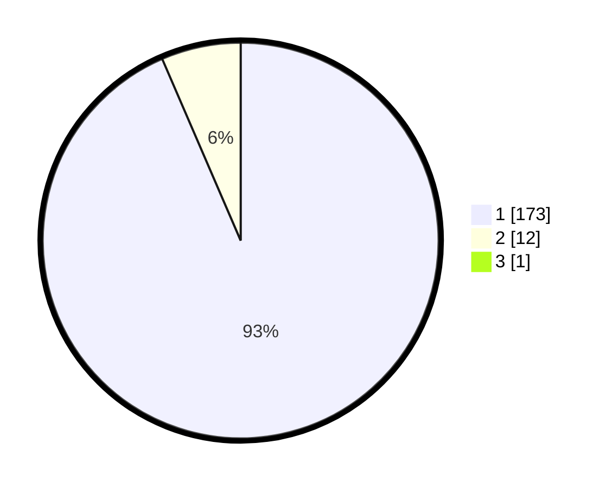

# Hasil

## Grafik

## Tabel

| No. | Nama Paslon    | Suara | Suara (raw) | Persentase |
|:--- |:-------------- | -----:| -----------:| ----------:|
| 1   | ANIES MUHAIMIN | 173   | [173][p-1]  | 93,01      |
| 2   | PRABOWO GIBRAN | 12    | [12][p-2]   | 6,45       |
| 3   | GANJAR MAHFUD  | 1     | [1][p-3]    | 0,54       |

[p-1]: https://github.com/gigit-pemilu/pemilu-2024-11-aceh/blob/main/pilpres/hitung-suara/sub/11-aceh/sub/11-bireuen/sub/01-samalanga/sub/2016-batee-iliek/sub/002-tps/sub/paslon-1.txt
[p-2]: https://github.com/gigit-pemilu/pemilu-2024-11-aceh/blob/main/pilpres/hitung-suara/sub/11-aceh/sub/11-bireuen/sub/01-samalanga/sub/2016-batee-iliek/sub/002-tps/sub/paslon-2.txt
[p-3]: https://github.com/gigit-pemilu/pemilu-2024-11-aceh/blob/main/pilpres/hitung-suara/sub/11-aceh/sub/11-bireuen/sub/01-samalanga/sub/2016-batee-iliek/sub/002-tps/sub/paslon-3.txt

## Foto C Plano

https://sirekap-obj-formc.kpu.go.id/b2a7/pemilu/ppwp/11/11/01/20/16/1111012016002-20240215-063646--80488c1a-8614-406f-97df-ccd689187194.jpg

https://sirekap-obj-formc.kpu.go.id/b2a7/pemilu/ppwp/11/11/01/20/16/1111012016002-20240215-063915--1163ea5a-1b55-4470-b389-49a897c8fb2f.jpg

https://sirekap-obj-formc.kpu.go.id/b2a7/pemilu/ppwp/11/11/01/20/16/1111012016002-20240215-064144--25dc7913-a574-4362-ab65-92191e3754f7.jpg

## Metadata

| Key        | Value               |
| ---------- | ------------------- |
| Time Stamp | 2024-02-15 22:40:13 |

