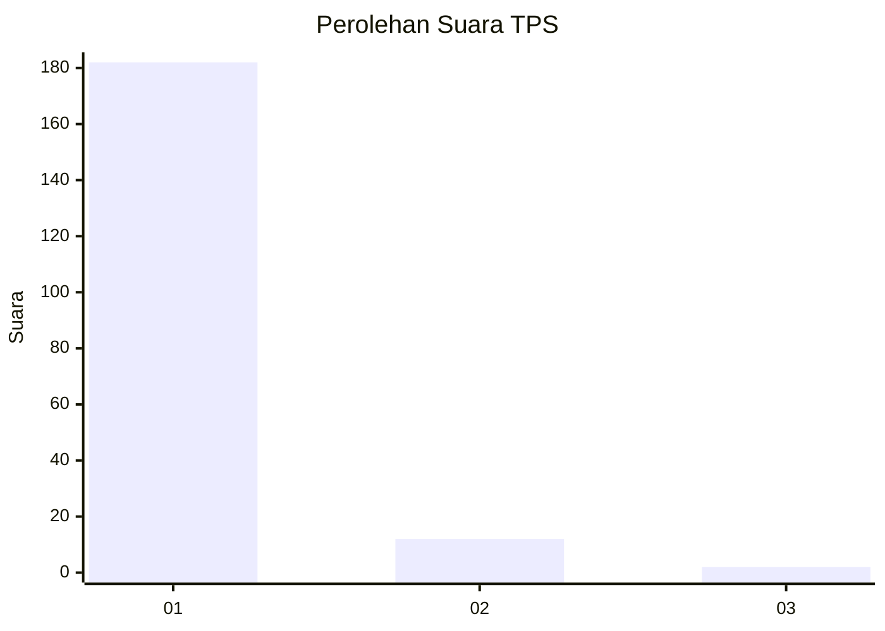
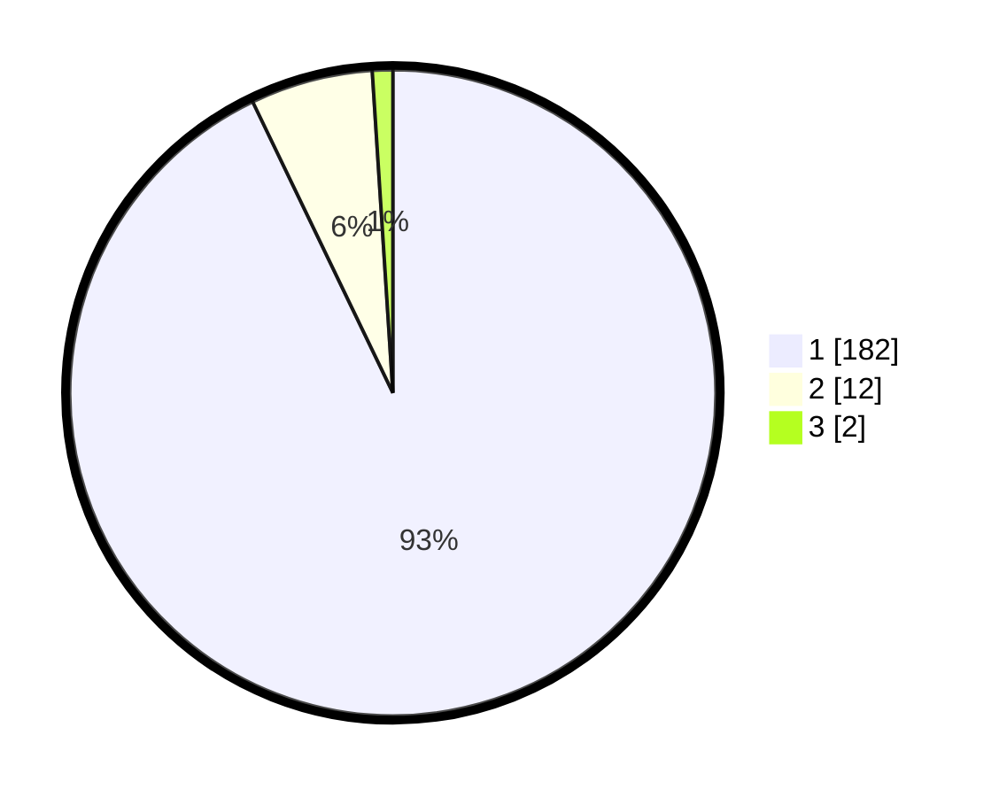

# Hasil

## Grafik

## Tabel

| No. | Nama Paslon    | Suara | Suara (raw) | Persentase |
|:--- |:-------------- | -----:| -----------:| ----------:|
| 1   | ANIES MUHAIMIN | 182   | [182][p-1]  | 92,86      |
| 2   | PRABOWO GIBRAN | 12    | [12][p-2]   | 6,12       |
| 3   | GANJAR MAHFUD  | 2     | [2][p-3]    | 1,02       |

[p-1]: https://github.com/gigit-pemilu/pemilu-2024-11-aceh/blob/main/pilpres/hitung-suara/sub/11-aceh/sub/11-bireuen/sub/01-samalanga/sub/2016-batee-iliek/sub/003-tps/sub/paslon-1.txt
[p-2]: https://github.com/gigit-pemilu/pemilu-2024-11-aceh/blob/main/pilpres/hitung-suara/sub/11-aceh/sub/11-bireuen/sub/01-samalanga/sub/2016-batee-iliek/sub/003-tps/sub/paslon-2.txt
[p-3]: https://github.com/gigit-pemilu/pemilu-2024-11-aceh/blob/main/pilpres/hitung-suara/sub/11-aceh/sub/11-bireuen/sub/01-samalanga/sub/2016-batee-iliek/sub/003-tps/sub/paslon-3.txt

## Foto C Plano

https://sirekap-obj-formc.kpu.go.id/c63e/pemilu/ppwp/11/11/01/20/16/1111012016003-20240215-061008--2d89ae63-840f-47d1-b644-bc507b3b5ca6.jpg

https://sirekap-obj-formc.kpu.go.id/c63e/pemilu/ppwp/11/11/01/20/16/1111012016003-20240215-055042--8e7e8218-6ca4-4bed-8db5-5cf5ea12948b.jpg

https://sirekap-obj-formc.kpu.go.id/c63e/pemilu/ppwp/11/11/01/20/16/1111012016003-20240215-055213--e4ad3962-ea9a-4ad4-94db-abb9b59aaa41.jpg

## Metadata

| Key        | Value               |
| ---------- | ------------------- |
| Time Stamp | 2024-02-15 22:40:13 |

