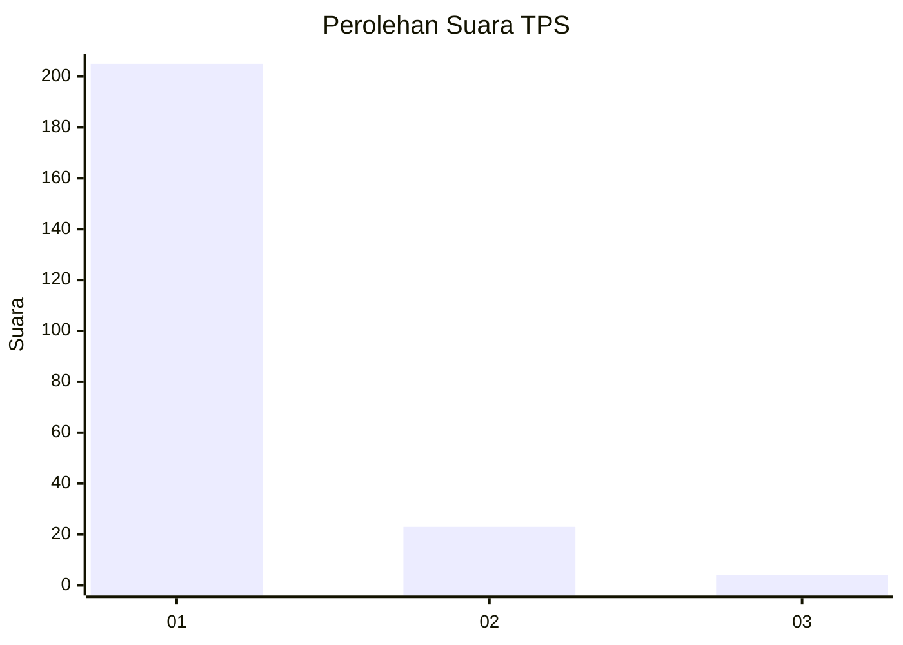
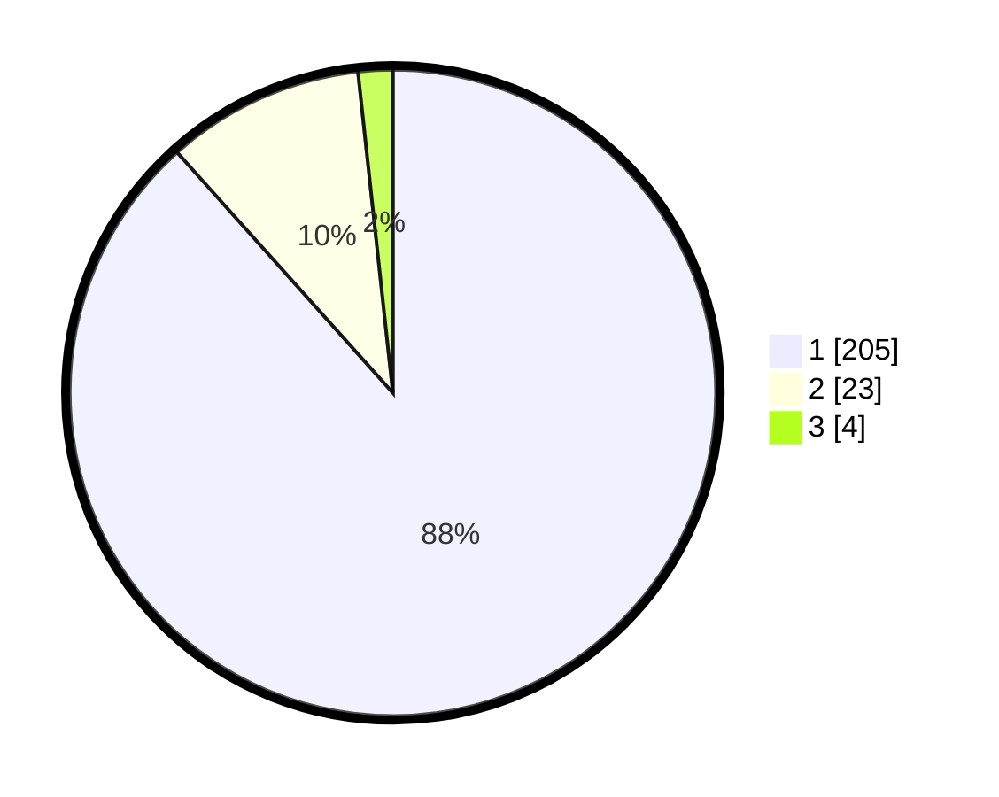

# Hasil

## Grafik

## Tabel

| No. | Nama Paslon    | Suara | Suara (raw) | Persentase |
|:--- |:-------------- | -----:| -----------:| ----------:|
| 1   | ANIES MUHAIMIN | 205   | [205][p-1]  | 88,36      |
| 2   | PRABOWO GIBRAN | 23    | [23][p-2]   | 9,91       |
| 3   | GANJAR MAHFUD  | 4     | [4][p-3]    | 1,72       |

[p-1]: https://github.com/gigit-pemilu/pemilu-2024-11-aceh/blob/main/pilpres/hitung-suara/sub/11-aceh/sub/11-bireuen/sub/01-samalanga/sub/2028-kandang/sub/001-tps/sub/paslon-1.txt
[p-2]: https://github.com/gigit-pemilu/pemilu-2024-11-aceh/blob/main/pilpres/hitung-suara/sub/11-aceh/sub/11-bireuen/sub/01-samalanga/sub/2028-kandang/sub/001-tps/sub/paslon-2.txt
[p-3]: https://github.com/gigit-pemilu/pemilu-2024-11-aceh/blob/main/pilpres/hitung-suara/sub/11-aceh/sub/11-bireuen/sub/01-samalanga/sub/2028-kandang/sub/001-tps/sub/paslon-3.txt

## Foto C Plano

https://sirekap-obj-formc.kpu.go.id/4258/pemilu/ppwp/11/11/01/20/28/1111012028001-20240215-040238--b63b9033-e616-4200-8458-55014a1a13d2.jpg

https://sirekap-obj-formc.kpu.go.id/4258/pemilu/ppwp/11/11/01/20/28/1111012028001-20240214-234143--6e9e01f1-84cc-4007-b8d2-20524e66e877.jpg

https://sirekap-obj-formc.kpu.go.id/4258/pemilu/ppwp/11/11/01/20/28/1111012028001-20240214-234433--5152ab70-0c15-443e-a8a5-952d1d1cbd7d.jpg

## Metadata

| Key        | Value               |
| ---------- | ------------------- |
| Time Stamp | 2024-02-15 12:00:28 |

