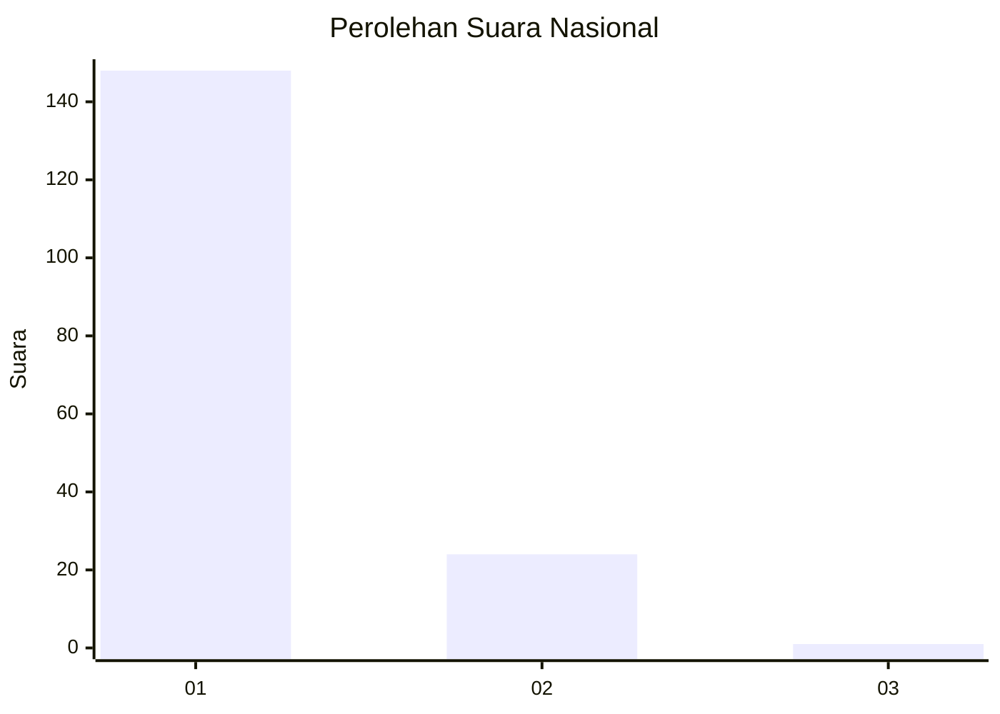
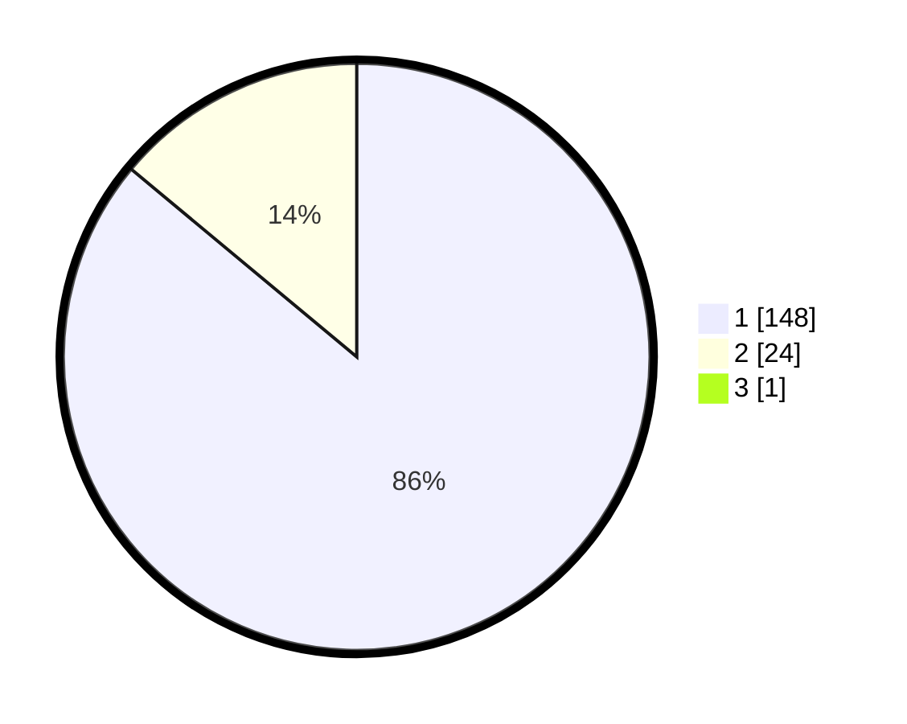

# Hasil

## Grafik

## Tabel

| No. | Nama Paslon    | Suara | Suara (raw) | Persentase |
|:--- |:-------------- | -----:| -----------:| ----------:|
| 1   | ANIES MUHAIMIN | 148   | [148][p-1]  | 85,55      |
| 2   | PRABOWO GIBRAN | 24    | [24][p-2]   | 13,87      |
| 3   | GANJAR MAHFUD  | 1     | [1][p-3]    | 0,58       |

[p-1]: https://github.com/gigit-pemilu/pemilu-2024/blob/main/pilpres/hitung-suara/sub/11-aceh/sub/11-bireuen/sub/02-jeunieb/sub/2018-blang-me-timu/sub/002-tps/sub/paslon-1.txt
[p-2]: https://github.com/gigit-pemilu/pemilu-2024/blob/main/pilpres/hitung-suara/sub/11-aceh/sub/11-bireuen/sub/02-jeunieb/sub/2018-blang-me-timu/sub/002-tps/sub/paslon-2.txt
[p-3]: https://github.com/gigit-pemilu/pemilu-2024/blob/main/pilpres/hitung-suara/sub/11-aceh/sub/11-bireuen/sub/02-jeunieb/sub/2018-blang-me-timu/sub/002-tps/sub/paslon-3.txt

## Foto C Plano

https://sirekap-obj-formc.kpu.go.id/53f7/pemilu/ppwp/11/11/02/20/18/1111022018002-20240215-042715--179ef7fd-e6c2-4691-ae8a-7d0e04b248b2.jpg

https://sirekap-obj-formc.kpu.go.id/53f7/pemilu/ppwp/11/11/02/20/18/1111022018002-20240215-043349--0a3a9a89-bb30-413d-aa06-558785c593f9.jpg

## Metadata

| Key        | Value               |
| ---------- | ------------------- |
| Time Stamp | 2024-02-15 15:30:25 |

