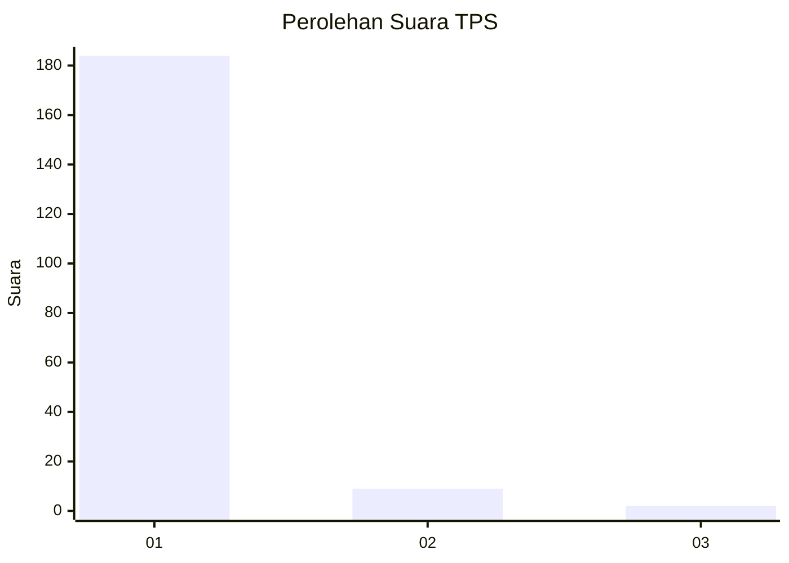
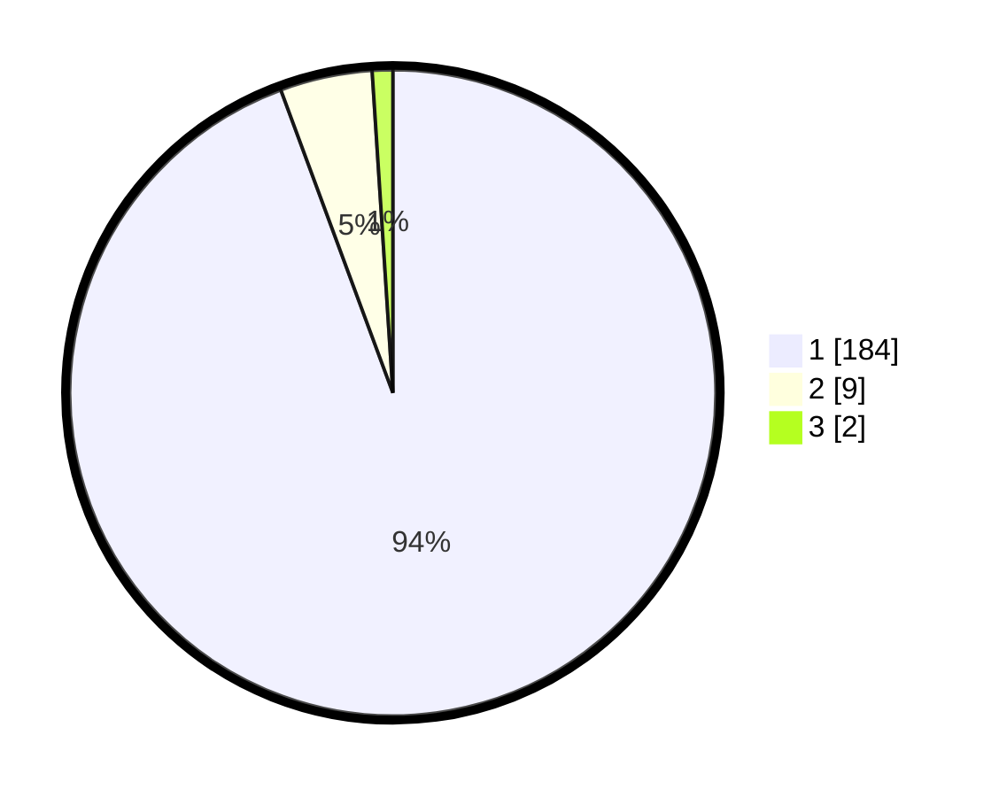

# Hasil

## Grafik

## Tabel

| No. | Nama Paslon    | Suara | Suara (raw) | Persentase |
|:--- |:-------------- | -----:| -----------:| ----------:|
| 1   | ANIES MUHAIMIN | 184   | [184][p-1]  | 94,36      |
| 2   | PRABOWO GIBRAN | 9     | [9][p-2]    | 4,62       |
| 3   | GANJAR MAHFUD  | 2     | [2][p-3]    | 1,03       |

[p-1]: https://github.com/gigit-pemilu/pemilu-2024-11-aceh/blob/main/pilpres/hitung-suara/sub/11-aceh/sub/11-bireuen/sub/02-jeunieb/sub/2031-lhok-kulam/sub/001-tps/sub/paslon-1.txt
[p-2]: https://github.com/gigit-pemilu/pemilu-2024-11-aceh/blob/main/pilpres/hitung-suara/sub/11-aceh/sub/11-bireuen/sub/02-jeunieb/sub/2031-lhok-kulam/sub/001-tps/sub/paslon-2.txt
[p-3]: https://github.com/gigit-pemilu/pemilu-2024-11-aceh/blob/main/pilpres/hitung-suara/sub/11-aceh/sub/11-bireuen/sub/02-jeunieb/sub/2031-lhok-kulam/sub/001-tps/sub/paslon-3.txt

## Foto C Plano

https://sirekap-obj-formc.kpu.go.id/b53d/pemilu/ppwp/11/11/02/20/31/1111022031001-20240218-161010--ec2ea92d-c6a6-4e08-8d74-609231cd2b2a.jpg

https://sirekap-obj-formc.kpu.go.id/b53d/pemilu/ppwp/11/11/02/20/31/1111022031001-20240215-114303--76f84915-9c30-4938-aeb6-a6388b0e9387.jpg

https://sirekap-obj-formc.kpu.go.id/b53d/pemilu/ppwp/11/11/02/20/31/1111022031001-20240215-114332--925360f0-60f9-4170-afbd-4966f8977715.jpg

## Metadata

| Key        | Value               |
| ---------- | ------------------- |
| Time Stamp | 2024-02-19 06:16:00 |

