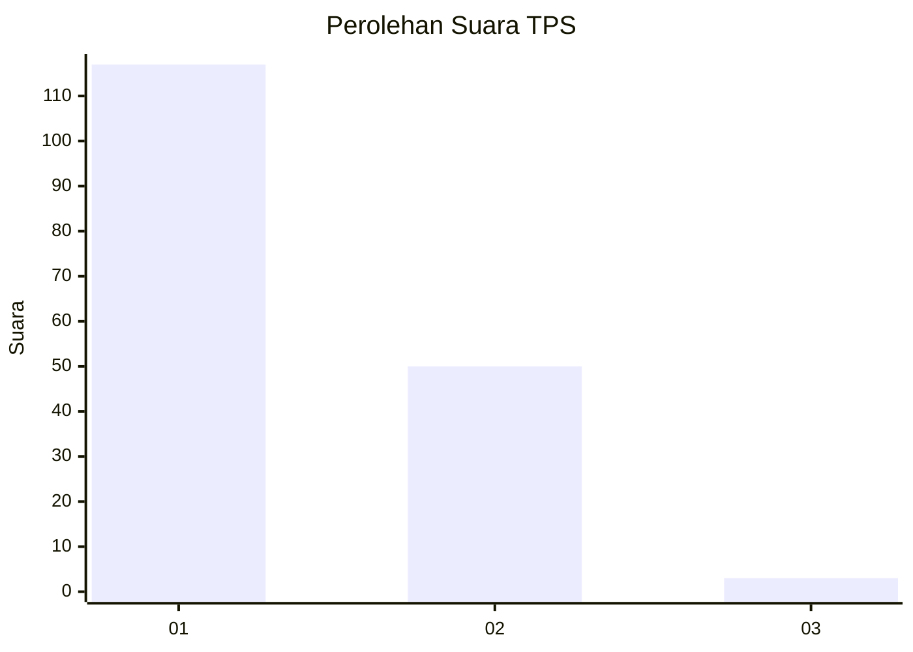
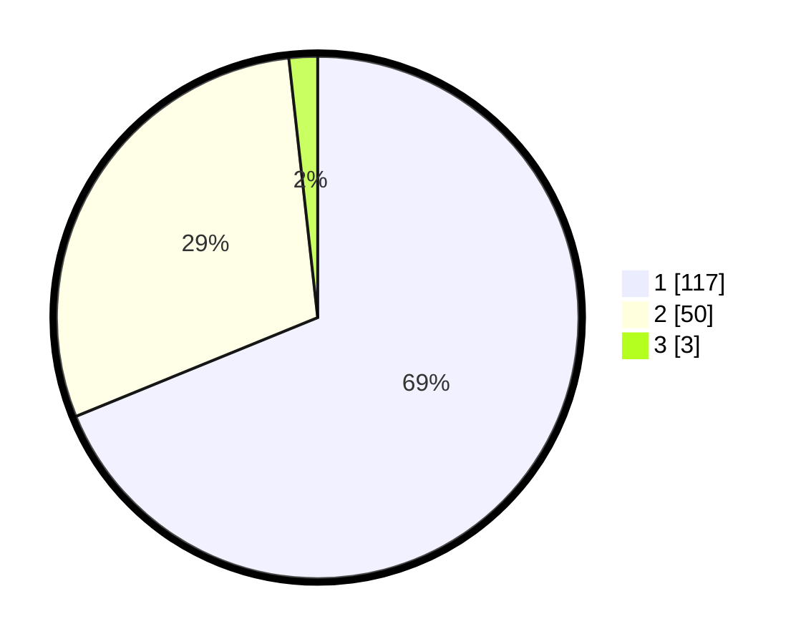

# Hasil

## Grafik

## Tabel

| No. | Nama Paslon    | Suara | Suara (raw) | Persentase |
|:--- |:-------------- | -----:| -----------:| ----------:|
| 1   | ANIES MUHAIMIN | 117   | [117][p-1]  | 68,82      |
| 2   | PRABOWO GIBRAN | 50    | [50][p-2]   | 29,41      |
| 3   | GANJAR MAHFUD  | 3     | [3][p-3]    | 1,76       |

[p-1]: https://github.com/gigit-pemilu/pemilu-2024-11-aceh/blob/main/pilpres/hitung-suara/sub/11-aceh/sub/11-bireuen/sub/02-jeunieb/sub/2033-uteun-peupaleh/sub/001-tps/sub/paslon-1.txt
[p-2]: https://github.com/gigit-pemilu/pemilu-2024-11-aceh/blob/main/pilpres/hitung-suara/sub/11-aceh/sub/11-bireuen/sub/02-jeunieb/sub/2033-uteun-peupaleh/sub/001-tps/sub/paslon-2.txt
[p-3]: https://github.com/gigit-pemilu/pemilu-2024-11-aceh/blob/main/pilpres/hitung-suara/sub/11-aceh/sub/11-bireuen/sub/02-jeunieb/sub/2033-uteun-peupaleh/sub/001-tps/sub/paslon-3.txt

## Foto C Plano

https://sirekap-obj-formc.kpu.go.id/d906/pemilu/ppwp/11/11/02/20/33/1111022033001-20240215-001029--1f43ec82-130c-459a-86a3-6abe9fe99ab0.jpg

https://sirekap-obj-formc.kpu.go.id/d906/pemilu/ppwp/11/11/02/20/33/1111022033001-20240215-001154--5d13c9ff-ace0-4ca4-b68f-9bbfa683114a.jpg

https://sirekap-obj-formc.kpu.go.id/d906/pemilu/ppwp/11/11/02/20/33/1111022033001-20240215-001220--3912ac78-50f5-4f5b-ad60-80be27d9fc1c.jpg

## Metadata

| Key        | Value               |
| ---------- | ------------------- |
| Time Stamp | 2024-02-15 21:01:18 |

