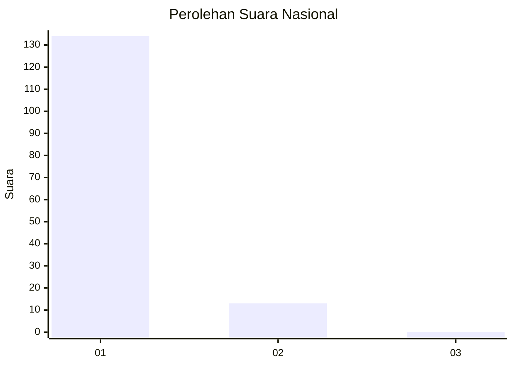
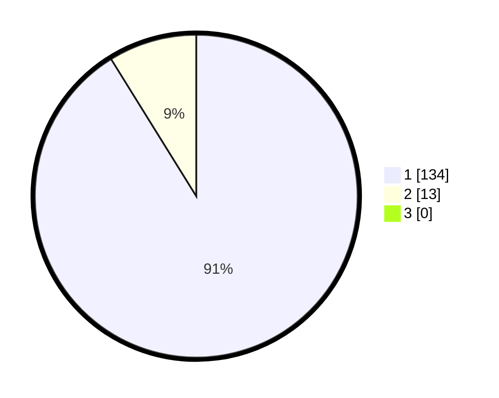

# Hasil

## Grafik

## Tabel

| No. | Nama Paslon    | Suara | Suara (raw) | Persentase |
|:--- |:-------------- | -----:| -----------:| ----------:|
| 1   | ANIES MUHAIMIN | 134   | [134][p-1]  | 91,16      |
| 2   | PRABOWO GIBRAN | 13    | [13][p-2]   | 8,84       |
| 3   | GANJAR MAHFUD  | 0     | [0][p-3]    | 0,00       |

[p-1]: https://github.com/gigit-pemilu/pemilu-2024/blob/main/pilpres/hitung-suara/sub/11-aceh/sub/11-bireuen/sub/02-jeunieb/sub/2038-matang-teungoh/sub/001-tps/sub/paslon-1.txt
[p-2]: https://github.com/gigit-pemilu/pemilu-2024/blob/main/pilpres/hitung-suara/sub/11-aceh/sub/11-bireuen/sub/02-jeunieb/sub/2038-matang-teungoh/sub/001-tps/sub/paslon-2.txt
[p-3]: https://github.com/gigit-pemilu/pemilu-2024/blob/main/pilpres/hitung-suara/sub/11-aceh/sub/11-bireuen/sub/02-jeunieb/sub/2038-matang-teungoh/sub/001-tps/sub/paslon-3.txt

## Foto C Plano

https://sirekap-obj-formc.kpu.go.id/49e2/pemilu/ppwp/11/11/02/20/38/1111022038001-20240220-160306--52fae5f3-61c8-4d6e-b7db-738243caec5a.jpg

https://sirekap-obj-formc.kpu.go.id/49e2/pemilu/ppwp/11/11/02/20/38/1111022038001-20240215-074854--fff82ea1-ac45-40cc-b036-2d5cd623233e.jpg

https://sirekap-obj-formc.kpu.go.id/49e2/pemilu/ppwp/11/11/02/20/38/1111022038001-20240215-074938--6685d4e7-d580-4c48-bebc-1fed26b17b95.jpg

## Metadata

| Key        | Value               |
| ---------- | ------------------- |
| Time Stamp | 2024-02-20 17:00:00 |

