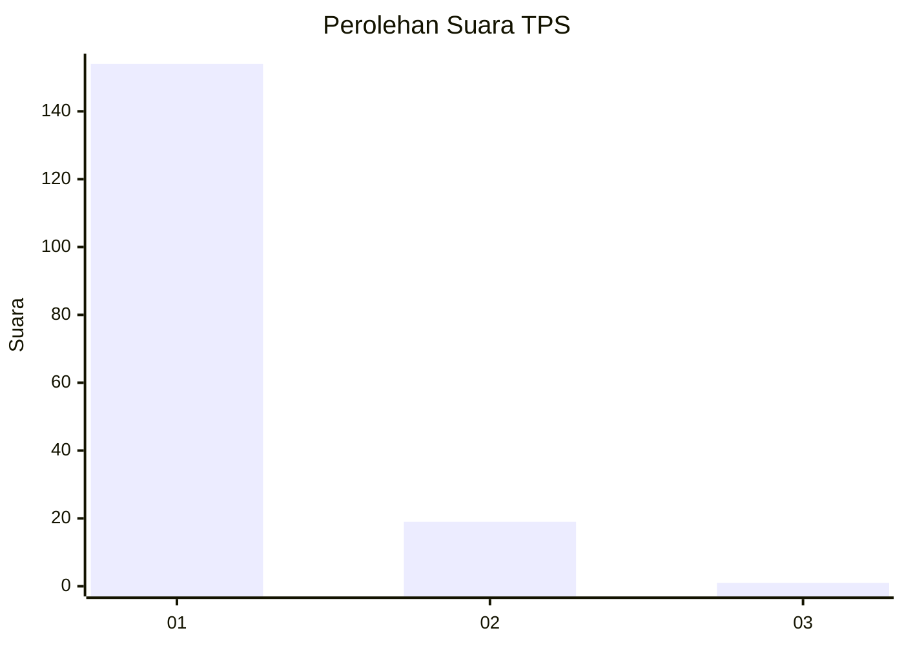
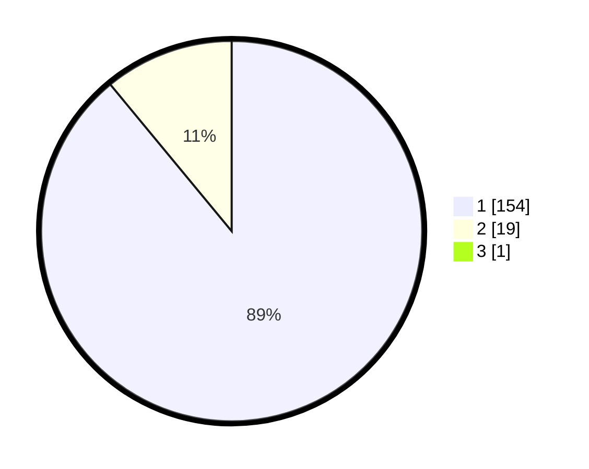

# Hasil

## Grafik

## Tabel

| No. | Nama Paslon    | Suara | Suara (raw) | Persentase |
|:--- |:-------------- | -----:| -----------:| ----------:|
| 1   | ANIES MUHAIMIN | 154   | [154][p-1]  | 88,51      |
| 2   | PRABOWO GIBRAN | 19    | [19][p-2]   | 10,92      |
| 3   | GANJAR MAHFUD  | 1     | [1][p-3]    | 0,57       |

[p-1]: https://github.com/gigit-pemilu/pemilu-2024-11-aceh/blob/main/pilpres/hitung-suara/sub/11-aceh/sub/11-bireuen/sub/02-jeunieb/sub/2040-blang-me-barat/sub/002-tps/sub/paslon-1.txt
[p-2]: https://github.com/gigit-pemilu/pemilu-2024-11-aceh/blob/main/pilpres/hitung-suara/sub/11-aceh/sub/11-bireuen/sub/02-jeunieb/sub/2040-blang-me-barat/sub/002-tps/sub/paslon-2.txt
[p-3]: https://github.com/gigit-pemilu/pemilu-2024-11-aceh/blob/main/pilpres/hitung-suara/sub/11-aceh/sub/11-bireuen/sub/02-jeunieb/sub/2040-blang-me-barat/sub/002-tps/sub/paslon-3.txt

## Foto C Plano

https://sirekap-obj-formc.kpu.go.id/2336/pemilu/ppwp/11/11/02/20/40/1111022040002-20240214-233048--10e0ea93-f02c-4269-8ee2-00378d8958d5.jpg

https://sirekap-obj-formc.kpu.go.id/2336/pemilu/ppwp/11/11/02/20/40/1111022040002-20240214-233107--fce49075-c396-41bc-bf17-9340c12c4497.jpg

https://sirekap-obj-formc.kpu.go.id/2336/pemilu/ppwp/11/11/02/20/40/1111022040002-20240214-233124--5d35a2e1-e474-47f3-9860-3fd1814f7a60.jpg

## Metadata

| Key        | Value               |
| ---------- | ------------------- |
| Time Stamp | 2024-02-15 21:01:18 |

