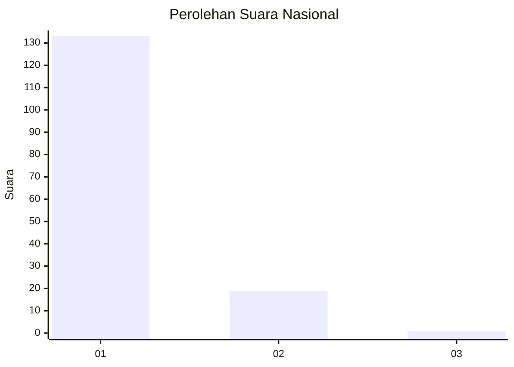
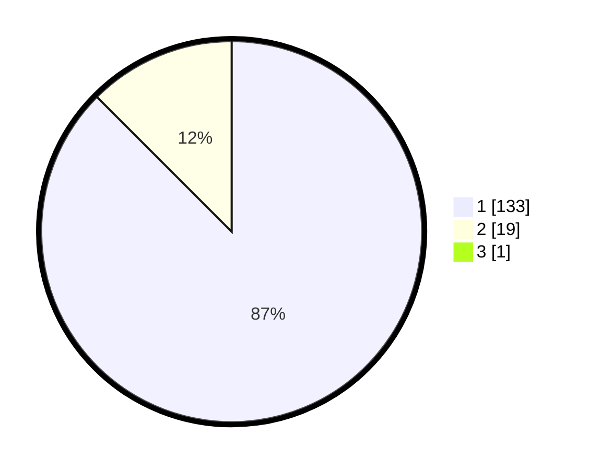

# Hasil

## Grafik

## Tabel

| No. | Nama Paslon    | Suara | Suara (raw) | Persentase |
|:--- |:-------------- | -----:| -----------:| ----------:|
| 1   | ANIES MUHAIMIN | 133   | [133][p-1]  | 86,93      |
| 2   | PRABOWO GIBRAN | 19    | [19][p-2]   | 12,42      |
| 3   | GANJAR MAHFUD  | 1     | [1][p-3]    | 0,65       |

[p-1]: https://github.com/gigit-pemilu/pemilu-2024/blob/main/pilpres/hitung-suara/sub/11-aceh/sub/11-bireuen/sub/02-jeunieb/sub/2041-keude-jeunieb/sub/001-tps/sub/paslon-1.txt
[p-2]: https://github.com/gigit-pemilu/pemilu-2024/blob/main/pilpres/hitung-suara/sub/11-aceh/sub/11-bireuen/sub/02-jeunieb/sub/2041-keude-jeunieb/sub/001-tps/sub/paslon-2.txt
[p-3]: https://github.com/gigit-pemilu/pemilu-2024/blob/main/pilpres/hitung-suara/sub/11-aceh/sub/11-bireuen/sub/02-jeunieb/sub/2041-keude-jeunieb/sub/001-tps/sub/paslon-3.txt

## Foto C Plano

https://sirekap-obj-formc.kpu.go.id/40b6/pemilu/ppwp/11/11/02/20/41/1111022041001-20240214-202145--fa1fc776-2d4a-44af-b1a1-652a17b68d43.jpg

https://sirekap-obj-formc.kpu.go.id/40b6/pemilu/ppwp/11/11/02/20/41/1111022041001-20240214-204549--8ced2324-aa5a-469e-bbae-5d1408db2172.jpg

https://sirekap-obj-formc.kpu.go.id/40b6/pemilu/ppwp/11/11/02/20/41/1111022041001-20240214-204630--6c8ce220-19ed-4809-9055-66fdae625fd7.jpg

## Metadata

| Key        | Value               |
| ---------- | ------------------- |
| Time Stamp | 2024-02-15 00:41:44 |

